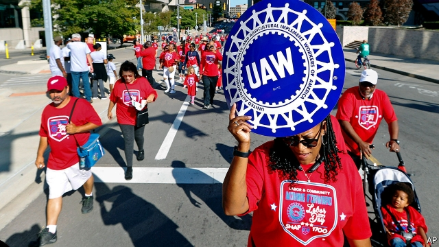
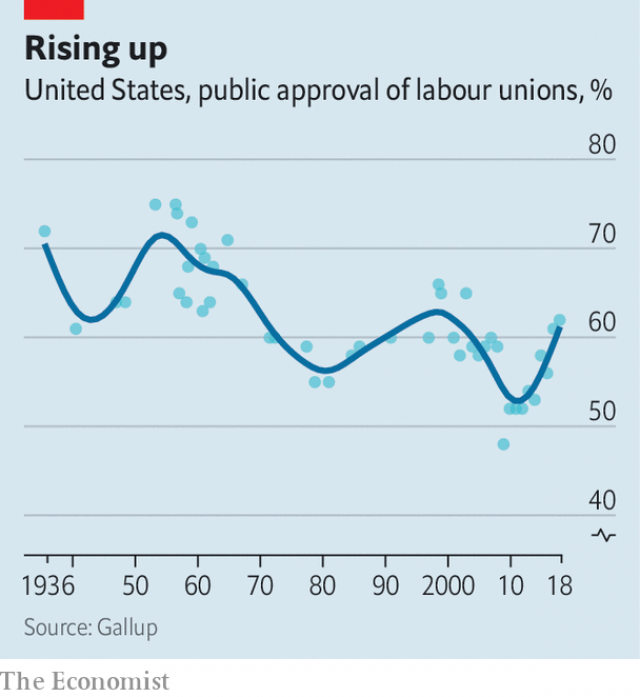

###### Highbrow organising

# Beleaguered unions seek members beyond the factory floor 

 

> print-edition iconPrint edition | United States | Sep 12th 2019 

JUDGING BY RECENT headlines, America’s unions appear stuck in time. Consider one of the biggest, the United Auto Workers (UAW). Its 400,000-odd members include nearly 150,000 who work at Detroit’s “big three” carmakers—GM, Ford and Fiat Chrysler. The UAW’s boss, Gary Jones, was busy this week hammering out a four-year labour contract for them, starting at GM, before the current one expires on September 15th. If not, strikes loom. 

Yet he is likely to feel distracted. Mr Jones has endured intense scrutiny since federal investigators in late August raided his home, those of former bosses and a union resort in Michigan. The feds have been busy exposing bribery at the UAW in a case that has rumbled on for years. So far nine union leaders have been charged and eight convicted for taking dodgy payments and gifts, including pairs of $1,000 shoes. 

Mr Jones has not been charged, but fellow bosses’ graft casts a poor light. If members lose trust in him, they might strike rather than take whatever deal he extracts from carmakers. That reputational hit could weaken union efforts elsewhere. The UAW and others long dreamed of organising workers at southern, foreign-owned “transplants” whose car factories are likelier than Detroit’s to grow. Scandal makes it harder to imagine winning them over. At the same time, overall union membership has been declining. Just 6% of private-sector employees are in unions, from a peak of 35% in 1954. Last year the Supreme Court reduced unions’ ability to take levies from public-sector workers. 

 

Beyond recent headlines, however, the likes of the UAW have some reasons to cheer. As unions have weakened the public’s sympathy for them has grown. A Gallup poll on August 28th suggested 64% of Americans approve of unions, close to a 50-year high (see chart). Similarly a Pew study last year said 51% see less unionisation as “mostly bad” for working people. 

This uptick probably has many causes. For one, workers are in a jauntier mood thanks to a tightening labour market, with rising wages, in the past few years. Harry Katz of Cornell University suggests unions are also helped by their “remarkable success” in promoting higher minimum wages in many states. 

Politics may be shifting attitudes, too. Donald Trump won votes of 43% of union households in 2016, a historically high share that was only slightly behind Hillary Clinton’s 51%, poor for a Democrat. This year Democratic candidates—not just the leftiest ones—are falling over each other to praise unions and labour rights such as paid parental leave, sick days and holidays. 

Among the public, youngsters look the most supportive, points out Steven Greenhouse, author of a book that traces unions’ changing fortunes. An earlier poll shows 65% of 18- to 34-year-olds approve of unions. He argues the young are spurred on by worries over income inequality and burdens of student debt. Mr Katz sees other drivers, such as the rise of informal “affinity groups”, when workers organise over a particular issue rather than pay bargaining. For example last November 20,000 Google staff walked out to protest against the way bosses handled charges of sexual harassment. Such groups, Mr Katz thinks, might stir interest in unions proper. 

Industrial unions have also spent the past few decades hunting for professional members. Overall white-collar unionisation slid to 9.5% last year, down from 11% a decade before. But the decline has been less rapid than for blue-collar workers. 

The UAW counts 109,000 white-collar members among its ranks. Staff at the Brooklyn Academy of Music belong to a UAW local, as do casino workers and civil servants in Michigan. Technical workers at the Guggenheim museum in Manhattan enrolled in a union this summer, the first time they have unionised. More journalists appear to be joining unions—the NewsGuild, representing print and digital workers, says it has 25,000 members in North America, a slight increase over the past few years. The United Steel Workers is trying to unionise tech staff, including the Pittsburgh branch of HCL, an Indian firm that supplies contractors to Google. 

Bigger unions see potential in higher education. The UAW boasts of 50,000 academic members, mostly junior staff who may face precarious working conditions. Dan Parsons, president of a 6,000-strong UAW affiliate at the University of Washington, traces a “pretty rapid increase” in recent membership. His union recently signed up 900 post-doctoral staff. 

Todd Wolfson, president of a union of 8,000 at Rutgers, says in the past year he has seen “more interest than for a decade” as adjuncts and graduate workers enrolled. Junior instructors feel exploited when asked to work 60-hour weeks for paltry pay, he says. As universities hire fewer tenured staff, they depend on such non-faculty, so “we are all just widgets, that’s why people are so attracted to unions.” 

If the UAW and others sign up more white-collar workers while losing blue ones, will the clout of the unions change? Not for a while. Mr Katz points out that academic unions remain fragmented across the country. And as Marick Masters at Wayne State University notes, service workers have less bargaining power than carmakers who can threaten—as in Detroit this month—to close massive factories. Strikes by casino staff or graduate lecturers might not make the same impression. ■ 

