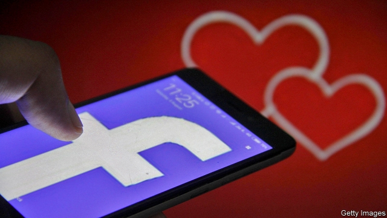

###### Friends with benefits

# Facebook has unleashed a new dating service 

 

> print-edition iconPrint edition | United States | Sep 12th 2019 

IN AMERICA it is no longer merely acceptable to meet your romantic partner on the internet. It is the norm. The latest data from a long-running survey by researchers at Stanford, released this summer, shows that 40% of new heterosexual couples met online in 2017, far more than at bars, through friends or at work. For gay couples the proportion is even higher, at 60%. 

Little wonder, then, that Facebook is bringing a dating service to the richest denizens of its internet fief. Facebook Dating launched in America on September 5th, having been tested first in smaller markets such as Colombia and Canada. American Facebook users seeking significant others can now find the dating service in a dedicated tab within the firm’s smartphone app. Willing daters must explicitly create a profile and fill in their preferences. Users may, if they wish, tap into their social graph to look for matches among friends of friends, but that option is not on by default. Facebook says any data generated while searching will be kept separate from its main service and not used to target ads. 

Facebook Dating has the potential to break one of the most interesting features of internet dating. Most dating apps pair up strangers, rather than friends of friends. For instance Tinder, the most popular dating app, pairs people up by allowing them to choose from a menu of potential partners within a set radius of where they are. OKCupid, a more old-school text-based approach, asks users to read through a profile. Real-life pairings are usually circumscribed by a person’s social sphere, and the chances of meeting a total stranger are low. But online most people are paired with strangers. Some sociology research suggests that this means that online dating has the potential to create couples from more diverse backgrounds than would tend to form in real life, possibly helping to reduce income inequality over time. 

Facebook’s effort will also make it possible to match anonymously, but trawling through friends of friends is likely to prove more alluring. Thus Facebook is remaking the old world that was governed by social ties, probably reducing any benefits that may have come with less assortative coupling through online dating. 

These are inauspicious times for Mark Zuckerberg’s company to roll out a dating service. The firm is under antitrust investigation from attorneys-general in eight American states and the District of Columbia. The firm’s record on handling user data is poor. Adding dating information to the mix—which includes sexual orientation and, perhaps, HIV status—seems bold at best, misguided at worst. 

Still, recent history suggests Facebook Dating will be a success. The firm has more tools at its disposal to help its amorous users find a good match than any other dating service, thanks to its huge user base and its trove of their data. Although user growth on Facebook itself is slowing, users seem generally unfazed by the firm’s numerous missteps. Its other services, including WhatsApp and Instagram, are still growing strongly. If that success is anything to go by, it suggests that future versions of the Stanford survey may do well to break out a new category of coupling: Facebook.■ 

