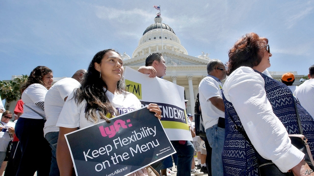

###### Categorical shift

# New rules in California could reshape the gig economy 

 

> print-edition iconPrint edition | United States | Sep 12th 2019 

IN A JOLT to California’s gig economy, the state’s lawmakers approved on September 11th a landmark bill, AB5, that will force many firms to classify independent contractors as employees. California’s governor, Gavin Newsom, a Democrat, had pushed hard for the change. As he argued in a Labour Day op-ed in the Sacramento Bee, firms must no longer be allowed to “shirk responsibility” and should cough up for things like medical benefits, unemployment insurance and paid sick days. The bill’s sponsor, Democratic assemblywoman Lorena Gonzalez, has argued it will help workers, “not Wall Street and their get-rich-quick IPOs”. 

Whether that is true or not is fiercely debated. Firms that rely heavily on contract workers argue that a requirement to treat them as employees will put many out of work. The bill’s authors seemingly admitted as much, inserting dozens of exemptions for workers including accountants, architects, dentists, doctors, engineers and estate agents. Missing from the exemptions are drivers for ride-sharing firms like Uber and Lyft—since, the bill’s authors argue, the ride-sharing platforms impose rules on their drivers which mean that they are not truly self-employed. 

Only “a small fraction” of Lyft’s roughly 325,000 drivers in California will keep working if the law takes effect as expected on January 1st, says Adrian Durbin, head of policy communications for the San Francisco-based firm. Some experts reckon ride fares could rise by as much as 30%. Demand for trips could therefore slip. Beyond that, Lyft drivers will lose the ability to work, or not work, whenever they want, Mr Durbin notes. 

Unions such as Teamsters pressed hard for the legislation, which promises to make recruiting members easier. One big backer of the bill, the Service Employees International Union, reckons other states will follow suit. A day before the bill passed, New York’s governor, Andrew Cuomo, a Democrat, lauded California’s push and said it got his “competitive juices flowing”. Democrats running for president who have endorsed California’s bill include front-runners such as Kamala Harris, Bernie Sanders and Elizabeth Warren. 

Lyft and Uber have lost roughly a third of their stockmarket values since July but both are gearing up for battle. The firms now hope to strike an alternative deal with unions and lawmakers by offering drivers certain benefits including reimbursement for some expenses and guaranteed earnings that exceed the minimum wage. Should that fail, Uber, for its part, reckons it may still manage to keep its drivers as contractors. In a conference call following the bill’s passage, Uber’s top lawyer, Tony West, said the idea is to argue in court that its main business is being a technology platform. That distinction could waive the requirement to treat drivers as employees. 

A final option, both firms say, is to gather petition signatures to kick-start a ballot initiative that would sidestep California’s lawmakers. Last month Lyft and Uber each put $30m into a joint campaign fund for that effort. “If we need to, we’ll take it to the voters,” says Lyft’s Mr Durbin. Uber has already begun to hire a campaign team. ■ 

