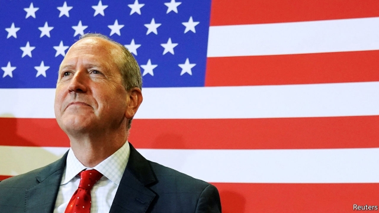
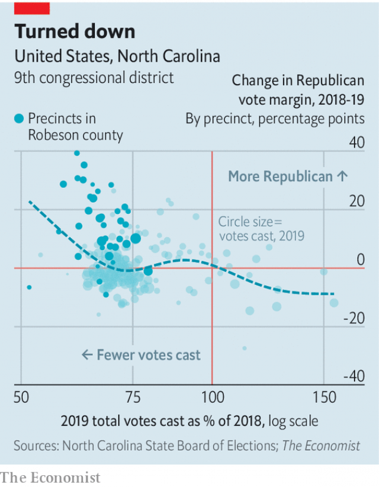

###### Just past the post

# What a Republican victory in North Carolina means for 2020 

 

> print-edition iconPrint edition | United States | Sep 12th 2019 

UP CLOSE, POLITICAL enthusiasm is gloriously strange. At the rally held by President Donald Trump in Fayetteville on the eve of election night in North Carolina’s 9th congressional district, the atmosphere was festive. “I haven’t been in a crowd like this since I saw Fleetwood Mac,” said a retired marine, who was unaware that the Democrat running in the district was also a retired marine. Before the president spoke there was discussion, among other things, of whether it was still OK to play Michael Jackson songs at such an occasion (“I hope he doesn’t come on stage to this, it’s a bit off”; “It’s probably just 80s Spotify”). A tall African-American man dressed head-to-toe in pyjamas with the president’s face all over them, capped with a Trump wig, lifted his top to reveal a T-shirt underneath with “Grab Her By The Pussy” written on it. A trans woman waved a banner that read “Women For Trump”. There were speeches from the president’s son and from the president’s son’s girlfriend, who said that the Trump family has sacrificed so much for America, because they love the people. 

Yet when it comes to election time, voters behave in ways all too easy to generalise about. Between the previous election in North Carolina’s 9th district in November 2018 and the special election on September 10th, which Dan Bishop, the Republican candidate, won narrowly, the news cycle has been dizzying. The trade war with China has intensified, the Mueller investigation concluded, the president has sent 4,800 tweets. The net effect of all this, at least in NC-9, was that the Republican increased his vote share by one percentage point. For all the effort poured into campaigning, and the speculation over whether this or that will hurt or help Mr Trump with voters, the overwhelming majority of people just voted for the party they supported last time. 

Such stability might be a relief to Republican congressmen. Art Pope, a former Republican state representative with a fearsome reputation among Democrats as a political operator, reckons the result shows that the Democratic wave of 2018 is now receding. In 2018, he says, the Democratic candidate, Dan McCready, the former marine and current entrepreneur, was free to define himself in the eyes of voters. A year on, with “Nancy Pelosi basking in the bright sunshine of Alexandria Ocasio-Cortez and the socialist wing of the party,” Mr Pope says it was easier to pin him down. 

That interpretation is kind to Republicans. No Democrat ought to have been competitive in the district, which stretches from suburban Charlotte to Fayetteville in the east. “The Most Patriotic City In The USA” is just outside the gates of Fort Bragg, a military base which covers 160,000 acres and is home to 50,000 soldiers and 25,000 of their family members. NC-9 has returned a Republican in each election since 1963. Mr Trump won it by 12 points in 2016. 

 

Yet the Republican candidate would probably have lost but for a particularly good result in Robeson county (see chart). Robeson is home to the Lumbee tribe of Native Americans, who were courted by both candidates. Mr Bishop, overcoming a reflexive Republican aversion to handouts, sponsored a bill signed into law in July in North Carolina’s statehouse to funnel money for health care and poverty alleviation to the Lumbee. Turnout in Robeson was low, because the tribe’s members are mostly poor, but it may have been decisive. 

One-off elections are not always good predictors of what comes next, but the mid-term results in 2018 were in line with the special elections that preceded them. If the Democratic Party were to do as well next year as its candidate did in NC-9, it would secure a huge majority in Congress. There are 32 seats currently held by Republicans that Mr Trump won by fewer than 12 points. Given Democrats already have a majority of 36, a repeat of the outcome in NC-9 would give them the biggest majority held by either party in the House since the early 1990s. For their part, the state’s Republicans are not exactly behaving like a party that knows it commands the support of a majority of North Carolinians. The day after the election they pushed through an important budget vote in the state legislature—while most of the Democratic members were at a ceremony to mark the terrorist attacks of September 11th 2001. ■ 

