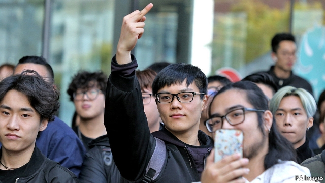

###### Waltzing Confucius

# Australian universities are accused of trading free speech for cash 

 

> print-edition iconPrint edition | Asia | Sep 21st 2019 

SEEK “HARMONY but not sameness”, advised the Chinese philosopher Confucius 2,500 years ago. Neither quality was on display when Chinese nationalists violently disrupted a rally at the University of Queensland in July in support of anti-government demonstrators in Hong Kong. Since then Drew Pavlou, one of the organisers of the sympathy rally, says he has received a litany of threats from Chinese patriots. The passport details of another participant in the rally, who is from the Chinese mainland, have been disseminated on social media. A third says authorities in China visited his family there, to warn them of the consequences of dissent. 

Mr Pavlou claims his university has since tried to squelch protests that might upset China, a charge it firmly denies. It is one of 13 campuses in Australia to host a Confucius Institute, a language school and cultural centre funded by the Chinese government. Some students worry about the university’s cosy ties with China. Peter Hoj, its vice-chancellor, has worked as a consultant to the Chinese state agency responsible for Confucius Institutes. Recently he quietly made a Chinese diplomat, Xu Jie, a visiting professor. Many Australians were outraged when Mr Xu praised the “spontaneous patriotic behaviour” of the Chinese students who instigated the scuffle. 

Other Australians are dazzled by the money to be made teaching Chinese students. Relative to the size of its population, Australia now hosts more international students than any other country. Just over a third of them—around 150,000—come from China. In the universities most eager to woo them, Chinese students now fill about a quarter of all places, says Salvatore Babones of the University of Sydney. This has turned tertiary education into Australia’s third-biggest export, enabling administrators to pump cash into new facilities and research. But the conservative coalition government seems increasingly worried about the implications for free speech and security. 

Lecturers gripe about complaints from Chinese students who bristle at criticism of their government. Some have apologised publicly for supposedly hurting students’ feelings; one was suspended in 2017 after he claimed that ordinary Chinese believe that government officials only ever speak the truth by accident. 

Last year Victoria University cancelled a screening of a film criticising Confucius Institutes after Chinese diplomats expressed misgivings about the event. Some academics complain that administrators have encouraged them to keep awkward opinions to themselves. One grumbles that his “freedom of speech was egregiously compromised” when a panel discussion on Chinese politics was suddenly cancelled ahead of a Chinese state visit to Australia. 

Students police each other as well as their teachers. Officially Chinese Students and Scholars Associations, which are backed by the Chinese state, run social events and help newcomers. But they are also assumed to snitch on dissenters, leaving many Chinese students afraid to speak their minds. 

By courting controversy, these organisations may have done more harm than good to China’s interests, says Mark Harrison, a Chinese-studies lecturer at the University of Tasmania. So have the Confucius Institutes, which are accused of stifling academic freedom by discouraging students from discussing sensitive topics. It is “completely inappropriate for universities to host what amount to arms of the Chinese Communist Party on their campuses”, argues Kevin Carrico of Monash University. 

Universities don’t think they need to register the institutes under a new law that requires agents of foreign governments attempting to influence politics to declare themselves. The attorney-general’s office is mulling whether they should. A separate government taskforce is investigating whether universities are doing enough to prevent sensitive research from reaching foreign governments. The Australian Strategic Policy Institute (ASPI), a think-tank, reckons 300-odd scientists tied to China’s armed forces have visited Australia since 2007, studying subjects such as quantum physics and navigation technology. In one “particularly worrying” case, a professor at the University of New South Wales worked with a Chinese general to develop supercomputers used in nuclear-weapons tests, notes Alex Joske of ASPI. 

Australian universities say they are working with the government to “safeguard security” without “undermining the invaluable asset of global collaboration”. But few seem keen to reduce their dependency on a continuing influx of Chinese students. This amounts to a “crisis of leadership”, a conservative senator recently asserted. If universities do not change their tack, says Mr Harrison, “they may find that federal agencies do it for them.” ■ 

