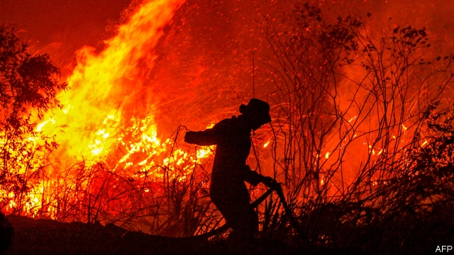

###### Gasping for air

# Burning forests are blackening the skies of South-East Asia 

 

> print-edition iconPrint edition | Asia | Sep 21st 2019 

THE AMAZON is not the world’s only smouldering rainforest, alas: fires are also raging in the jungles of Indonesia, blanketing much of South-East Asia in thick smoke. Some 3,300 square kilometres on the islands of Sumatra and Borneo have gone up in flames. The government has deployed more than 9,000 people and 52 aircraft to fight the fires. Indonesia and neighbouring Malaysia are also trying to quench the flames and clear the haze they produce by seeding clouds. But containing the infernos is even harder than usual because of dry weather, which has become more common as the climate changes. 

The haze is thought to have caused more than 200,000 respiratory infections and has prompted more than 1,500 schools in Malaysia alone to close. The smoke has been thick enough to disrupt air traffic. The president of Indonesia, Joko Widodo, says he is praying for rain. 

Indonesia’s environment and forestry ministry says most of the fires were lit deliberately. In one district, according to Doni Monardo of the National Disaster Mitigation Agency, 80% of the fires appear to be intended to convert forest into palm-oil plantations. In theory, using fire to do this is illegal, but the local officials who should stop it are easily bought off. The alternative—clear-felling the often swampy forest and disposing of the resulting waste—is expensive. Preparing land for plantations without using fire costs around $300-400 a hectare, says Herry Purnomo of the Centre for International Forestry Research, which is based in Indonesia, whereas burning costs $30. 

The fires are particularly difficult to extinguish because many of them are in peat forests. These are swampy jungles where vegetation that falls to the ground does not completely decay because of the waterlogged soil. When peat becomes dry enough to burn, it can continue to combust underground long after the trees on the surface have been doused. The resulting deforestation is especially harmful to the climate, since peatlands store as much as ten times more carbon per hectare than other forests. 

Since he was first elected in 2014, Mr Widodo, better known as Jokowi, has sought to stamp out the flames (there was another bad year in 2015, although forest-clearing fires are a feature of every dry season). In 2017 the forestry ministry launched a masterplan for protecting peatlands and preventing fires. The next year a national land-use map was released, making it easier for the authorities to establish land ownership and prosecute those responsible for fires. 

Jokowi’s government has come down relatively hard on the culprits. After the fires of 2015, police arrested 660 people. So far the authorities have arrested 200 people and are investigating some 370 companies in connection with the current fires. By contrast, only 40 or so were arrested under Jokowi’s predecessor, Susilo Bambang Yudhoyono. Fires are often started just outside palm-oil concessions to obscure responsibility. But the government could be tougher: as of February, some $220m in fines owed by plantation companies involved in past fires remained unpaid. They, at least, should be made to feel the burn. 

