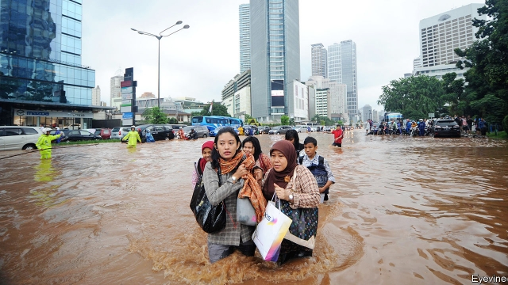

###### In deep trouble

# Climate change is forcing Asian cities to rethink their flood defences 

 

> print-edition iconPrint edition | Asia | Sep 21st 2019 

IN NORTH JAKARTA, not far from a quayside where workers unload frozen mackerel, a derelict building stands a metre deep in murky water. The warehouse was flooded in 2007, after torrential rains and a tidal surge submerged half the city under nearly four metres of water, displacing half a million people and causing $550m in damage. The building has remained inundated and abandoned ever since—barring the hardy soul who seems to be camping on the first floor, aided by a rowing boat. 

Floods have always plagued Jakarta, but in recent years they have become more severe. Many other cities in Asia are menaced by the same phenomenon. As the planet heats up, sea levels are rising. Heavy rainstorms are also becoming more frequent and tropical cyclones more intense. And Asia’s coastal cities are growing, even as the risk of flooding increases. The number of people living in flood plains in Asia is expected to more than double between 2000 and 2060, according to the Asian Development Bank (ADB). As cities grow, they exacerbate flood-risk by covering ground that would once have absorbed water with concrete and asphalt. The amount and value of the property at risk also grows. Thirteen of the 20 cities projected to have the biggest increases in annual losses caused by flooding between 2005 and 2050 are in Asia. 

Jakarta exemplifies the typical response to rising tides and swelling rains. Though Akuarium, a neighbourhood of shanties, is on the coast, it is impossible to see the sea from its dirt streets. A three-metre-tall sea wall stands in the way. For centuries Jakarta’s authorities have dispatched engineers to hold back the rising waters. In the 18th century they built flood canals; in the 19th century, retention ponds. After the floods of 2007 they raised the existing 30km-long sea wall, widened and dredged the canal system and dug more retention ponds. The idea that the water would recede if only nature could be tamed still motivates Indonesia’s planners. After another disastrous flood in 2013, the president of the day instructed his ministers to be bolder. The result was the National Capital Integrated Coastal Development (NCICD), a $40bn mega-project consisting of a 25km outer sea wall and 17 artificial islands which would seal off Jakarta Bay. 

The plan was controversial because of its huge cost, the damage it would do to the maritime ecosystem in the enclosed bay and the fact that it did not deal with a significant cause of flooding in Jakarta: subsidence. Though the sea is rising by 0.8cm a year, parts of northern, coastal Jakarta are sinking by 25cm a year, according to Heri Andreas, a geologist at the Bandung Institute of Technology. At least 40% of residents tap into aquifers, either because they are not connected to mains water or, if they are, because their supply is unreliable and dirty. As they drain the water from under their feet, the soil is compressed. Forty percent of Jakarta is now below sea level. This means that water in the drainage system that would otherwise empty into the bay remains trapped in the city. And as Jakarta sinks, it is dragging its dykes down with it. 

Building the plants and pipes to supply treated water is expensive and time-consuming, however, and the result is hidden out of sight. The NCICD plan, in contrast, would have sculpted 1,000 hectares of reclaimed land into a new waterfront city in the shape of a garuda, a mythical bird that is the symbol of Indonesia. “By developing North Jakarta, the project promises to [fulfil] the world-class city aspirations of Indonesia’s political elites,” writes Emma Colven of the University of Oklahoma. “People want to see visible infrastructure,” says Srinivasan Ancha of the ADB. 

In August the government signalled a change of tack. It announced plans to clean Jakarta’s public water supply and connect the entire city to it in an effort to stop groundwater extraction. The NCICD plan has also been revised. The sea wall will no longer enclose the bay, and the artificial islands have been scrapped, although 2,000 hectares of land will still be reclaimed for development. The cost has fallen by half. 

Jakarta is not the only Asian city to get cold feet about big engineering schemes in recent years, and to embrace cheaper flood-control measures. The most notable convert is Singapore, which is no stranger to monumental waterworks. It recently completed a vast underground retention pond at a cost of S$227m ($164m), a cathedral of concrete buttresses fed and drained by pipes you could drive a car through. The city is so proud of Marina Barrage, a system of huge pumps and nine 27-metre-long hydraulic gates to stop the business district flooding, that it has turned the S$226m facility into a tourist attraction. Over the past decade it has spent a total of S$2.4bn on drains. Yet as the tiny city-state runs out of space for colossal new structures, and as ever more torrential storms threaten to overwhelm even the new, improved drainage network, Singapore has had to rethink the way it manages storm water. 

In 2006 Singapore launched a scheme to increase the city’s absorption capacity by natural means, by converting canals and reservoirs into streams and lakes and by creating wetlands and other spaces designed to flood. Swamps, after all, can absorb potentially ruinous floods, while mangrove forests can protect cities near the coast from storm surges. Maintaining them is much cheaper than building dykes. Singapore completed 75 projects to mimic such natural flood defences between 2010 and 2018. The scheme, which also helps to harvest rainwater, is the first of its kind in the tropics. But the rest of Asia, with far less to spend on colossal flood defences, will surely follow suit. ■ 

