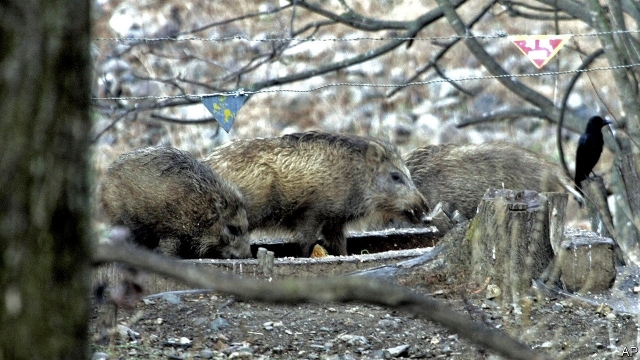

###### Boar war

# The disease killing Asia’s pigs continues to spread 

 

> print-edition iconPrint edition | Asia | Sep 21st 2019 

THE BORDER guards were to attempt to catch the infiltrators alive but, if that failed, to shoot to kill. But somehow, a few stealthy interlopers seem to have managed to sneak past the hundreds of thousands of soldiers defending South Korea from its hostile neighbour to the north. The South Korean authorities were desperate to stop the wild boars in question, for fear that they might inadvertently import African swine fever, a disease known to have been present in North Korea since May. On September 17th the South Korean government confirmed that five pigs on a farm in Paju, close to the border, had died of swine fever. The government immediately issued a 48-hour ban on moving pigs and said that 4,000 pigs on and near the affected farm would be culled. But the next day it reported a second case in a neighbouring county. Authorities are still investigating what caused these outbreaks, but wild boar are plausible suspects. 

South Korea is the latest country in Asia to be affected by the disease, which is harmless to humans but usually deadly for pigs and for which there is neither a cure nor a vaccine. Since the first case was reported in China a little over a year ago, it has spread across the continent. It reached Mongolia in January, Vietnam in February and Cambodia in April. Laos reported its first case in June. In August it spread to Myanmar and earlier this month to the Philippines. 

In an attempt to halt contagion, perhaps 60m pigs have been culled in China and a further 5m in Vietnam. But in several of the afflicted countries the regulation and monitoring of livestock and the reporting of outbreaks is patchy, to say the least, making it hard to be certain how far the disease has spread. North Korea, for instance, has disclosed only a single occurrence, on the border with China on May 23rd, even though the arrival of the disease in the South suggests it has travelled the length of the country. The site of the first known outbreak in Myanmar, meanwhile, is Shan state, a lawless region controlled in large part by militias suspicious of the central government. 

Surprisingly, Thailand, home to CP Foods, the biggest pork producer outside America and China, seems to have avoided the affliction so far, even though it has long and largely unguarded borders with three of the affected countries. That may be because pig-farming there tends to be on a bigger scale than elsewhere in the region, says Dirk Pfeiffer of City University in Hong Kong. In contrast, small farms, which produce much of the pork in China and South-East Asia, are particularly susceptible. Many smallholders either lack the expertise to protect their animals or cannot afford the fencing and uncontaminated feed needed to keep the disease at bay. 

That is not the problem in South Korea. High standards of food safety and reporting and well-functioning compensation mechanisms for farmers mean that it will probably be able to contain swine fever relatively successfully, says Mr Pfeiffer. South Koreans may have to pay a bit more for their barbecued pork in the months to come. But the country’s pig farmers are less likely than their counterparts elsewhere in the region to face complete destitution. ■ 

