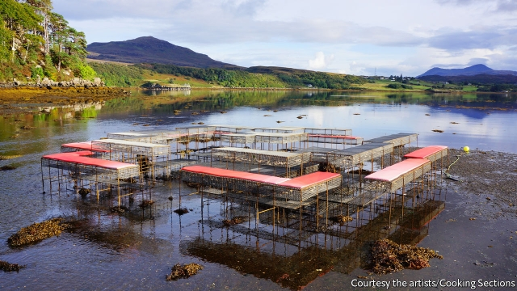

###### Food for thought

# Climate change is a challenge for artists 

 

> print-edition iconPrint edition | Books and arts | Sep 21st 2019 

WHAT TO WEAR to dine on the ocean floor? The invitation warned of the “changing weathers” of Scotland’s west coast. Oilskins and a sou’wester might have been appropriate. Or wellies. Or perhaps just bare feet. Over ten days in September 2017, Alon Schwabe and Daniel Fernández Pascual, the former an Israeli-born dancer and performance artist, the latter a Spanish architect, served meals with a message to anyone who, at low tide, was prepared to walk out into Bayfield Bay, off Portree, the capital of the Isle of Skye, to eat at their “oyster table”. 

The tabletops and benches that were the set for their performance were actually metal cages filled with oysters (pictured). At high tide they were completely submerged, and drew in seaweed and assorted molluscs. When the tide went out, the mesh became a dining room. Surrounded by their guests, the two artists, who work under the name Cooking Sections and call themselves “spatial practitioners”, set to work shucking shellfish and handing round kelp lasagne, nori crackers and scones made from sea lettuce and seaweed butter, all the while keeping up a practised storytelling routine. 

Their theme was how diets should be updated in response to climate change. Instead of herbivores or carnivores, the pair say, people should consider becoming “climavores”—eating more locally sourced food and changing menus according to the season. Their interest in the idea began with a project among the Inuit in Alaska in 2014. Later this year they will perform at the Venice Biennale; next year they will set out their stall at Tate Britain in London. 

For centuries artists generally saw nature as the work of God. Today many discern the hand of man behind polluted seashores and vanishing species. But making art out of climate change, rather than from nature itself, has not proved straightforward. While it is useful material for apocalyptic films, climate change makes a tough subject for painting and sculpture. The scale and complexity mean that depicting it in visual terms is hard—as the bedraggled rubber squid and limp flora on show at Venice inadvertently attest. Equally challenging, for those whose aim is didactic, is finding the most fitting artistic way to raise awareness of the crisis. 

The world’s best known climate-change artist is Olafur Eliasson. He began his career at 15, selling gouaches of landscapes he had encountered on walks with his Icelandic father, a painter. Later he photographed shrinking glaciers and polluted rivers. But it was his experiments with geometry and architecture, beginning in his late 20s, that led Mr Eliasson to make big conceptual pieces that use light, water and varying temperatures to create sensory experiences for his audiences. The “Weather Project” (2003) employed a vast “sun” to flood the Turbine Hall at Tate Modern in London with yellow light, hinting at a future of ever higher temperatures. Audiences threw themselves into the performance. They lay on the floor, made star shapes with their bodies and took endless selfies—forms of engagement that have since become the norm at exhibitions around the world. 

The “Weather Project” was the first large-scale effort to deal with climate change in contemporary art. Fifteen years later, Mr Eliasson brought 24 massive chunks of ice from Greenland to the banks of the Thames in a work called “Ice Watch London”. As the ice melted outside Tate Modern, performance and protest fused. “I believe in challenging people’s perspectives and the numbness of the political sphere,” Mr Eliasson says. He notes that far more people saw the installation in London than would have done in Greenland—but some critics pointed out the cost in energy of transporting the ice across the Atlantic (there were installations in Copenhagen and Paris, too). 

Less well known, but in their own, quieter way as effective, are the growing cadre of artists who are developing pieces that engage directly with communities. “Climate-change art doesn’t have to be shouty,” says Aaron Cezar, director of the Delfina Foundation in London, which has arranged the performance-art programme in Venice this year. “It’s about making complex ideas simple, and about connecting.” 

Consider, for example, “The Edible Hut” in Detroit, Michigan. The hut is a community and performance space with an edible roof made of plants, erected by Mira Burack, who works under the name Matterology. Or Renzo Martens, a Dutch film-maker and conceptual artist, who works in Congo, drawing attention to the ecological impact of the palm-oil industry. Or Vivien Sansour, a film-maker and storyteller who has collaborated with farmers in Honduras, Uruguay and the West Bank. Through her narratives she encourages them to grow heritage varieties of vegetables and share their seeds, thereby earning the nickname, the “Seed Queen of Palestine”. 

This is the expanding niche—between big-time pyrotechnics and the struggle of figurative art to capture the scope and peril of climate change—in which Cooking Sections operate. Their climavore project was commissioned by Atlas Arts, a Scottish cultural agency, which stumped up £150,000 ($186,000) of public subsidy. The artists wanted to draw attention to the particular problems of the seas around Skye: increasing acidification and toxic algae blooms caused by rising temperatures, as well as the harm done to the ocean floor around the island by intense salmon farming that continues to grow. 

As part of the performance, they asked Ben Oakes, a local scallop-diver, to give talks focused on the damage inflicted by scallop-dredging. A seaweed forager spoke of the many possible uses for kelp, including flavouring gin. Three of the island’s best-known chefs undertook to stop serving farmed salmon, creating special “climavore” menus instead. Cooking Sections themselves gave a number of workshops in the local high school about cooking with foraged ingredients; three school-leavers are being offered “climavore” apprenticeships each year in nearby restaurants. 

The project has succeeded, the artists believe, because it has engaged with locals, as well as with some of Skye’s 500,000 visitors a year. “It has injected a real energy into the conversation, about how people might do things differently in the future,” Mr Schwabe says. Mr Eliasson’s verdict on climate activism in art is more oracular. “The madman of yesterday”, he says, “will be the visionary of tomorrow.” ■ 

