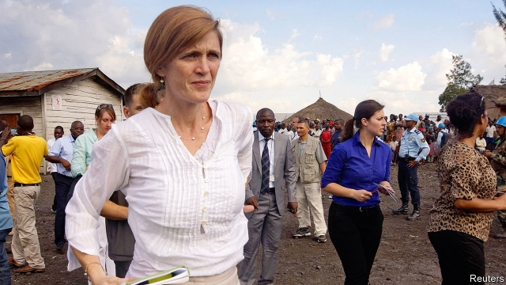

###### Absolute Power

# Samantha Power’s portrait of American diplomacy 

 

> print-edition iconPrint edition | Books and arts | Sep 21st 2019 

The Education of an Idealist. By Samantha Power.Dey Street Books; 592 pages; $29.99. William Collins; £20. 

IN AUGUST 2013 a devastating chemical-weapons attack on the Damascus suburbs killed some 1,400 people. Faced with a clear breach of the red line he drew a year earlier, President Barack Obama had to decide what to do. He blinked. Rather than ordering reprisals against the regime of Syria’s president, Bashar al-Assad, he opted to ask for Congress’s permission first. And Congress, it turned out, was not keen. 

Samantha Power, Mr Obama’s new ambassador to the United Nations, faced a choice, too. She had spent her professional life arguing for a more assertive American response to atrocities. She believed her boss should punish this horrendous crime, and indeed earlier ones, with air strikes. Now her idealism confronted the complexities of government. Should she resign, as some critics urged her to do? 

She opted to stay on. Yet she also rejected the choice once put to her at the UN by Mexico’s ambassador there: that she had to decide whether she was a diplomat or an activist. Instead, as she describes in this engaging memoir, she tried (at times uneasily) to be both. Although her time at the UN was quite recent, from mid-2013 to early 2017, her account of her hyperactive global engagement is a fascinating description of a different era of diplomacy. President Donald Trump sets little store by the UN, allowing most of this year to pass with only an acting American ambassador there. 

During the courtesy calls she made to all her fellow UN ambassadors (except North Korea’s), Ms Power was keen to learn about their personal histories. Her own is as unlikely as any. She was born in Ireland. Her gifted but alcoholic father used to take her to a grubby Dublin pub; he died when she was 14. By then she had already left for America with her ambitious mother and supportive stepfather, both doctors. She loved sports; while helping out on a baseball broadcast at a local station in Atlanta in 1989, she saw the raw video feed of events in Tiananmen Square, where Chinese forces attacked protesters. She found herself wondering what America’s government would do in the face of such brutality. 

The same question returned with a vengeance when, after Yale and an internship at a Washington think-tank, Ms Power became absorbed by the deepening crisis in the Balkans. She chronicled its horrors as a freelance journalist in Bosnia, for this newspaper among others. In 1995, back in America and on her way to Harvard Law School, she cried with relief on hearing that NATO was launching the air strikes that would break the siege of Sarajevo. 

One killing spree was over, but not Ms Power’s obsession with the subject. Friends joked that she was “all genocide, all the time”. Her book, “A Problem from Hell”, won a Pulitzer. She coined the word “upstanders” (as opposed to “bystanders”) to describe those who tried to take a stand against genocide; it found its way into the Oxford English Dictionary. And, after meeting Mr Obama over dinner in 2005, she found her way onto the staff of the young senator from Illinois. 

Her friendship with Mr Obama survived the embarrassment she caused during his presidential run when, in an unguarded moment, she called his rival, Hillary Clinton, a “monster”. Through the campaign she met her husband, Cass Sunstein, a law professor and author. After Mr Obama’s victory she got the chance to apply her activism in government, first handling UN-related matters at the National Security Council, then at the UN itself in New York. 

The second half of Ms Power’s memoir is an insider’s account of foreign-policy-making, and an intensely personal one. Her own life as a diplomat involved juggling the demands of her job and those of her two young children. She thought John Kerry, as secretary of state, surprisingly warm, and was distressed to find Aung San Suu Kyi, Myanmar’s heroine, a bad listener. Her most intriguing relationship was with Vitaly Churkin, Russia’s veteran ambassador at the UN (who died shortly after her time there). It developed into “something resembling a genuine friendship”. After one argument, she told him she knew he had mixed motives, half sincere and half ulterior; no, he shot back, “we are fully sincere about achieving our ulterior motive.” Not surprisingly, given the growing antagonism between Russia and the West, the near-friendship yielded limited results. 

Despite the frustrations, Ms Power can claim that her wins mounted up. Many were low-key, such as a hands-on campaign to free a number of women political prisoners or the successful defence of benefits for UN employees in same-sex marriages. A bigger deal—though its impact is questionable—was the agreement she helped negotiate with Churkin to remove Syria’s chemical-weapons stocks. Better, involvement in the Central African Republic “led some to claim that we helped avert a genocide”. Mobilisation of efforts to combat Ebola in west Africa was “an example of why the world needed the United Nations, because no one country…could have slayed the epidemic on its own.” 

The activist-turned-diplomat regrets that America did not do more on Syria. But she firmly believes in the power of American diplomacy to do good: “On issue after issue, either the United States brought a game plan to the table or else the problem worsened.” Through it all is her abiding sense of wonder: that this girl from Dublin could be sitting behind the “United States” sign at the UN, speaking for America. ■ 

