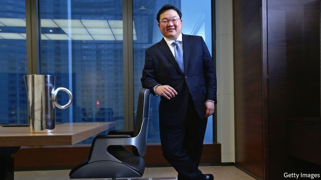

###### There she blows

# The story behind “Billion Dollar Whale” 

 

> print-edition iconPrint edition | Books and arts | Sep 21st 2019 

IT IS A dry name for what may prove the heist of the century. The 1MDB affair, involving the alleged theft of $4.5bn from the Malaysian state development fund of that name, has felled a Malaysian prime minister, ensnared Goldman Sachs and embarrassed Hollywood bigwigs. An impeccably researched book on the scandal—by Tom Wright and Bradley Hope of the Wall Street Journal—came out last year. But not in Britain, thanks to its strict libel laws and the efforts of its fearsome “reputation-management” industry. That omission was rectified on September 12th with the delayed publication of the British edition, even as legal threats continued to fly. 

“Billion Dollar Whale” focuses on the role of Jho Low (pictured), a baby-faced Malaysian playboy who American prosecutors allege was the mastermind of the misappropriation. Mr Low, a fugitive sought by Interpol (and believed to be in China), has been charged with money-laundering-related offences in America and Malaysia. He maintains his innocence. His spokesman says the book is “trial-by-media at its worst” and “guilt by lifestyle”. Among other extravagances, Mr Low threw lavish parties for bankers and celebrities, showering them with gifts, including a Picasso (since returned) for Leonardo DiCaprio. 

The problems for the book’s British release began when the local arm of its publisher, Hachette, declined to distribute it on behalf of the company’s American division because of legal threats from several people it mentioned. Scribe, a plucky independent house that also published an unflattering portrayal of the billionaire Koch brothers, later picked up the baton. 

The other source of discouragement was a campaign led by Schillings, a British law firm acting for Mr Low. In a move unusually aggressive even by British standards, Schillings bombarded not only the publisher but also distributors, in Britain and elsewhere, with threatening letters. Several booksellers received reams of missives, some hand-delivered, which advised that suggesting Mr Low was guilty of fraud was “outrageously defamatory”. Selling the book would potentially interfere “in the proper administration of justice in the United States”. Some vendors were warned against categorising the book as “true crime”. Many distributors were spooked. Amazon decided against selling the book in Britain (and some other European countries) after Hachette refused to indemnify it against legal action. 

Free-speech campaigners have bemoaned this assault on bookshops, not least because Schillings’s threats appear to rest on shaky legal foundations, even in Britain. The Defamation Act of 2013 states, in effect, that distributors cannot be targeted unless it is impossible to go after the publisher, author or editor. For all the bombast, Mr Low is not believed to have sued or tried to sue Hachette, Scribe, Messrs Wright and Hope, or anyone else involved. Schillings declined to comment. But this is the only known case of lawyers in Britain targeting book distributors on defamation grounds since the law of 2013 was passed. 

In the run-up to the British release, Scribe issued a statement reassuring British booksellers that they are on safe legal ground. Most, including Amazon, are now willing to stock “Billion Dollar Whale”. (A few brave shops have done so already, using copies ordered from America.) Sarah Braybrooke of Scribe says orders from British outlets are “excellent”. 

Publication in the spiritual home of the libel complaint does not, however, mean Mr Low will necessarily consider his efforts wasted. “Knocking a few stockists out of the loop for a time by maximising pressure on them may be the best he could have hoped for,” says one media lawyer. The campaign, he reckons, was probably always more about damage limitation than legal redress. “It’s not clear to me how someone on the run, facing criminal charges and wanted by Interpol, is able to do this,” Ms Braybrooke observes. 

The fight goes on. Schillings continues to fire off letters, recently sending another batch to bookshops around the world to coincide with an updated edition. Scribe has received ten letters in the past six weeks, mostly demanding that it comply with data-protection laws by handing over all personal information it holds on Mr Low. “It’s intimidating,” says Mr Hope; “but it’s also good publicity for our book.” ■ 

