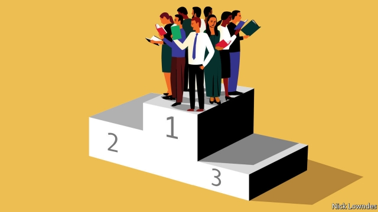

###### Johnson

# Which is the best language? 

 

> print-edition iconPrint edition | Books and arts | Sep 21st 2019 

MAURICE DRUON of the French Academy once proposed that French should be made the principal legal language of the European Union. He argued that its logic and precision rendered it the judicial language par excellence. Others chortled. How very French of him! 

The French are hardly alone in believing that their language is especially poetic, emotional, logical, precise, accessible or rich. But it turns out that the things people prize in their own languages can often be the same things foreign learners hate. Take the formal-informal distinction in words for “you”. German and French have du and tu for friends and family, and Sie and vous for unknown adults and formal speech. Natives of those languages miss that distinction when speaking English. Those whose languages (like English) don’t make it in the first place often resent having this choice forced on them in French or German. 

A dictum among linguists is that languages differ not in what they can express, but in what they must. Given the time and willingness to explain or coin basic terms, any language could be used to talk about anything. But they vary wildly in what they insist speakers say, with the tu-vous distinction just the tip of an iceberg. Washo, a native language of Nevada, has four past and three future tenses, depending on how distant an event is in time. Tariana, from Brazil, has “evidentiality”: speakers choose one of five verb-endings to show how they know what they aver to be true. Jarawara, also from Brazil, distinguishes “we (including you)” and “we (without you)”. 

The many different things a language can and must do are the subject of “Are Some Languages Better than Others?”, a book from 2016 by R.M.W. Dixon of James Cook University in Australia. Mr Dixon dispels old colonialist prejudices that European languages are sophisticated and indigenous ones primitive. Indeed, many of the most nuanced discriminations are required not by French or German but among isolated traditional communities. 

In answering his title’s provocative question, Mr Dixon finds that requiring distinctions (formal or informal “you”, inclusive or exclusive “we”, evidentiality), is useful. The more information, the better. But not every language can require every distinction: a language that had them all would be too hard for members of the community to learn, to say nothing of outsiders. There may be an outer limit to how complex languages can get, constrained by the brain’s processing power. 

Into the argument about whether some languages are superior comes a recent paper on information density in speech, by François Pellegrino and his colleagues at the University of Lyon. Some languages, like Japanese, have few distinct sounds and tight rules on how syllables may be structured, so that the number of possible syllables is low (think ka, ru, to, etc). Other languages (like English) have fewer constraints, so that a single syllable may be as complicated as strengths. All things being equal, one syllable chosen among English’s thousands will carry more information than one picked from Japanese’s dozens. But the study finds that this imbalance is counteracted by speech rate: speakers of Japanese get in many of their simple syllables more quickly than English-speakers do their complicated ones. Overall information density turns out to be the same across hugely different tongues. 

In short, languages are governed by trade-offs. One that avoids making certain information mandatory may be easy to speak, but leaves the listener to fill in the gaps. It may be simple to learn but less expressive. Some languages have lots of redundant elements: in los tres gatos negros están mojados (“the three black cats are wet” in Spanish), all six words indicate a plural. Marking the plural just once (as Chinese does) would be enough. But redundancy has a virtue: emphatic communication is more likely to survive a noisy environment. 

Languages, Mr Dixon says, are like a Western-style house. There are a few rooms you must have (kitchen, bedroom, living room, bathroom), and some discretionary options (office, guest room). On a fixed budget, you can’t have all the extras. He does not crown a “best” language. In the end, he says, readers should make their own list of desirable features, and then closely examine a few languages to decide whether one has more of them than another. But the list of advantages, he concedes, is itself a matter of judgment. For all his scientific criteria, in the end the verdict is in the ear of the beholder. 

