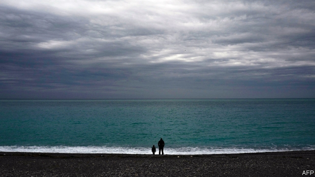

###### Kids these days

# Youth and age collide in Emma Donoghue’s new novel 

 

> print-edition iconPrint edition | Books and arts | Sep 21st 2019 

Akin. By Emma Donoghue. Little, Brown; 352 pages; $28. Picador; £16.99. 

EMMA DONOGHUE specialises in odd couples. Even before her international bestseller, “Room” (2010), in which a sociopath keeps a mother and her young son prisoner in a soundproof shack, Ms Donoghue was writing short stories and novels (set in her native Dublin) about relationships and households that defy conventional definitions of family. “Akin”, her spirited, highly accomplished new book, indicates, by its title at least, that although this time her characters inhabit a different milieu, her theme is a familiar—and familial—one. 

Noah Selvaggio, a widower and retired scientist, is nearing his 80th birthday. He lives in an Upper West Side apartment crammed with works by his French grandfather, a world-renowned photographer who practised under the pseudonym Père Sonne (“No One”). Memories of Noah’s late wife, Joan, and his younger sister, Fernande, crowd in. Noah is childless; his only nephew, Victor, died of an overdose at 26. Still mentally and physically active, he is terrified of extreme old age. An unusual bequest from Fernande of old photos taken by their mother, Margot, during the Nazi occupation of Nice, leads him to plan a trip to the city of his birth to uncover their provenance—and learn more about his family’s wartime past. 

Into this grand scheme is rudely thrust a hitherto unknown great-nephew, Michael. Sparky and vulnerable, the 11-year-old is the offspring of the deceased Victor and Amber, who is in jail for alleged drug-dealing. The relative with whom Michael had been living in a gritty part of Brooklyn has died, and his options are stark: Noah or the social services. Reluctantly, Noah agrees to take him in temporarily—which will mean Michael going with him to Nice. 

The pair bicker from the start. Michael is potty-mouthed, a seemingly endless consumer of junk food and addicted to violent video games. He is also bright, witty, endearing—and scared. He wets the bed at night, and scoffs at Noah’s vain attempts to inject some culture, and vegetables, into his mind and body. 

“How could anyone bear to be a parent?” Noah marvels. “Like contracting to love a werewolf.” The two become unlikely detectives as Michael’s technological nous, and Noah’s learning, lead to the slow revelation of Margot’s role in the real-life Marcel Network—an underground movement that saved hundreds of Jewish children in 1943-45. Whether Margot was a collaborator or resistance heroine is not revealed until the end of the novel. As well as this fascinating slice of European history, “Akin” offers a subtle, entertaining portrait of the relationship—and friction—between age and youth. ■ 

