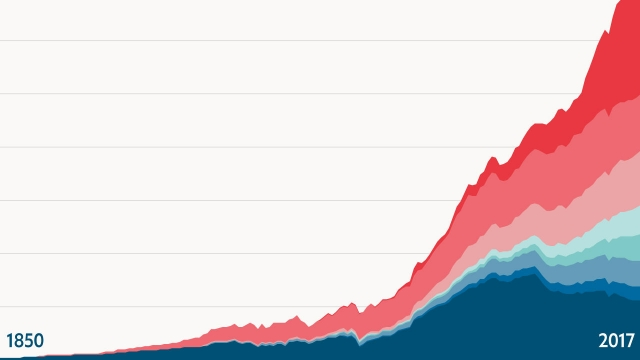
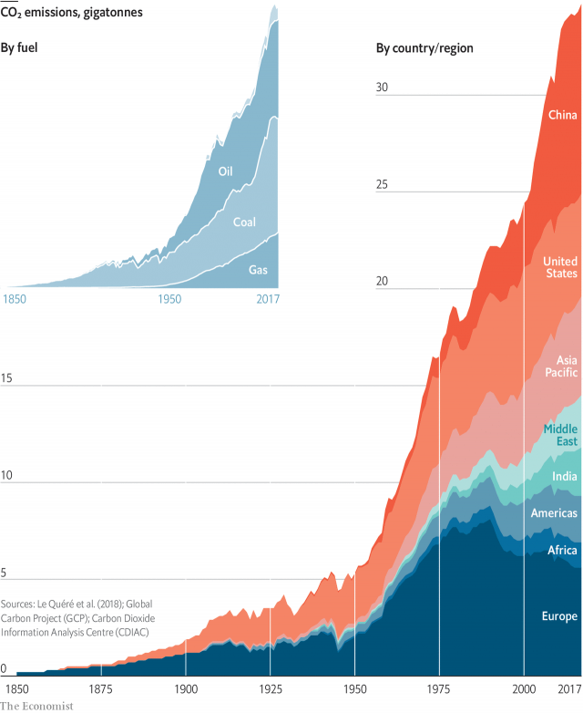
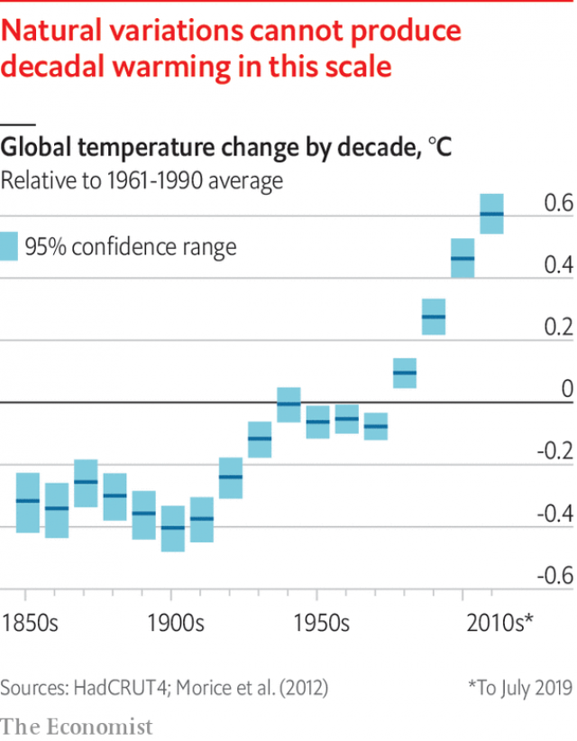
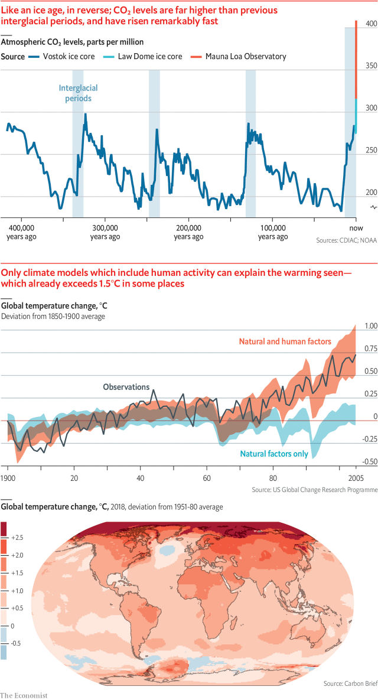
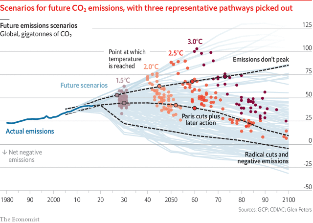
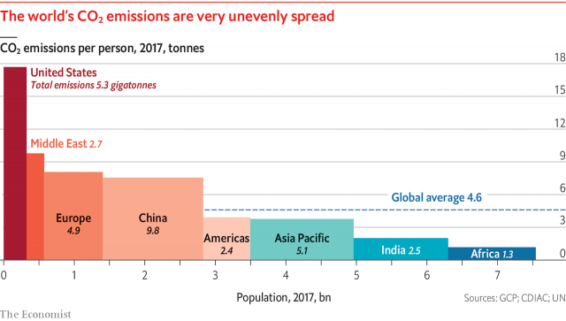

###### Global warming 101

# The past, present and future of climate change 

 

> print-edition iconPrint edition | Briefing | Sep 21st 2019 

IN THE EARLY 19th century Joseph Fourier, a French pioneer in the study of heat, showed that the atmosphere kept the Earth warmer than it would be if exposed directly to outer space. By 1860 John Tyndall, an Irish physicist, had found that a key to this warming lay in an interesting property of some atmospheric gases, including carbon dioxide. They were transparent to visible light but absorbed infrared radiation, which meant they let sunlight in but impeded heat from getting out. By the turn of the 20th century Svante Arrhenius, a Swedish chemist, was speculating that low carbon-dioxide levels might have caused the ice ages, and that the industrial use of coal might warm the planet. 

 

What none foresaw was how fast, and how far, the use of fossil fuels would grow (see chart above). In 1900 the deliberate burning of fossil fuels—almost entirely, at the time, coal—produced about 2bn tonnes of carbon dioxide. By 1950 industrial emissions were three times that much. Today they are close to 20 times that much. 

That explosion of fossil-fuel use is inseparable from everything else which made the 20th century unique in human history. As well as providing unprecedented access to energy for manufacturing, heating and transport, fossil fuels also made almost all the Earth’s other resources vastly more accessible. The nitrogen-based explosives and fertilisers which fossil fuels made cheap and plentiful transformed mining, warfare and farming. Oil refineries poured forth the raw materials for plastics. The forests met the chainsaw. 

In no previous century had the human population doubled. In the 20th century it came within a whisker of doubling twice. In no previous century had world GDP doubled. In the 20th century it doubled four times and then some. 

An appendix to a report prepared by America’s Presidential Science Advisory Committee in 1965 marks the first time that politicians were made directly aware of the likely climate impact of all this. In the first half of the century scientists believed that almost all the carbon dioxide given off by industry would be soaked up by the oceans. But Roger Revelle, an oceanographer, had shown in the 1950s that this was not the case. He had also instituted efforts to measure year-on-year changes in the atmosphere’s carbon-dioxide level. By 1965 it was clear that it was steadily rising. 

The summary of what that rise meant, novel when sent to the president, is now familiar. Carbon stored up in the crust over hundreds of millions of years was being released in a few generations; if nothing were done, temperatures and sea levels would rise to an extent with no historic parallel. Its suggested response seems more bizarre: trillions of ping-pong balls on the ocean surface might reflect back more of the sun’s rays, providing a cooling effect. 

 

The big difference between 1965 and now, though, is what was then a peculiar prediction is now an acute predicament. In 1965 the carbon-dioxide level was 320 parts per million (ppm); unprecedented, but only 40ppm above what it had been two centuries earlier. The next 40ppm took just three decades. The 40ppm after that took just two. The carbon-dioxide level is now 408ppm, and still rising by 2ppm a year. 

Records of ancient atmospheres provide an unnerving context for this precipitous rise. Arrhenius was right in his hypothesis that a large part of the difference in temperature between the ice ages and the warm “interglacials” that separated them was down to carbon dioxide. Evidence from Antarctic ice cores shows the two going up and down together over hundreds of thousands of years. In interglacials the carbon-dioxide level is 1.45 times higher than it is in the depths of an ice age. Today’s level is 1.45 times higher than that of a typical interglacial. In terms of carbon dioxide’s greenhouse effect, today’s world is already as far from that of the 18th century as the 18th century was from the ice age (see “like an ice age” chart). 

 

Not all the difference in temperature between interglacials and ice ages was because of carbon dioxide. The reflection of sunlight by the expanded ice caps added to the cooling, as did the dryness of the atmosphere. But the ice cores make it clear that what the world is seeing is a sudden and dramatic shift in fundamental parameter of the planet’s climate. The last time the Earth had a carbon-dioxide level similar to today’s, it was on average about 3°C warmer. Greenland’s hills were green. Parts of Antarctica were fringed with forest. The water now frozen over those landscapes was in the oceans, providing sea levels 20 metres higher than today’s. 

There is no evidence that President Lyndon Johnson read the 1965 report. He certainly didn’t act on it. The idea of deliberately changing the Earth’s reflectivity, whether with ping-pong balls or by other means, was outlandish. The idea that the fuels on which the American and world economies were based should be phased out would have seemed even more so. And there was, back then, no conclusive proof that humans were warming the Earth. 

Proof took time. Carbon dioxide is not the only greenhouse gas. Methane and nitrous oxide trap heat, too. So does water vapour, which thereby amplifies the effects of the others. Because warmth drives evaporation, a world warmed by carbon dioxide will have a moister atmosphere, which will make it warmer still. But water vapour also condenses into clouds—some of which cool the world and some of which warm it further. Then and now, the complexities of such processes make precision about the amount of warming expected for a given carbon-dioxide level unachievable. 

Further complexities abound. Burning fossil fuels releases particles small enough to float in the air as well as carbon dioxide. These “aerosols” warm the atmosphere, but also shade and thereby cool the surface below; in the 1960s and 1970s some thought their cooling power might overpower the warming effects of carbon dioxide. Volcanic eruptions also produce surface-cooling aerosols, the effects of which can be global; the brightness of the sun varies over time, too, in subtle ways. And even without such external “forcings”, the internal dynamics of the climate will shift heat between the oceans and atmosphere over various timescales. The best known such shifts, the El Niño events seen a few times a decade, show up in the mean surface temperature of the world as a whole. 

These complexities meant that, for a time, there was doubt about greenhouse warming, which the fossil-fuel lobby deliberately fostered. There is no legitimate doubt today. Every decade since the 1970s has been warmer than the one before, which rules out natural variations. It is possible to compare climate models that account for just the natural forcings of the 20th century with those that take into account human activities, too. The effects of industry are not statistically significant until the 1980s. Now they are indisputable. 

 

At the Earth Summit in Rio de Janeiro in 1992, around the time that the human effect on the climate was becoming clearly discernible, the nations of the world signed the UN Framework Convention on Climate Change (UNFCCC). By doing so they promised to “prevent dangerous anthropogenic interference with the climate system”. 

Since then humans have emitted 765bn more tonnes of carbon dioxide; the 2010s have been, on average, some 0.5°C hotter than the 1980s. The Intergovernmental Panel on Climate Change (IPCC) estimates that mean surface temperature is now 1°C above what it was in the pre-industrial world, and rising by about 0.2°C a decade. In mid- to high-northern latitudes, and in some other places, there has already been a warming of 1.5°C or more; much of the Arctic has seen more than 3°C (see map). 

The figure of 1.5°C matters because of the Paris agreement, signed by the parties to the UNFCCC in 2015. That agreement added targets to the original goal of preventing “dangerous interference” in the climate: the signatories promised to hold global warming “well below” 2°C above pre-industrial temperatures and to make “efforts to limit the temperature increase to 1.5°C”. 

Neither 1.5°C nor 2°C has any particular significance outside these commitments. Neither marks a threshold beyond which the world becomes uninhabitable, or a tipping point of no return. Conversely, they are not limits below which climate change has no harmful effects. There must be thresholds and tipping points in a warming world. But they are not well enough understood for them to be associated with specific rises in mean temperature. 

For the most part the harm warming will do—making extreme weather events more frequent and/or more intense, changing patterns of rainfall and drought, disrupting ecosystems, driving up sea levels—simply gets greater the more warming there is. And its global toll could well be so great that individual calamities add little. 

At present further warming is certain, whatever the world does about its emissions. This is in part because, just as a pan of water on a hob takes time to boil when the gas below is lit, so the world’s mean temperature is taking time to respond to the heating imposed by the sky above. It is also because what matters is the total amount of greenhouse gas in the atmosphere, not the rate at which it increases. Lowering annual emissions merely slows the rate at which the sky’s heating effect gets stronger; surface warming does not come to an end until the greenhouse-gas level is no longer increasing at all. If warming is to be held to 1.5°C that needs to happen by around 2050; if it is to be kept well below 2°C there are at best a couple more decades to play with. 

Thus, in its simplest form, the 21st century’s supertanker-U-turn challenge: reversing the 20-fold increase in emissions the 20th century set in train, and doing so at twice the speed. Replacing everything that burns gas or coal or oil to heat a home or drive a generator or turn a wheel. Rebuilding all the steelworks; refashioning the cement works; recycling or replacing the plastics; transforming farms on all continents. And doing it all while expanding the economy enough to meet the needs and desires of a population which may well be half again as large by 2100 as it is today. 

“Integrated assessment models”, which combine economic dynamics with assumptions about the climate, suggest that getting to zero emissions by 2050 means halving current emissions by 2030. No nation is on course to do that. The national pledges made at the time of the Paris agreement would, if met, see global emissions in 2030 roughly equivalent to today’s. Even if emissions decline thereafter, that suggests a good chance of reaching 3°C. 

Some countries already emit less than half as much carbon dioxide as the global average. But they are countries where many people desperately want more of the energy, transport and resources that fossil fuels have provided richer nations over the past century. Some of those richer nations have now pledged to rejoin the low emitters. Britain has legislated for massive cuts in emissions by 2050. But the fact that legislation calls for something does not mean it will happen. And even if it did, at a global level it would remain a small contribution. 

This is one of the problems of trying to stop warming through emission policies. If you reduce emissions and no one else does, you face roughly the same climate risk as before. If everyone else reduces and you do not, you get almost as much benefit as you would if you had joined in. It is a collective-action problem that only gets worse as mitigation gets more ambitious. 

What is more, the costs and benefits are radically uncertain and unevenly distributed. Most of the benefit from curtailing climate change will almost certainly be felt by people in developing countries; most of the cost of emission cuts will be felt elsewhere. And most of the benefits will be accrued not today, but in 50 or 100 years. 

It is thus fitting that the most striking recent development in climate politics is the rise of activism among the young. For people born, like most of the world’s current leaders, well before 1980, the second half of the 21st century seems largely hypothetical. For people born after 2000, like Greta Thunberg, a Swedish activist, and some 2.6bn others, it seems like half their lives. This gives moral weight to their demands that the Paris targets be met, with emissions halved by 2030. But the belief that this can be accomplished through a massive influx of “political will” severely underestimates the challenge. 

It is true that, after a spectacular boom in renewable-energy installations, electricity from the wind and the sun now accounts for 7% of the world’s total generation. The price of such installations has tumbled; they are now often cheaper than fossil-fuel generating capacity, though storage capacity and grid modifications may make that advantage less at the level of the whole electricity system. 

One step towards halving emissions by 2030 would be to ramp such renewable-electricity generation up to half the total. This would mean a fivefold-to-tenfold increase in capacity. Expanding hydroelectricity and nuclear power would lessen the challenge of all those square kilometres of solar panels and millions of windmills. But increased demand would heighten it. Last year world electricity demand rose by 3.7%. Eleven years of such growth would see demand in 2030 half as large again as demand in 2018. All that new capacity would have to be fossil-fuel-free. 

And electricity is the easy part. Emissions from generating plants are less than 40% of all industrial emissions. Progress on reducing emissions from industrial processes and transport is far less advanced. Only 0.5% of the world’s vehicles are electric, according to BloombergNEF, a research firm. If that were to increase to 50% without increasing emissions the production of fossil-fuel-free electricity would have to shoot up yet further. 

 

The investment needed to bring all this about would be unprecedented. So would the harm to sections of the fossil economy. According to Carbon Tracker, a think-tank, more than half the money the big oil companies plan to spend on new fields would be worthless in a world that halved emissions by 2030. The implications extend to geopolitics. A world in which the oil price is no longer of interest is one very different from that of the past century. 

Dislocation on such a scale might be undertaken if a large asteroid on a fixed trajectory were set to devastate North America on January 1st 2031. It is far harder to imagine when the victims are less readily identifiable and the harms less cosmically certain—even if they eventually turn out to be comparable in scale. Realising this, the climate negotiators of the world have, over the past decade, increasingly come to depend on the idea of “negative emissions”. Instead of not putting carbon dioxide into the atmosphere at all, put it in and take it out later. By evoking ever larger negative emissions later in the century it is possible to accept a later peak and a slower reduction while still being able to say that you will end up within the 1.5°C or 2°C limit (see “four futures” chart). 

 

Unfortunately, technologies capable of delivering negative emissions of billions of tonnes a year for reasonable prices over decades do not exist. There are, though, ideas about how they could be brought into being. One favoured by modellers involves first growing plants, which suck up atmospheric carbon dioxide through photosynthesis, and then burning them in power stations which store the carbon dioxide they produce underground. A surmountable problem is that no such systems yet exist at scale. A much tougher one is that the amount of land required for growing all those energy crops would be enormous. 

This opens up a dilemma. Given that reducing emissions seems certain not to deliver quickly enough, it would seem stupid not to put serious effort into developing better ways of achieving negative emissions. But the better such R&D makes the outlook for negative emissions appear, the more the impetus for prompt emissions reduction diminishes. Something similar applies for a more radical potential response, solar geoengineering, which like the ping-pong balls of 1965 would reflect sunlight back to space before it could warm the Earth. Researchers thinking about this all stress that it should be used to reduce the harm of carbon dioxide already emitted, not used as an excuse to emit more. But the temptation would be there. 

Even if the world were doing enough to limit warming to 2°C, there would still be a need for adaptation. Many communities are not even well adapted to today’s climate. Adaptation is in some ways a much easier policy to pursue than emissions reduction. But it has disadvantages. It gets harder as things get worse. It has a strong tendency to be reactive. And it is most easily achieved by those with resources; people who are marginalised and excluded, who the IPCC finds tend to be most affected by climate change, have the least capacity to adapt to it. It can also fall prey to the “moral hazard” problem encountered by negative emissions and solar geoengineering. 

None of this means adaptation is not worthwhile. It is vital, and the developed nations—developed thanks to fossil fuels—have a duty to help their poorer counterparts achieve it, a duty acknowledged in Paris, if as yet barely acted on. But it will not stabilise the climate that humans have, in their global growth spurt, destabilised. And it will not stop all the suffering that instability will bring. ■ 

