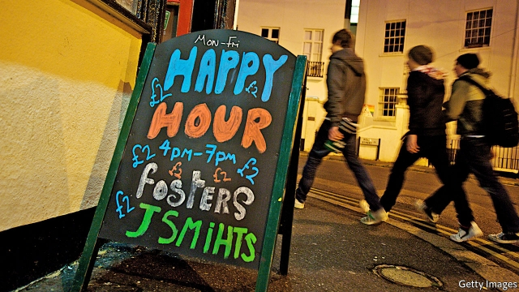

###### Tequila crammers

# As Britain’s students hit the library, university bars call time 

 

> print-edition iconPrint edition | Britain | Sep 21st 2019 

TO THE DISAPPOINTMENT of Molly, a 19-year-old at the University of Portsmouth, the Waterhole Bar is no more. “I enjoyed pre-ing in there with friends,” she sighs. “We’d get together, have a few snakebites, get hyped.” Access was restricted to students, meaning it felt safe. Karaoke Fridays were fun. But students were recently told the bar would be replaced with a “vibrant, student-centred and social-gathering space”. 

In a pre-mobile-phone era, university bars were a place to bump into people you knew and enjoy cheap drinks. Brewers sold booze at below cost price to get students hooked on certain brands. No longer. Abertay, in Dundee, has also closed its bar. Chester and Coventry have transformed theirs into “events spaces”. Many have already become places which offer not just alcohol but also pizzas, coffee and laptop charging, notes Jim Dickinson of Wonkhe, a think-tank. 

In the 2000s pubs began competing harder for students’ custom, taking business away from university bars. And young people are drinking less. Three in ten 16- to 24-year-olds are teetotal, up from two in ten in 2005. Many of those who indulge will pre-drink at a friend’s flat, rather than a bar, before heading to a club. To stroll through Portsmouth’s campus in freshers week is to be bombarded with information about nights out: Dirty Disco (drinks: £1.50, or $1.90), Connection (“indie, retro and electro alternative”) and the Eskimo Project (“the club so big it requires 2 venues”). 

Ben Archer, a third-year student, stayed away from the Waterhole. “It was quite grim, it didn’t smell great,” he recalls. College bars were not the best places to induct foreign students—who make up 14% of undergraduates—into British drinking culture. And the culture has anyway been watered down, says Ian Dunn, Coventry University’s provost. “Students are more serious about study,” he explains. “The library is full.” 

