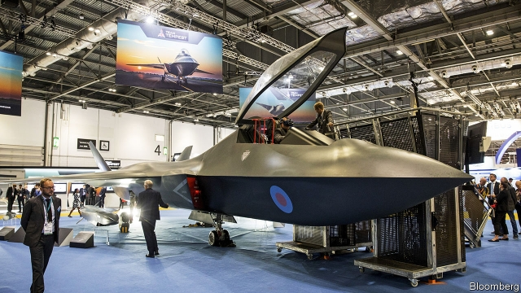

###### Tempestuous times

# Britain’s Tempest warplane heads for a dogfight with an EU rival 

 

> print-edition iconPrint edition | Britain | Sep 21st 2019 

FOR A FEW days, the ExCeL convention centre in east London was transformed into a Disneyland for arms dealers. On September 10th-13th Defence & Security Equipment International (DSEI), one of the world’s largest weapons bazaars, filled its cavernous halls with enough tanks, missiles and drones to invade a small country. Towering above all of these was a full-sized model of a sleek warplane with sprawling wings and a nose like a bulbous arrowhead. 

The aircraft in question, Tempest, is to be the jewel in the crown of Britain’s £23bn ($29bn) defence industry. In two decades Britain’s Eurofighter Typhoons will be retiring and the fifth-generation F-35 Lightning will be creaking at the joints. If Britain wants to keep flying world-class warplanes, and to retain the expertise to build and export them, it must start work now. To that end, in July 2018 the government announced nearly £2bn of funding over ten years as part of its Combat Air Strategy. 

Over 1,000 people are working on Team Tempest, as the consortium of BAE Systems, Rolls-Royce, Leonardo and MBDA is known, with that number set to rise to 2,500 by 2021. The plan is to get the Tempest in the air by 2035—and to “take Global Britain into the stratosphere”, as Ben Wallace, the defence secretary, put it at DSEI. 

Since modern warplanes are eye-wateringly expensive to build and buy, few countries embark on the effort alone. Britain chalked up its first success in July, when Sweden—a proficient manufacturer of fighter jets, through Saab—agreed to co-operate on future aircraft, beginning with a one-year study due in autumn 2020. Then on September 10th Italy announced that it would also partner with Team Tempest. Britain hopes that those decisions will sway others who are mulling over the future of their fleets, bringing technological know-how and economies of scale. Japan, Australia and Turkey are all mooted as potential partners. 

The catch is that other warplanes are available. Several European countries are co-operating to build their own sixth-generation “air system” (a term that reflects the fact that the warplane itself will be only one part of a larger network, which might include drone swarms). France, which shunned participation in the European Typhoon project and the American-led F-35, favours its own national champion, Dassault. Moreover, France and Germany both want the European Union to develop a more integrated and mature defence industry, capable of holding its own against American behemoths. 

At the Paris Air Show in June, the French, German and Spanish defence ministers announced a partnership between Dassault and Airbus, funded with €4bn ($4.4bn) to 2025, building on an earlier Tempest-like initiative known as Future Combat Air System. It was a “big day for the European defence union”, noted Ursula von der Leyen, then German defence minister and now president-elect of the European Commission. 

Yet for all this flurry of activity, there is scepticism that the result will be two flying planes. “Competition among Europeans when it weakens us against the Americans [and] the Chinese is ridiculous,” complained Emmanuel Macron, France’s president, in June. The economic logic might suggest that the British-led project and continental one ought to merge. But the political logic says otherwise. France is set on a plane that can take off from aircraft-carriers and carry nuclear bombs, whereas Britain has the F-35 for that. The rivalry between BAE and Dassault will also be hard to surmount; neither would readily give up its lead status. And Britain’s close military ties with America make it sceptical of the idea of a common European defence-industrial front. 

As ever, Brexit adds a wrinkle. If and when Britain leaves the EU, it will be pushed to the fringes of the bloc’s defence projects, and cut out of some entirely. Earlier this month Britain even asked the EU to downgrade the defence pledges made in the non-binding political declaration of the withdrawal agreement, seeking a more complete break. Many Europeans would consider it odd for the bloc to bolster its indigenous defence capabilities, only to put its future air-power in the hands of a diplomatically freewheeling outsider. ■ 

