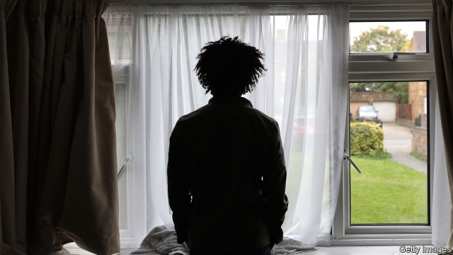

###### Employment-seekers

# Britain’s ban on jobs for asylum-seekers pleases nobody 

 

> print-edition iconPrint edition | Britain | Sep 21st 2019 

THE HOME OFFICE’S waiting room stretches the length and breadth of Britain. Somewhere in the queue is a 35-year-old Nigerian called Kemi. When she applied for asylum, in 2016, London seemed like heaven compared with the domestic abuse she suffered back home. She came to study but stayed after becoming pregnant, fearing that her baby, like her other two daughters, would suffer genital mutilation if she went back. Now, Britain seems closer to purgatory. She shares her flat with two other families. Antidepressants offer little respite. When her £38 ($47) weekly allowance runs out, she sometimes begs for money. Yet, like almost all those on the asylum waiting list, she is banned from working. “I have my hands, I have my skills,” she says. “I don’t need the government’s money. I want to be able to make my own.” 

The queue moves slowly. About half of asylum applicants wait more than six months for a decision, up from a fifth in 2015. Applications fell during this period, but staff were diverted to clear a backlog of candidates waiting more than ten years for a decision and to run the post-Brexit settlement scheme for Europeans, says Jill Rutter of British Future, a think-tank. 

The logjam has rekindled opposition to the work ban. Most rich countries allow asylum-seekers to work within a few months of submitting an application. They can take a job straight away in Canada and Sweden and after six months in America. In Britain, they could work after six months until 2002, when the then Labour government imposed the ban after a surge in asylum applications. Officials reckoned making money while on the waiting list encouraged applications, even by those with little chance of success. Since 2010, those on the list for more than a year can work, but only if they take a job on the government’s list of shortage occupations. “It was not a very useful shift,” says Ms Rutter. “They’ve very specific jobs: radiographer, ballet dancer.” 

There is little evidence that the work ban deters migrants. Surveys of asylum-seekers find that only a sixth knew before they came to Britain that they would not be able to work. Kemi was among those who assumed she would find a job. Factors such as ability to speak the language and the presence of relatives and friends have a greater bearing on a migrant’s decision to come to a particular country than short-term concerns like the application process. 

Lifting the ban would clearly help asylum-seekers themselves. Forced inactivity allows skills to atrophy and can contribute to mental illness, says Cornelius Katona of the Helen Bamber Foundation, a charity. The job ban also cheats the taxpayer, as in practice many asylum-seekers find work in the grey economy. Two-thirds of legitimate company bosses think they should be allowed to work after six months, according to a poll published on September 16th by Refugee Action, another charity. And changing the rules would not necessarily prove a vote-loser. British Future found that the vast majority of voters do not know about the ban. More than two-thirds would support a right to work after six months. 

The ban is at odds with the rhetoric of recent governments that benefit claimants must contribute to society. “It goes hugely against the man on the street’s common sense,” says Stephen Hale of Refugee Action. Lifting the ban may be too good an opportunity to pass up. The Home Office does not often have the chance to please do-gooders, populists and bosses at once. ■ 

