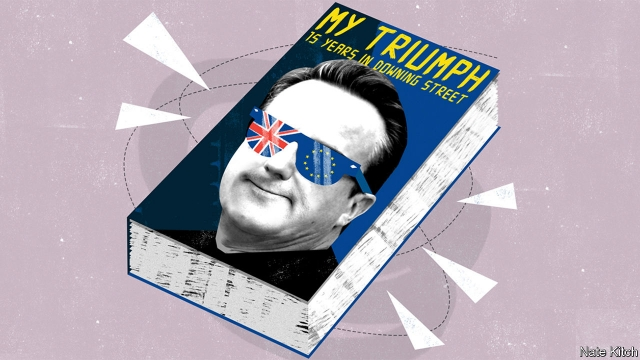

###### Bagehot

# David Cameron’s alternative memoirs 

 

> print-edition iconPrint edition | Britain | Sep 19th 2019 

A FRIEND ONCE asked Margaret Thatcher what she would do differently if she had her time again. After a pause for thought, she replied: “I think I did pretty well the first time.” I don’t feel quite the same way. I was wrong to withdraw Conservative MEPs from the European Parliament’s centre-right alliance. I was wrong to surround myself with so many chums from school and university. On reflection the “Big Society” contained too much hot air. But I do pride myself on one thing: I left behind a country that was far more at ease with itself than the one I inherited. 

The reason for this was the defining act of my career, the Brexit referendum of 2016. After the result was announced, the pundit class assured me with one voice that I didn’t deserve any credit for doing the blindingly obvious. “Mr Cameron was confronted with an open goal,” the Times editorialised. “All he did was kick the ball.” These were often the same people who, before the vote, had informed me that I risked unleashing monsters. I can only say that the referendum didn’t feel like an open goal at the time. The campaign tore the country apart and strained some of my closest friendships. And the result was worryingly close. I sometimes torment myself, in my more masochistic moments, by imagining what might have happened had it gone the other way! 

The fever of Euroscepticism eventually broke and Britain entered its current age of Euro-contentment. Nigel Farage moved to America for a gig with Fox News and a slot on the speaking circuit. I’m told that he has built quite a place in southern Florida—a mock-Tudor mansion complete with red telephone boxes and a working pub serving real ale, pie and mash. With his guiding hand removed, the UK Independence Party was captured by people who were so nauseating and ill-disciplined that membership collapsed. The Daily Mail was the only big-selling newspaper to continue to champion the lost cause and, after a particularly foam-flecked leader about “the traitor in Downing Street”, Viscount Rothermere stepped in to replace Paul Dacre with Geordie Greig, a sensible man as well as a good friend. 

What went unreported at the time was that the death of Euroscepticism also took a lot of work on my part. A good chunk of the Tory party had campaigned for the losing side. Millions of good people had voted to leave, not because they were fed up with Europe but because they were fed up with Britain. I tackled the Tory problem by forgiving the most talented Leavers, such as Boris Johnson and Michael Gove, while simultaneously marginalising the irreconcilables. New MPs only have to look at the desiccated hulks of Iain Duncan Smith and Jacob Rees-Mogg lounging in the parliamentary tea-room to know their fate if they step out of line. I dealt with the problem of the left-behind by announcing the end of austerity at the 2017 party conference and encouraging Boris, as business secretary, to make revitalising the north and the Midlands his priority—or, as he put it, a matter of “do or die”. 

I also threw myself into the European issue in a way that I’d never done before. I learned two things from the frustrating renegotiations leading up to the referendum. First, you can’t be a part-time member of the club—you have to put in time sitting on the committees. Second, you can’t underestimate the inflexibility of transnational bureaucrats. I kept up the pressure, ably assisted by Sir Ivan Rogers, agitating for the completion of the single market in services and issuing blood-curdling warnings about what would happen if they didn’t rethink freedom of movement. My position was enormously strengthened by Britain’s close relations with America, and my personal rapport with President Clinton (thank goodness she beat that charlatan calling himself “Mr Brexit”). 

I hope I’m not showing my colleagues any disrespect when I add that my greatest helper was not anybody on my side. Jeremy Corbyn is the gift that kept giving: an antediluvian leftist with noxious views and even more noxious friends; a dim bulb who prefers working on his allotment to mastering his briefs; and an old man in what, on our side at least, is a young man’s game (I’m 17 years his junior and I was one of the oldest members of our cabinet). At one point the fanatic was even overheard muttering “Fuck business.” Tony Blair used to say he felt physically sick while preparing for prime minister’s questions against William Hague. I came to look forward to my weekly duels with the Steptoe of Islington. 

Thankfully, from my perspective, Corbyn was good at just one thing—clinging onto power. He packed Labour’s executive committee with crazies and cronies. He introduced a programme of “rolling deselections” to weed out moderates. (One of the things that makes me proud to be a Conservative is that we would never stoop to deselecting MPs.) The more unelectable Labour became, the more Corbyn and his Stalinist controllers were entrenched in power. A tragedy for the country but a godsend for my party. 

Political obituarists like to quote Enoch Powell’s melancholy observation that “all political careers…end in failure”. I’m fortunate to have escaped that fate. The past few years have been heady ones. I don’t for a minute regret breaking my pledge not to stick around for a third term. The election victory in 2020 exceeded our wildest expectations. The Tory party is now everything I dreamed of all those years ago in Notting Hill—a national party with MPs in every corner of the country, from Scotland to inner-London, and a thoroughly modern programme. The EU has at last caved in on freedom of movement. And although I will miss Downing Street, in Ruth Davidson the party now has an ideal new leader. I know that Boris had a good claim to the job—and he has made clear that he is annoyed at being gazumped by a newcomer to Westminster—but the party rightly decided that a second Bullingdon boy in a row would be a mistake. Ruth is just the right person to carry on the work of modernisation, consigning Scottish nationalism to the dustbin of history in the same way that I saw off the madness of Brexit. ■ 

