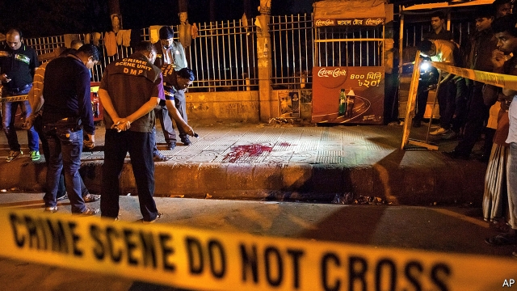

###### Radicalisation in reverse

# How Britain exports Islamist extremism to Bangladesh 

 

> print-edition iconPrint edition | Britain | Sep 21st 2019 

SINCE THE first wave of Bangladeshi migrants arrived in Britain in the 1970s, foreign-born preachers have held sway in the community. For a while the most visible consequence to outsiders was when Bangladeshi restaurants stopped selling alcohol, after conservative clerics such as Delwar Hossain Sayeedi came to preach temperance to the diaspora in the 1990s (some curry houses found a theological loophole in the form of “bring your own booze”). Recent years have seen more serious worries about the influence of foreign extremists. In February Shamima Begum, an east-London schoolgirl, was stripped of her British citizenship after running away to join Islamic State (IS) in Syria. 

Yet in Dhaka, amid a rising tempo of terrorist attacks, officials are asking who is radicalising whom. Bangladesh’s government often blames outsiders for its problem with radical Islam. But here it has a point. British citizens have been implicated in the planning, funding and promotion of terrorism in Bangladesh, to the alarm of the country’s security services. “We do not know what is driving radicalisation in Britain,” says a senior officer in Bangladesh’s Counter-Terrorism Intelligence Bureau, “but it is contaminating our society.” 

Britain’s exporting of radical Islam goes back a long way. Syed Golam Maula, the founder of the Bangladeshi chapter of Hizb-ut-Tahrir, an Islamist movement that is banned in Bangladesh but not in Britain, was introduced to the organisation while studying in London in the early 1990s. In 2015 Sheikh Hasina Wajed, the prime minister, complained to her opposite number, David Cameron, that British citizens were promoting radicalism in her country. Her comments came after religious extremists targeted gay activists, atheist bloggers and religious minorities. Touhidur Rahman, a Briton of Bangladeshi origin, was accused of (but never charged with) planning the murder of two secular bloggers. 

Earlier this year Bangladeshi police arrested Rizwan Haroon, who had previously lived in Britain, on suspicion of using a school in Dhaka to recruit youngsters to IS. He is awaiting trial. According to America’s FBI, Siful Haque Sujan, a Bangladeshi-born British citizen believed to have been killed in Syria in 2015, was a leading figure in IS who used eBay to send money to operatives in Britain and America. An American military report found that he had set up shell companies in Bangladesh, Britain and Spain to move funds and drones on behalf of the terrorist organisation. 

Britons are by no means the only difficult part of the Bangladeshi diaspora. One of the perpetrators of a deadly attack in 2016 on the Holey Artisan Bakery in Dhaka was Canadian. But intelligence agencies are particularly interested in Britain, whose 600,000 people of Bangladeshi origin make up the largest Western chunk of the diaspora. Some half a billion dollars in remittances are sent to Bangladesh from Britain each year, according to the World Bank, more than from any other Western country (though much less than from the Gulf states, where many Bangladeshis toil). 

Cash from Green Crescent, a now-defunct British charity, was connected by Bangladeshi security services to the Holey Bakery attack. In 2009 Bangladeshi forces raided a madrassa funded by Green Crescent and found weapons and extremist literature. They claim the charity’s British founder, Faisal Mostafa, has links to Jamaat-ul-Mujahideen, a terrorist outfit, which he denies. He has twice been acquitted of terrorism offences in Britain. “Green Crescent is likely just the tip of the iceberg,” says Rakib Ehsan of the Henry Jackson Society, a think-tank. “We have no way of tracing even a fraction of the charitable funds that go from the UK to Bangladesh.” 

The home and away communities are “surprisingly linked…much more so than other diaspora communities,” says Kamaldeep Bhui, an extremism expert at Queen Mary University of London. Most British-Bangladeshis come from a single region, Sylhet, and 70% live in London, so ties are strong. This has fostered the continuity of cultural norms and for a long time “shielded” Bangladeshis from extremist ideas, argues Tahir Abbas of Leiden University. “British Bangladeshis weren’t so much on the map in terms of these issues—until Islamic State,” he says. Perhaps 100 of the 800 or so Britons who have joined IS are of Bangladeshi origin. Bangladeshis are disproportionately represented on Britain’s terrorist watch-list, according to officials in both countries. Last year one, Naa’imur Rahman, was convicted of plotting to kill the then prime minister, Theresa May. 

Ali Riaz of Illinois State University argues that the government’s response to 9/11 lumped together all Muslims, making many identify more with their religion than their nationality or ethnic origin. This has made them vulnerable to the universalist messages of groups like IS. Disillusioned youngsters “try to reclaim elements of their past, of their country of origin—religion can be the easiest thing to grab hold of,” says Mr Bhui. Some become more orthodox than their parents. Orthodoxy is not the same as extremism, he notes, “but extremist groups can hide easily in orthodoxy.” It does not help that Bangladeshis are the poorest ethnic group in Britain. 

In Dhaka, keeping tabs on happenings in Tower Hamlets is hard. Some suspects are wanted in Bangladesh but operate freely in Britain, a source of frustration for Bangladeshi intelligence services. Despite what counter-terrorism chiefs describe as a high level of co-operation, the flow of information is hindered by the two intelligence services’ very different cultures. Bangladeshi spooks freely haul people in for questioning, tap phones and tail suspicious folk (including Economist correspondents). Torture is common; extra-judicial killing is neither unusual nor even much covered up. This reduces Britain’s willingness to share information. “We respect the cultures of the countries we work with and we limit our expectations,” says the Bangladeshi counter-terrorism officer. 

The ideas, money and recruitment essential to extremism no longer move neatly from one country another, notes Mr Riaz, but in a “confusing whirlwind”. The challenge facing British and Bangladeshi intelligence is far more complex than when preachers such as Mr Sayeedi, who is now behind bars in Bangladesh, were banishing booze from east London’s curry houses. ■ 

