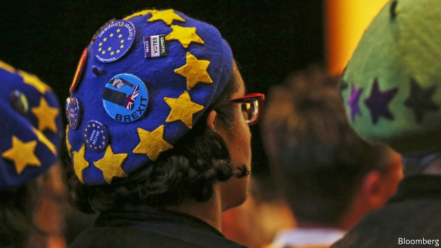
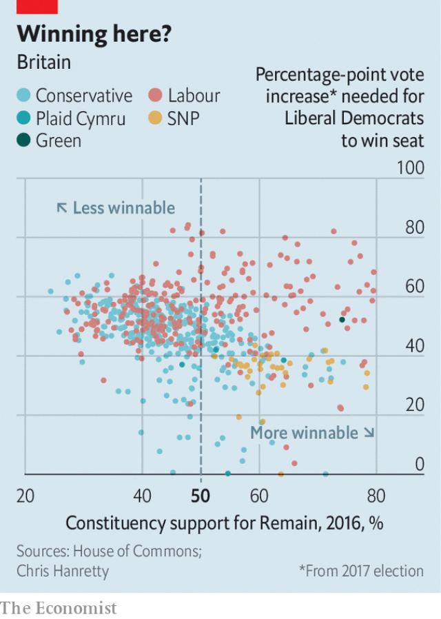

###### Ctrl+Z Brexit

# The Liberal Democrats bet on a vow to overturn the Brexit referendum 

 

> print-edition iconPrint edition | Britain | Sep 19th 2019 

THE LIBERAL DEMOCRATS do not like Brexit. To clear up any lingering doubts about this, at their conference in Bournemouth a batch of their freshly elected MEPs strode on stage wearing “STOP BREXIT” T-shirts. Elsewhere, activists wearing blue berets spangled with EU stars wandered around hawking “Bollocks to Brexit” stickers. For those who had still not got the message, Jo Swinson, the party’s leader, unveiled a new policy: if the Lib Dems win the next election, they will revoke Britain’s Article 50 request to leave the EU “on day one”. 

While Labour has wobbled on Brexit, the Lib Dems have dug in as the party of Remain. Their previous policy was to support a second referendum, which they have called for consistently since the first one, in 2016. The party says it will still back a second referendum if, as is almost inevitable, it fails to win a majority. 

Not all are happy with the revoke policy. Grandees grumbled. Sir Norman Lamb, one of the party’s more Eurosceptic MPs, complained that simply revoking would annoy voters in the rural south-west, where the Lib Dems hope to gain seats, and his own constituency of North Norfolk. Brexit tore up old electoral alliances. The Lib Dems have historically relied on a mix of university towns and well-to-do suburbs (which tended to back Remain) and rural seats (where Leave was popular). Wavering Tory Remain-voters may think it a bit rum to ditch Brexit without another vote on the matter. And many of the Lib Dems’ most winnable seats are Tory ones (see chart).  

 

Yet the move will please the party’s growing base of Remainers. Remain-voters prefer cancellation of Brexit to a second referendum by two to one, according to a poll by Opinium. A petition calling for the revocation of Article 50 was signed by 6.1m people—nearly three times more than voted Lib Dem in the general election of 2017. Defenders of the revoke policy point out that it has attracted attention to the party, and contrast its clarity with Labour’s evolving muddle. Labour would hold a second referendum but its leader, Jeremy Corbyn, said on September 17th that he would be neutral during the campaign. 

Unless polls are wildly wrong, the Lib Dems’ promise to revoke Article 50 could prove as relevant as a Sunday-league footballer’s plan for an elaborate celebration should he score in an FA Cup final. If the party wins its predicted 20% or so, Ms Swinson will not go to Downing Street.  

Still, optimism abounded in Bournemouth. Normally the annual conference is a form of therapy for Lib Dems, jokes Tim Farron, who led the party in 2015-17 while it was on life support, with 8% of the vote and only eight MPs. Now its MPs are bombastic. Chuka Umunna, who defected from Labour (via Change UK) this summer, suggested that 200 seats would be in contention if the party got a 5% swing. When a party wins more than about a quarter of the vote, a deluge of seats follows, under the logic of the first-past-the-post system.  

Yet local politics can trump national swings. Remainers are clustered in cities and Scotland, whereas Leavers are scattered more evenly, making it easier for pro-Brexit parties to pick up seats. A modest headwind could blow the Lib Dems off course. Only one of their 18 seats—Orkney and Shetland—is truly safe. The Lib Dems are inches from both disaster and glory. 

Either way, they may play kingmaker. Ms Swinson has ruled out any formal coalition or pact with either Labour or the Conservatives. Instead the party will vote on a case-by-case basis, says Sir Ed Davey, its finance spokesman. The Lib Dems were burnt when a tie-up with the Tories in 2010-15 resulted in them losing 90% of their MPs in the next election. Breaking popular manifesto promises, such as ending tuition fees, did the most damage. When it comes to Brexit, the Lib Dems will try not to make the same mistake twice. ■ 

