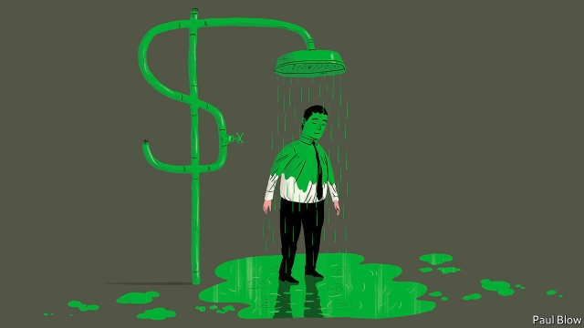
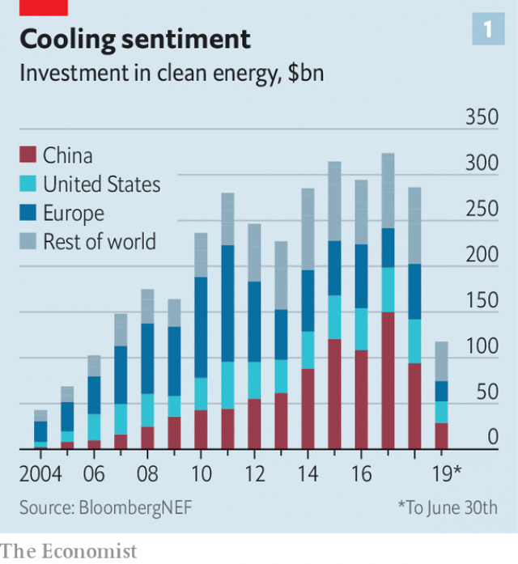
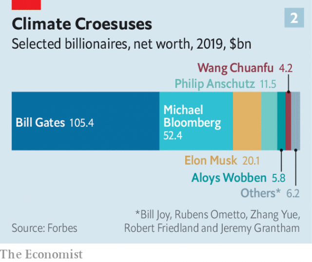

###### The not-so-dirty dozen

# Climate capitalists have serious money in climate-friendly investments 

 

> print-edition iconPrint edition | Business | Sep 21st 2019 

BETS ON CLEAN technologies have ballooned this decade. Over $2.6trn has flowed into low-carbon energy alone since 2010, according to BloombergNEF, a research firm (see chart 1). Now that some ventures have soured, after green subsidies grew stingier around the world, many investors are thinking again. 

Many, but not all. A clutch of industrialists and entrepreneurs are doubling down. The Economist’s unscientific survey has identified 12 with notably climate-friendly dispositions, and a combined net worth of $200bn (see chart 2). Some, like Elon Musk, Bill Gates and Michael Bloomberg, are household names. Others are little-known outside their industry. Their wagers cover mature technologies (electric cars, wind turbines), fast-maturing ones (high-voltage grids, meatless burgers) and out-there ideas (turning carbon from the air into useful stuff). All want to do good by the planet. Most expect to do well for themselves. 

The world’s most prominent green mogul is Mr Musk. Having made a killing with PayPal, an online-payments firm, he ploughed some of his fortune into Tesla. The carmaker is in trouble; last year it lost roughly $1bn. But it has turned electric vehicles from an unsightly curiosity (think G-Wiz) first into an object of desire, then, with its mass-market Model 3, into something reassuringly ordinary. Production of the Model 3 has hit snags. But no big car firm can today go without its own EVs. 

 

Mr Musk has also put billions into batteries, for Teslas and to balance the electric grid. The minerals inside them are the preserve of our second tycoon, Robert Friedland. His brash style and early mining investments earned him the nickname “toxic Bob” from the press. But his investments in battery metals, made through holdings like Ivanhoe Mines, make him look greener today. He is digging up cobalt and nickel in Australia, and developing what could be the world’s second-biggest copper mine in Africa. His joint-venture with Chinese investors is working on metal sulphates for lithium-ion cells. 

 

Wang Chuanfu is the closest China has to Mr Musk. BYD, the company he founded in 1995, started out making rechargeable batteries. Today its sprawling campus in Shenzhen shows off solar cells, electric cars, heavy machinery, mobile-phone components and much else besides that needs energy storage. In 2008 Warren Buffett’s Berkshire Hathaway invested $232m in BYD. The stake is now worth over $1.5bn. BYD’s sales surpassed $18bn last year, putting it among the biggest makers of batteries and electric cars. 

Like Messrs Musk, Friedland and Wang, others from our list joined the ranks of tycoons by seeing their ideas mature. Mr Wang’s compatriot, Zhang Yue, runs Broad Group, a huge manufacturer of chillers that recycle waste heat. Brazil has Rubens Ometto, the man behind the world’s biggest bioenergy firm and its first ethanol billionaire. His company, Cosan, produces sugar and, through a joint-venture with Royal Dutch Shell, an Anglo-Dutch energy giant, sugar-cane ethanol. In Germany Aloys Wobben, who built his first wind turbine at university and later developed a pioneering variable-speed model, turned Enercon, which he created in 1984, into a leading producer of such equipment. 

A second group of moguls funnels money made elsewhere into climatically noble projects seeking scale. Consider Philip Anschutz, whose empire stretches from oil to entertainment (and whom the New Yorker described as the “man who owns LA”). He has spent a decade promoting a $3bn high-voltage electric grid, TransWest Express, to send 3GW of wind power (which he is backing separately) from blustery Wyoming to electricity-hungry California. It should start construction in 2020. 

Or take Bill Joy, who co-founded Sun Microsystems. As befits a self-assured Silicon Valley software pioneer, he reckons his climate bets could tackle half of all annual greenhouse-gas emissions. In 2011 he backed Beyond Meat, a maker of plant-based alternatives to burgers; meat production accounts for 14.5% of global emissions. The company’s share price is up six-fold since it went public in May. To clean up cement-making (6% of emissions), in 2014 Mr Joy invested in Solidia Technologies, which has found a way to cut the industry’s carbon footprint by 70%. LafargeHolcim, a Franco-Swiss cement colossus, is helping commercialise it. 

Besides imminently scalable ventures, Mr Joy has supported speculative ones like Ionic Materials, a firm that has come up with an energy-storage technology that uses solid polymers (Wired, a magazine popular among geeks, called it the “Jesus battery”). When it comes to moonshots, though, it is hard to beat Mr Gates. This week the co-founder of Microsoft told the Financial Times that those who want to change the world should stop wasting time urging investors to dump fossil-fuel stocks and put their money and energy behind disruptive technologies. 

Mr Gates is putting a part of his $105bn fortune where his mouth is: into blue-sky projects. Literally, in the case of Carbon Engineering, a company working to turn CO2 in the air to fuel. Because its carbon is being taken from the atmosphere, it has no net-effect on the atmospheric stock when burned. He co-founded TerraPower, which has developed a new type of nuclear reactor. And in 2016 he launched Breakthrough Energy Ventures, a $1bn pot of “patient, risk-tolerant capital” to bankroll technologies that radically cut annual emissions. Only those with the potential to shave 500m tonnes (1% or so) or more off today’s global total need apply. Investments include Boston Metal (which aims to decarbonise steelmaking) and Commonwealth Fusion Systems (which is pursuing nuclear fusion). Fellow plutocrats have been enlisted into the fund: Mr Bloomberg, Amazon’s Jeff Bezos, Alibaba’s Jack Ma, Masayoshi Son of SoftBank and Mukesh Ambani of Reliance, an Indian conglomerate. 

The last kind of climate tycoon does not seek returns, at least directly. Jeremy Grantham of GMO, a $70bn investment fund, is giving away most of his $1bn fortune to climate politics and research. It isn’t really philanthropy, he says. “It’s sensible defensive investing in the broadest sense.” Mr Bloomberg has poured $500m into Beyond Carbon, an initiative to kill off coal plants in America by financing green lobbyists and politicians at state and local level. 

Our twelfth apostle of climate action is not himself deep-pocketed. But Pope Francis, the greenest pontiff to date, has ultimate control over the Vatican Bank’s $3bn-worth of assets—and a bully pulpit to exercise moral suasion over much more. In June he rounded up oil bosses from BP, ExxonMobil, Shell and Total, and strong-armed them to support “economically meaningful” carbon prices and disclose risks posed by climate change to their companies (see article). 

Our list is necessarily incomplete. Other fat cats back clean investments. So do firms, even historically carbon-cuddling ones like GM, whose carmaking prowess may do more to popularise EVs than Tesla, or McDermott, which builds oil rigs but whose subsidiary has put money in NET Power, a builder of power plants in which carbon dioxide released by burning natural gas in pure oxygen is heated and then used instead of steam to turn a turbine (with any excess captured). 

Many clean bets continue to rely on tax breaks, subsidies or the prospect of high carbon prices. Plenty will fail in the marketplace. But some may succeed. Without creative destruction powered by climate capitalists, including profit-seeking ones, safeguarding the planet would be considerably more daunting than it already is.■ 

