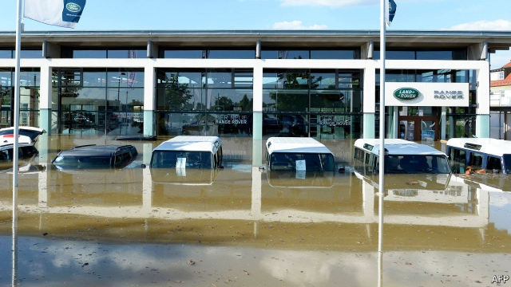

###### Planet Inc

# Firms face physical, regulatory and legal risks from climate change 

 

> print-edition iconPrint edition | Business | Sep 21st 2019 

LIKE ALL human enterprise, business is threatened by climate change. And, as with humanity as a whole, these risks may not become catastrophic for the corporate world for decades. But some corporate citizens will be vulnerable sooner—if they are not already. Global regulators, such as the Financial Stability Board (FSB), want firms to get to grips with the three ways in which the climate affects their prospects 

Physical effects of global warming—rising sea levels, drier droughts, stormier storms—imperil factories and other assets, as well as transport and energy links that knit supply chains together. They hurt worker productivity—or, if companies spend on adaptation, like air-conditioning to keep employees cool, increase overheads. A study of over 11,000 globally listed firms found that accounting for physical risks would shave just 2-3% off their market value on average. But the most exposed could lose 20%. 

The risk of climate calamities rises imperceptibly quarter to quarter. For most firms it would become material when present-day assets, which seldom last more than 15 years, and bosses, who typically stick around for less, are a distant memory. Even long-term asset managers tend not to hold on to shares for more than a decade. Credit raters and insurers are trying to factor in physical risks when evaluating borrowers and pricing premiums. For now, the market signals are too subtle to detect. 

Investors are more attuned to “transition risks”. Carbon taxes, tradable emissions permits and other policies to chivvy along the process of making economies greener impose costs on companies. Of the 195 signatories of the Paris climate agreement, 81 mention a carbon price in their pledges to limit global warming. Half of those have announced a carbon tax, cap-and-trade scheme, or both. Add state and local schemes, and they cover 15% of the world’s emissions, up from 4% in 2010. 

Being a function of politics rather than physics, transition risks are less certain than physical ones. The costs are currently trifling; governments raise perhaps $30bn a year worldwide in carbon levies, a fraction of the $2trn in profits that America Inc generated last year. But if they lived up to the Paris deal’s aim of keeping warming within 2°C of pre-industrial levels, 15% of global stockmarket value might be on the line. A study in 2018 found that electricity producers would have to retire a fifth of capacity, and cancel all planned projects. 

The final threat looms in the courtroom. It is the hardest of the three to assess. This month PG&E reached an $11bn settlement with insurers seeking compensation from the Californian utility for payouts they made to homeowners and businesses in connection with wildfires. These were sparked by its power lines—and climate change increased their likelihood. Proving a company’s culpability for natural disasters is rarely this uncomplicated. Plaintiffs must show that they have suffered an injury, that the defendant caused it and that the court can redress it (with damages, say). In 2012 a federal court threw out a case brought by residents of Mississippi against 34 big carbon emitters for harm resulting from Hurricane Katrina, which they argued climate change made more destructive. 

Still, climate lawsuits against companies are mounting. Last year New York state sued ExxonMobil for deceiving investors about risks to the firm from climate-change regulation (the firm denies this). Better climate science has made establishing causality more credible, if by no means easy. Some American counties have sued a number of oil giants on grounds akin to those of the Mississippi claimants. 

In 2017 the FSB issued voluntary guidelines to firms and investors about disclosing such risks. Big asset managers, including BlackRock, back these in principle. But firms are reluctant to be the first to own up to vulnerabilities. They fear, rightly, that the market will punish honesty, not reward it. Until disclosures are made mandatory, companies are likely to prevaricate.■ 

