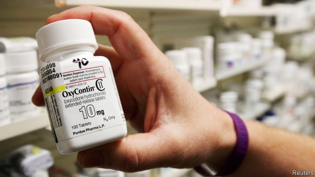

###### Peddler’s gambit

# How to divvy up the remains of Purdue Pharma 

 

> print-edition iconPrint edition | Business | Sep 19th 2019 

POWERFUL OPIOID painkillers have helped fuel a crisis of addiction and death in America in the past two decades. If one company has become the villain of this tragic tale, it is Purdue Pharma. The Sackler family, which controls the drugmaker, made billions of dollars peddling the drugs—often, state prosecutors have charged, and which Purdue and the Sacklers deny, with aggressive sales tactics and questionable marketing campaigns that downplayed the dangers of OxyContin, its blockbuster opioid medication. 

They will not profit from them any more. On September 15th the company declared bankruptcy. The move is part of a sweeping settlement agreed with plaintiffs in Ohio, where a case against makers and distributors of the drugs, due to start in a federal court next month, brings together claims from some 2,000 states, local governments and Native American tribes. 

The settlement comes on the heels of a landmark ruling in August in Oklahoma, where a state court found that a sales campaign of Johnson & Johnson, a giant drugmaker, contributed to the state’s opioid crisis and ordered it to pay $572m towards an abatement plan. J&J risked a trial rather than settling (as Purdue had, for $270m, without admitting guilt) because it felt it had a strong case; it sold a tiny fraction of the pills in the state. J&J maintains its innocence and plans to appeal. But the judge’s decision has sent a chill through the opioids supply chain, which suddenly felt less invincible. 

Purdue was the first to crack. Under the deal, it is to be reconstituted as a public trust. The plaintiffs in the Ohio case will receive future proceeds from sales of opioids and drugs used to treat addiction to them (which, in a bitter irony, Purdue also makes). The deal is valued at some $10bn: perhaps $3bn from the Sacklers and the rest from their company and other assets. Neither Purdue nor the family need admit wrongdoing. 

Those who favour the arrangement say it gives governments some money to pay for treatment of addicts and other measures to combat the public-health crisis caused by opioids. Despite J&J’s loss, the case against Purdue in Ohio could have dragged on and proved indecisive. It would be expensive. Purdue has reportedly spent $250m so far on legal fees. Better to give what money it has left to opioid victims, not lawyers, the reasoning goes. 

Others worry that the bankruptcy is a financial wheeze which lets the company and its owners off too easily. Letitia James, New York’s attorney-general, who together with her opposite numbers in 25 other states declined to join the Ohio settlement, has called the deal with Purdue “an insult, plain and simple”. 

New York has issued subpoenas to several dozen banks and financial advisers in an effort to understand the family’s financial picture. Ms James’s investigators have already unearthed $1bn in wire transfers by the Sacklers. Some of the money ended up in Swiss bank accounts. This may have been completely legal, as the family asserts. Even so, many Americans find it grating that though the Sacklers will not make more money from opioids, they may be able to keep much of the fortune they have amassed from these controversial drugs.■ 

