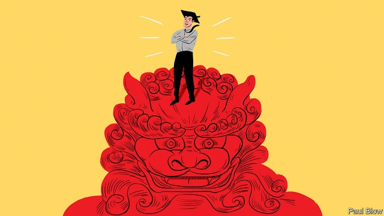

###### Bartleby

# Masters of Business in Asia 

 

> print-edition iconPrint edition | Business | Sep 19th 2019 

ASIA’S RISING economic power is remaking the world. Chinese corporate champions like Alibaba and Tencent are challenging their Western counterparts. Are they bringing with them a specifically Asian management style? Bartleby visited two highly rated business schools in Hong Kong in an attempt to find out. 

First, temperament. Yuk-fai Fong is a professor of management, strategy and economics. During a stint at the Kellogg School of Management in Illinois, he recalls, his Asian students tended to be quiet. On arriving at Hong Kong University (HKU), he discovered that students there were not diffident at all but instead stereotypical, opinionated MBAs. Mr Fong concludes that, in America, Asian students were unfamiliar with corporate culture and even company names. They may have been more self-conscious about speaking in a second language in a second country. In Hong Kong they felt, naturally, more at home. 

Where Mr Fong did find a difference was in the attitudes of MBA students towards leadership styles. He conducted a survey of MBA alumni and current and past students on HKU’s executive MBA course (which, like other such courses, is part-time and aimed at people already involved in running companies). It asked respondents about their views of behaviours that are broadly desirable (for example, having integrity, being visionary or prizing performance), broadly undesirable (being dictatorial, asocial or non-explicit when communicating), or culturally contingent (the extent to which managers were, say, bureaucratic or status-conscious). 

The survey found that Asian respondents were more tolerant than their Western counterparts at HKU of undesirable leadership characteristics such as authoritarianism and asociality (each group disliked such traits, but Western respondents disliked them more). It also revealed that those who worked for local companies were more enthusiastic about performance-oriented leaders than peers employed at Western firms. 

That may reflect prevailing organisational structures in Asia, where family businesses, often led by a founding patriarch, are more common. Steven Dekrey, the associate dean of the Hong Kong University of Science and Technology (HKUST), says that the classic case studies of large Western corporations developed by American business schools are less pertinent in the Asian context. So HKUST uses more cases based on family businesses; the executive MBA programme allows students to bring examples from their own experience, much of which also comes from family firms. And because the family orientation of Asian companies means that few businesses are used to being challenged by their boards, Mr Dekrey runs a programme for developing independent directors to plug the gap. 

His school is also encouraging students to think of corporate “purpose”, beyond making money. Whereas firms in America or Europe increasingly profess to care about things other than the bottom line (with varying degrees of sincerity), that is a novel idea in Asia, where executives are mostly guided by the pure profit motive. 

Of course, business schools can teach all this only to students who enroll. Corporate Asia has yet fully to appreciate the benefits of an MBA education. That is the last big difference from the West. But Mr Dekrey sees encouraging signs for the growth of business education in Asia. Among those students who are interested in an MBA, more appear willing to choose an Asian school such as the HKUST—nicknamed the “University of Stress and Tension” but in fact a rather attractive place to study, with views of Clearwater Bay conducive to reflection and learning. 

Indeed, having set up its executive MBA programme with the help of Kellogg, the school has now itself begun to mentor colleges in other countries, such as the Skolkovo School of Management in Moscow. And this month HKUST will break ground on a new campus in the Chinese province of Guangdong. Many faculty members are expected to move to the mainland. 

When the British empire was expanding, the saying was that “trade followed the flag”. Perhaps today business education follows economic power. One day Chinese management styles may come to be seen as exemplars for international companies—and Chinese business schools may rival the top American ones. 

