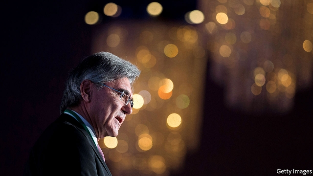
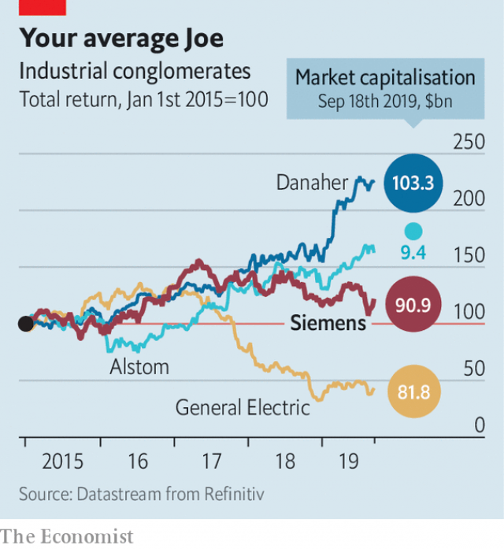

###### Europe’s biggest conglomerate

# Nobody said reforming Siemens was going to be easy 

 

> print-edition iconPrint edition | Business | Sep 21st 2019 

JOE KAESER cuts an unusual figure among the taciturn bosses of Deutschland AG. The wiry 62-year-old is bursting with energy. He unabashedly tweets (in both English and German) about his concern over the rise of the hard-right in Germany—and, more atypically still, considers such pronouncements to be part of his job as a captain of German industry. 

Mr Kaeser’s boldness has made him friends, but also bitter enemies, who accuse him of calculated PR, hypocrisy, double standards and far worse. He was widely criticised for meeting Russia’s president, Vladimir Putin, shortly after his annexation of Crimea and for cosying up to the governments of Saudi Arabia, China and Iran when big contracts are at stake. “The voice of morality is flexible,” was the headline of a recent article about Mr Kaeser in the Neue Züricher Zeitung. Mr Kaeser admits that moral values and business interests can clash. “It is a thin line to walk,” he says. But “values don’t always create jobs.” 

These days Mr Kaeser may be making headlines for his worldview. But his six-year effort to spruce up one of Germany’s industrial giants deserves equal—if not greater—attention. True to his temperament, he has gone about this mammoth task in a thrusting manner. Success, he believes, is near. Is it? 

The son of a mechanic from Lower Bavaria, who betrays the region’s lilt in both English and German, has worked at Siemens for 40 years. In 2013, when he was promoted from finance chief to chief executive, only two of nine divisions of the group, which makes everything from software and body scanners to trains and gas turbines, were doing well. A good chunk of sales was generated by businesses that made no profit at all. Mr Kaeser slimmed the group’s bloated bureaucracy, centralising human resources and other functions and ordered division bosses to focus on developing, building and selling their wares. By 2017 most of the heavy lifting appeared to be done. Siemens’s share price recovered to highs last seen in 2007. The supervisory board prematurely extended Mr Kaeser’s tenure to 2021. 

 

Some felt that at this point Siemens deserved a pause from the restructuring drive. Instead, Mr Kaeser accelerated it. He spun off the group’s remaining stake in Osram, a maker of light bulbs, sold its kitchen and washing-machine business to Bosch, another German engineering giant, and flogged its hearing-aids unit to EQT, a Scandinavian private-equity firm. He merged Siemens’s wind-turbine arm with Spain’s Gamesa and listed Healthineers, its medical-technology business, on the Frankfurt stock exchange. Traditional conglomerates do not have a future because, he says, their inherent lack of focus drives mediocrity. 

This furious diet has not had entirely the desired effect. Since the start of 2017 Siemens has underperformed Germany’s stockmarket and counterparts like Alstom of France and Philips of the Netherlands. In February the European Union blocked the proposed merger of the rail business with Alstom’s, on competition grounds. Mr Kaeser is looking at alternatives, including a public listing for the unit. On August 1st Siemens missed analysts’ earnings forecasts in all its industrial divisions bar rail. 

With characteristic punchiness, Mr Kaeser blamed investor angst on geopolitics and macroeconomics. Fresh from a trip to China with Chancellor Angela Merkel, he is himself nervous about trade tensions between China and America. “A decoupling of economic systems and standards driven by a political agenda would be a nightmare,” he says, predicting it would set the world back by decades. Siemens has 33,000 employees in China, its second-largest international market after America, representing a tenth of sales. 

Some of the company’s recent weakness may indeed be down to the global slowdown. But some surely reflects the difficulty of turning around a sprawling 172-year-old giant. Industry-watchers estimate that its shares are still trading at a discount of up to 30% compared with its sum-of-parts value. Mr Kaeser expects vindication next September, when he plans to list the ailing gas-and-power unit. The business, which employs 80,000 people and makes €30bn a year in revenue from dirty energy industries, will be tarted up by adding Siemens’s 59% stake in Gamesa. Hiving it off will remove a big drag on the parent’s performance, suggest analysts at Deutsche Bank. 

“The endgame is to transform Siemens into a slimmer world leader in industrial-automation software and smart infrastructure,” says Ben Uglow of Morgan Stanley, an investment bank. Margins on the digital and automation arms are 17-23%, well above the 10% for the rest of the group. If Mr Kaeser has his way, these will form the core of the future Siemens. 

On September 18th the group’s supervisory board proposed that Michael Sen, who sits on the management board, lead the soon-to-be-sold energy business. It also appointed Roland Busch, the operations and technology chief, as deputy CEO—and Mr Kaeser’s heir-apparent. As the man overseeing the digital and automation businesses, Mr Busch has the experience to steer a streamlined Siemens into the next era. Mr Kaeser had a good run until 2017, then a so-so one. It may be time to pass the baton. Perhaps he can try his hand—and his Twitter-adept thumbs—at politics. ■ 

