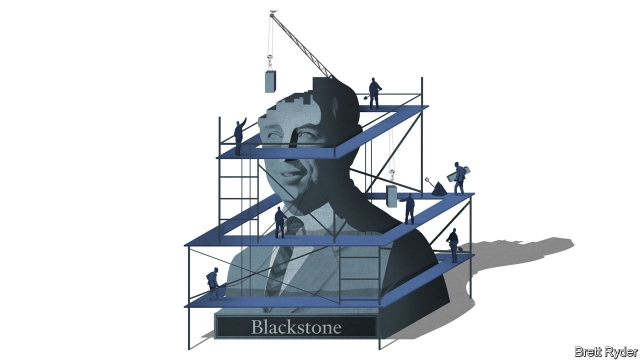

###### Schumpeter

# The lessons of Stephen Schwarzman 

 

> print-edition iconPrint edition | Business | Sep 19th 2019 

AS A CHILD growing up in Philadelphia, Stephen Schwarzman had a part-time job selling handkerchiefs to old ladies at his father’s shop, Schwarzman’s Curtains and Linens. He hated it. His main consolation was imagining how the firm could expand across post-war America, like Sears. But his father was not interested. He was happy with a house, two cars and some money. He was no entrepreneur. The younger Mr Schwarzman, who went on to co-found Blackstone, the world’s largest alternative-asset manager, and become an Olympian of modern-day capitalism worth $18bn, recounts that story at the start of his memoir, “What It Takes”. It is one of the few times a mere mortal appears in his account—only to be swiftly shunted aside. 

Mr Schwarzman has little time in the book for the little guy. Other financiers wring their hands over the wealth gap between bosses and workers. Not him. He was a rare executive in America’s Business Roundtable not to sign a charter last month calling for an end to the shareholder-led model of capitalism. His private life appears to be one of lavish parties and glamorous schmoozing. Acknowledgments in the book stretch to 14 pages and he name-drops five American presidents, four French ones and China’s Xi Jinping. 

Yet Mr Schwarzman avoids footling with life’s foot-soldiers for a reason. The book has a higher purpose. Many will read it for insights on how to become a master of the universe. The subtext is how to build a legacy: a quest that at 72, he looks hellbent on. That means giving away chunks of his fortune so that the Schwarzman name is inscribed, Rockefeller-like, on libraries, universities and scholarship programmes. It also means building a firm that outlasts him as J.P. Morgan has outlasted John Pierpont. Indeed, Mr Schwarzman’s 25 “Rules for Work and Life” can be boiled down to one: how to create a corporate culture that persists. 

Contrary to its barbarian image, the world of finance is not culture-free. Yes, employees at Lehman Brothers, where Mr Schwarzman once worked, famously had a reputation for not stabbing people in the back—but walking right up and stabbing them in the front. And Blackstone is sometimes similarly portrayed as a dealmaking war machine, with Mr Schwarzman as the merciless field-marshal; not for him hard-to-measure pieties about the purpose of business. But his company does have purpose, he feels: to generate healthy profits for investors, which include pension funds, while providing 500,000 jobs in the firms in which Blackstone invests. 

Peer beneath Blackstone’s armour and clear values emerge. The interplay between three in particular—ruthless ambition, unexpected humility and fierce loyalty—is the backbone of Mr Schwarzman’s book. It also lies at the core of his company. 

Start with ambition. Blackstone is steeped in unabashed elitism. Mr Schwarzman makes no bones about his own desire to be bigger than the rest. After he co-founded Blackstone with $400,000 in 1985, he set out to raise more money from investors than any upstart fund before it. Now it has $545bn under management—this year it has raised the world’s biggest-ever private-equity and property funds. When he launched Blackstone’s initial public offering in 2007, he wanted it to be the first private-equity IPO. Blackstone was pipped to the post by a smaller rival but it was still one of Wall Street’s landmark listings. This year it scrapped its partnership structure to become a corporation, raising its market value above $60bn—not far from that of BlackRock, which split from Blackstone in the mid-1990s to become a powerhouse in its own right, and with which Mr Schwarzman has a respectful rivalry. When hiring, he aims to recruit only “tens”. As he puts it: “You have two options: either run a middling company going nowhere or clear out the mediocrity.” His philanthropy focuses on the elites of tomorrow—by sending American scholars to China, for instance. 

This competitive streak is balanced by surprising humbleness. Blackstone readily learns from its mistakes. Mr Schwarzman owns up to several. The most painful came in 1989, when he backed a new employee’s gamble on a steel firm, Edgcomb, despite opposition from more experienced colleagues. It went spectacularly wrong. Since then, he ordained, investment decisions must always be made collectively. The meetings, robust affairs where participants compete to pick holes in each other’s ideas, reflect the premium Blackstone affords ambition. But focusing on downside risks rather than upside potential promotes prudence. When Blackstone bought Equity Office Properties, a real-estate trust, for $39bn on the eve of the financial crisis in 2007, it recouped more than half what it had paid at a profit within a day in order to turn a huge risk into a manageable one. 

The third value is loyalty. When Blackstone’s share price tumbled during the financial crisis, Mr Schwarzman listened to board members urging him to maintain its dividend, to spare the blushes of the Chinese sovereign-wealth fund, which had taken a huge punt on the IPO. As he told Jimmy Cayne, the boss of Bear Stearns, as the investment bank stared into the abyss: “There are times when you just have to stand up and write a cheque.” In other words, safeguard your reputation by making good those whose money you are responsible for. Mr Cayne did not listen. 

The book has flaws, as does its author. He describes his early career in humorous detail: as a fresh-faced financier, “I must have been the biggest buyer of antiperspirant on the East Side of Manhattan.” By the end, he mainly brags. Blackstone is less prudent than he lets on. Buying Hilton, a hotel chain, for $26bn amid the financial crisis turned a huge profit—but was reckless in the extreme at the time. He glosses over the incestuous relationship between Wall Street and Washington. That said, his defence of capitalism at its red-blooded best is refreshing. If Blackstone’s mix of dynamism and integrity lives up to this paragon, Mr Schwarzman’s firm deserves to last. ■ 

