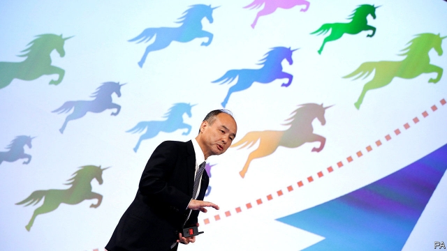
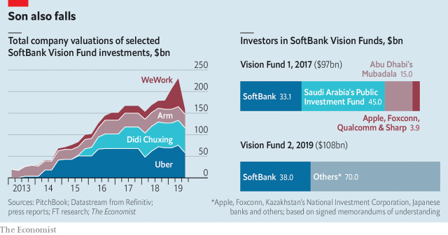

###### Impaired vision

# WeWork sparks worries about Masayoshi Son’s Vision Funds 

 

> print-edition iconPrint edition | Business | Sep 21st 2019 

WEWORK’S BUILDING in Tokyo’s Shibuya district is a cross between an iceberg and a plastic bottle passed through a shredder. Fitting, then, that the office-rental firm’s abortive listing, shelved on September 17th, threatens a financial shredding for its mastermind, Masayoshi Son—and that the debacle may be the tip of an iceberg for his $100bn Vision Fund (VF). 

Mr Son bet on Adam Neumann, WeWork’s charismatic co-founder, after meeting him for half an hour in 2017. SoftBank, the Japanese group Mr Son controls, and the VF then gave the firm $4.4bn, despite its tenuous claim to techiness. Mr Son would reportedly have handed over another $16bn this year had Saudi Arabia’s sovereign-wealth fund, the VF’s biggest backer, not objected. But SoftBank gave WeWork $2bn anyway. All told, the VF and SoftBank have invested or committed to invest $10.65bn in the firm and own 29% of it. 

Had WeWork gone public at $20bn (less than half the valuation of $47bn in its latest funding round), the VF and SoftBank could under one scenario have faced unrealised losses of up to $7.5bn, estimates Atul Goyal of Jefferies, an investment bank. As sentiment soured, partly owing to WeWork’s weak corporate governance, reports surfaced of Mr Neumann contemplating a value as low as $10bn. 

WeWork will again attempt to list later this year—presumably with a better story about governance and path to profit. Still, an initial public offering (IPO) may prove hard. Investors may be disinclined to embrace a stock with a good chance of losing value quickly. If WeWork cannot raise new capital, Mr Son may have to come up with cash to keep it going. SoftBank’s own share price has fallen by 20% since July. 

 

Even with the IPO on ice, and no price set, the VF and SoftBank may still need to adjust WeWork’s fair value. That means the VF’s stated returns may still have to be lowered when market prices are eventually taken into account. In June it reported $20.2bn of gains on total investments of $71.4bn. Some were realised; many were paper gains on hard-to-value investments. 

The deeper worry is that unicorn valuations in the private market may have risen materially above what public-market investors will pay in an IPO, says Pierre Ferragu of New Street Research. Many of the VF’s 83 investments could suffer unrealised losses if and when they go public. True, it could enjoy post-IPO share-price rises. Shares in Guardant Health, a VF-backed diagnostics firm, have more than tripled in price since its IPO in 2018. But Uber’s shareholders have seen 30% of its value wiped out since it listed in May. The VF is looking at more unrealised losses, of $3.9bn, on the ride-hailing firm, Jefferies reckons. 

The WeWork fiasco comes as Mr Son’s $108bn Vision Fund 2 was about to start. In August he said he would begin spending its cash within a month or two. Memorandums of understanding have been inked with investors. Worries about tech IPOs and an economic slump may make it harder to close. The Saudi fund and Abu Dhabi’s Mubadala Investment, another big investor in the original VF, are reportedly considering whether to scale back their investment in the new one. An executive at one big sovereign-wealth fund says SoftBank may need a face-saving way to reduce the new VF’s size. “Markets are too toppish to try and deploy another fund of that scale.” 

The VF says WeWork, one of many firms in the portfolio, gets too much attention. And Mr Son, who lost most of his wealth in the first dotcom bubble, is no stranger to the ups and downs of venture investing. WeWork’s Mr Neumann has admitted to feeling “humbled” by the delayed IPO. His cheerleader-in-chief is probably not. ■ 

