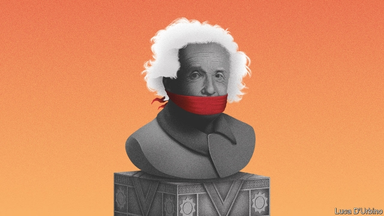

###### Relatively revealing

# An exhibition in Shanghai celebrates Einstein’s genius 

 

> print-edition iconPrint edition | China | Sep 19th 2019 

“FREEDOM OF TEACHING and of opinion in book or press is the foundation for the sound and natural development of any people.” In China even uttering these words in public may get a person into trouble. But it was Albert Einstein who wrote them, and he is officially revered. The quotation appears on bookmarks at the gift shop of the World Expo Museum in Shanghai, where the scientist’s work is being celebrated in an exhibition that opened in August. Einstein visited the city in 1922, locals are proud to recall. 

Crowds have been flocking to see the memorabilia, which will be on display until late October. A big draw are Einstein’s notes on special relativity, in which he sets out the formula E=mc². There is no mention of how controversial even the famous theory once was in China. During Mao Zedong’s Cultural Revolution, it was attacked by some scholars in the Chinese Academy of Sciences. They wrote a paper describing relativity as “a profound reflection of Western bourgeois reactionary political viewpoints”. In an attempt to restore sanity Zhou Enlai, who was then prime minister, eventually stepped in. “The Jewish nation has produced many outstanding talents. Marx was Jewish, so was Einstein,” he said. 

The exhibition does not, however, explore Einstein’s views on freedom of expression. These are revealed only among the souvenirs, one of which is a biography of Einstein by an American, Walter Isaacson. It describes the German-born scientist’s nonconformity and hostility to state control. “Tyranny repulsed him, and he saw tolerance not simply as a sweet virtue but as a necessary condition for a creative society,” it says. But the book is on sale only in English. There is nothing in Chinese at the exhibition that reveals Einstein’s opinions on political freedom. 

This year, especially, the authorities are keen to avoid tricky questions about science and dissent. It is the 30th anniversary of pro-democracy unrest in Tiananmen Square that was crushed by the Chinese army with huge loss of life. Among the most vocal of the intellectuals who supported the protests were several Chinese physicists: Wang Ganchang, who led China’s nuclear-weapons programme; Fang Lizhi, an astrophysicist who later defected to America; and Xu Liangying, China’s pre-eminent translator of Einstein’s works. 

All three are now dead. Like the others, Xu kept calling for democracy into old age. Remarkably, however, Xu’s work is acknowledged at the exhibition by a display of a translation in his handwriting. Curators sought advice from Xu’s son and invited him to the opening. 

But this is no political thaw. Since Xi Jinping took over as China’s leader in 2012, he has tightened the screws on dissent. Scientists have not been immune. Zheng Wenfeng, an associate professor at the University of Electronic Science and Technology of China in the south-western city of Chengdu, had the temerity this summer to question the significance of the “four great inventions”: the compass, printing, papermaking and gunpowder. China cites these as evidence of its ancient scientific prowess. No patriot can question that. Mr Zheng was duly punished with two years’ suspension from teaching. ■ 

