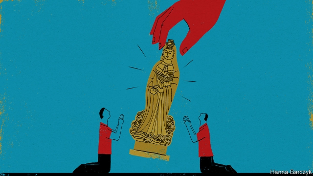

###### Chaguan

# China’s atheist Communist Party encourages folk religion 

 

> print-edition iconPrint edition | China | Sep 21st 2019 

THERE ARE several ways to gauge whether the Communist Party of China approves of an institution. A brass nameplate, issued by an arm of the party or state, is one sign. A stamp for endorsing important materials can be used as a further badge of respectability. But the best test of approved status, arguably, is the issuing of lots of paperwork. Somewhat surprisingly, a Ming dynasty temple hidden up an alleyway off Shipu harbour, one of eastern China’s largest fishing ports, passes all these tests. 

An incense-scented haven of red woodwork and worn grey flagstones, the temple is dedicated to Mazu, a tenth-century maiden who miraculously saved relatives from a shipwreck and later became a goddess. Older residents remember when the temple risked destruction as a den of feudal superstition. During the Cultural Revolution of 1966-76, when sacred sites were razed by Maoist zealots and countless priests and monks were harried to death, the temple became a primary school. Red Guards tried to ransack the place, says Han Sulian, a temple volunteer. But locals “threatened to beat them up so they backed off”, she recalls with pride. Sailors never stopped believing in Mazu, adds Ms Han. They would wear incense pouches as secret talismans when they left Shipu to hunt eels and yellow croaker in the East China Sea. 

Today, fishermen need not hide their prayers. Chaguan visited the temple on September 16th, hours before party bigwigs and other officials arrived. They were in Shipu to open a new fishing season, ending a ban imposed on May 1st to allow exhausted stocks a chance of recovery. A brass plate on the temple’s weathered façade shows it is licensed by the Ethnic and Religious Affairs Committee of Zhejiang province. Inside, new banners in embroidered yellow satin lie on the altar, ready for marking in red ink with the temple’s stamp, before being flown from boats’ masts. Paperwork, in the form of stacks of prayer slips, combines belief and bureaucracy. A slip bears the hull numbers of two ships, their skippers’ names and handwritten appeals for the boats to encounter calm seas and return with full holds. Crews will burn their slips before leaving Shipu, a pretty harbour surrounded by steep wooded hills. Meanwhile local women busy themselves sorting bottles of wine, left over from a fishermen’s banquet the night before. That open-air feast, overseen by beaming officials and filmed by state television, culminated in a waterborne procession of illuminated trawlers. The boats carried statues of Mazu and other deities past tourists on the harbourside, glowing smartphone cameras held aloft. 

The party remains officially atheist. Though formal tolerance of five faiths—Buddhism, Daoism, Islam and two strands of Christianity, Protestantism and Catholicism—was reinstated in 1982, six years after the death of Mao Zedong, rules have tightened under President Xi Jinping. He has called for the “sinicisation” of religion. In plainer language this means that all beliefs must in the end bow to a worldlier credo, involving party-ordained patriotism and family values. Organs of state repression have targeted Muslims accused of excessive piety, particularly in the western region of Xinjiang, where hundreds of thousands of Muslims, mostly from the Uighur minority, have been detained in re-education camps. Tibetan Buddhists live in a surveillance state largely closed to foreigners. Even in prosperous Zhejiang, officials have ordered crosses that are too prominent to be torn off hundreds of Christian churches, and shut down unofficial “house churches”. In contrast certain forms of faith are encouraged, especially those with roots in China and big followings among overseas Chinese. Mazu-worship fits that bill. Over the centuries migrants from China’s maritime provinces have built temples to the goddess, also known as Tianhou, from Macau to Malaysia and Melbourne. Helpfully, Mazu worship is classed as a folk belief and not as a religion, notes Zhou Jinyan of the China Mazu Cultural Exchange Association, a semi-official body. That allows for looser regulation and for the faith’s promotion for economic and political ends. 

Mazu has a big following in Taiwan. In 2011 Mr Xi urged officials to “make full use” of Mazu to woo Taiwanese, most of whom have ancestral ties with the mainland. Taiwanese money built a gaudy new temple to Ruyi, a sister deity of Mazu’s, on a hill above Shipu. A lot of it came from relatives of the late “Blacky” Ko Sau Leung, a popular crooner and stuntman known for jumping the Yellow River in a sports car. Ko was among thousands of Zhejiang folk who were evacuated to Nationalist-held Taiwan in 1955 when the offshore islands they called home were overrun by Communist forces, some years after China’s civil war. Many settled in the Taiwanese port of Fugang, nicknamed “little Shipu”. Fugang believers are honoured guests at Shipu’s fishing festival, bustling about in T-shirts reading “Goddess of the Sea”. 

Grand ceremonies for Mazu were unknown 40 years ago when Zhou Quanyang, the owner of a 150-tonne fishing boat, was a boy, and China a much poorer place. “It’s when your belly is full and you have some money, that’s when you pray,” says Mr Zhou. Every fisherman has faith in Mazu, he says, as the town’s 2,800 vessels are readied for the fishing season. His own daughter, a university student, does not believe, he adds. This prompts unexpected sympathy from Chaguan’s minder, an official from the local county propaganda office listening to the exchange. With a father in such a dangerous line of work, that daughter “should probably believe more, and pray for her dad”, the minder exclaims. 

Mazu has competition, revealed by the Chinese characters for “Emmanuel” discreetly painted on a few ships putting to sea. Perhaps 100 boats are Christian-owned, claims Peter, a local Protestant. Party leaders see Christianity as a foreign intruder, he laments. That is why they promote folk religion and “cultural confidence”. Yet the fishing life calls for deeper faith, Peter argues: the ocean reminds man how small he is in the face of nature. ■ 

