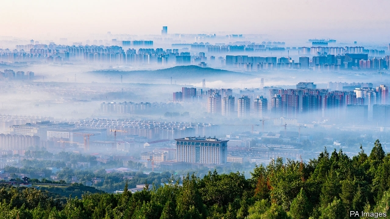
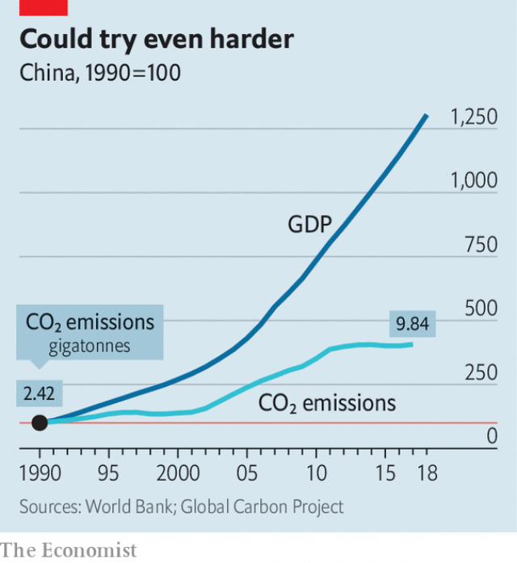

###### From smog to slog

# To prevent catastrophic global warming, China must hang tough 

 

> print-edition iconPrint edition | China | Sep 21st 2019 

AFTER DONALD TRUMP became America’s president in 2017 and thumbed his nose at international efforts to curb global warming, China emerged as a hero in the campaign. Other Western leaders were relieved that it did not take the opportunity to back away as well—after all, it had once condemned climate-change talk as Western fearmongering aimed at undermining China’s economic growth. The country’s president, Xi Jinping, won widespread applause for insisting that emissions goals agreed at the UN’s climate meeting in Paris in 2015 must be upheld. 

Now environmentalists wonder whether China will lead the charge in a new round of climate diplomacy. One aim of the climate summit at the UN’s headquarters on September 23rd is to remind countries that they will need more ambitious targets if the world is to keep global warming below 2°C. Work is getting under way on drawing up China’s next five-year economic plan, which will take effect in 2021. It will be a test of China’s willingness to raise its game. Early signs are not promising. 

China certainly looks well on track to fulfil the pledges it made at the Paris conference: that carbon-dioxide emissions would reach a final peak “around 2030”, and that by then one-fifth of its energy would come from non-fossil sources, up from one-sixth currently. In 2015 its carbon emissions, having surged in many of the preceding years, fell slightly for the first time this century (see chart). This was because China was no longer flooding its economy with money in order to combat the effects of the global financial crisis of 2008. It was also the result of vast green projects launched by the government to assuage public anger over toxic air and other environmental damage. The smog choking China’s cities was being caused, not least, by the burning of coal which was also responsible for much of the country’s greenhouse-gas emissions. The air in Beijing (pictured), though still often awful, appears cleaner than it was a few years ago. 

 

The proportion of China’s energy that is produced from coal, the most polluting of fossil fuels, is still high. But it has decreased by more than ten percentage points over the past decade, to below 60%. A third of the world’s electricity-generating capacity from wind is now in China, as are a quarter of the world’s solar panels in use. The country is building 11 more nuclear reactors, to add to its existing 47. From next year China will start requiring fossil-fuelled power firms to buy and sell credits in a national carbon-trading scheme—though it may be years before the system results in big cuts in emissions. 

But the pledges made in Paris by China and the world’s other main emitters of global-warming gasses are far from enough. Fulfilling them may still allow temperatures to rise by 3-3.5°C, which would be catastrophic. The UN wants countries to propose tougher targets by the middle of next year and agree on these at another climate conference at the end of 2020. 

China does not encourage public debate about this. Even as the country’s leaders have been basking in the glow of global gratitude for their climate-change efforts, they have been tightening controls on NGOs. The state-run media rarely question the government’s policies. But some Chinese experts have been calling on it to step up to the plate. In June an influential Chinese think-tank, the China Council for International Co-operation on Environment and Development, said the country should pledge that its emissions will peak by 2025 rather than 2030, and that by then non-fossil fuels should contribute at least one-quarter of the energy it consumes. 

China has real incentives to keep up the pace. It wants to reduce the economy’s dependence on labour-intensive manufacturing and boost the role of high technology and services. It worries about dependence on imported fossil fuels: last year 72% of its oil was imported and 43% of its gas. The attacks on Saudi Arabia’s oilfields on September 14th were scary for China: the country had been by far the biggest source of China’s imported oil. 

But some analysts doubt whether China is ready yet to commit to tougher emissions targets. The main reason is that the economy is slowing faster than officials would like. This year the aim is to expand it by between 6% and 6.5%. That would be in line with China’s long-term aim of achieving more sustainable, less frothy, growth. But China’s prime minister, Li Keqiang, said this week that even 6% has not been easy to achieve, citing a global slowdown and the “rise of protectionism and unilateralism”—a veiled reference to the trade war with America. 

In August a senior Chinese climate official warned that economic uncertainty caused by the trade conflict, among other factors, was making it less likely that China would reduce its emissions any more swiftly than promised. China’s leaders can hardly be keen to put aside money for stiffer green policies while the economy is going through such a bumpy patch. 

To keep the economy growing within the target range, officials have allowed more credit to flow to some high-emitting industries such as steel and cement, and cranked up coal-fired plants to meet the resulting increase in power demand (and it is building them apace abroad as part of its Belt and Road Initiative, a global infrastructure-building scheme—see article). After falling in 2015 and 2016, China’s carbon emissions began creeping upwards again. Greenpeace estimates that carbon-dioxide emissions grew 4% in the first half of this year. 

Large state-owned companies with vested interests in fossil fuels sense an opportunity. In March power firms proposed that the government allow another 300-500 coal-fired power stations to be built by 2030, a 30% increase in capacity. Officials must resist the temptation. If not, the planet is damned. ■ 

