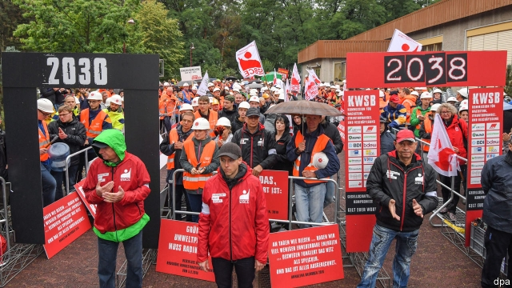
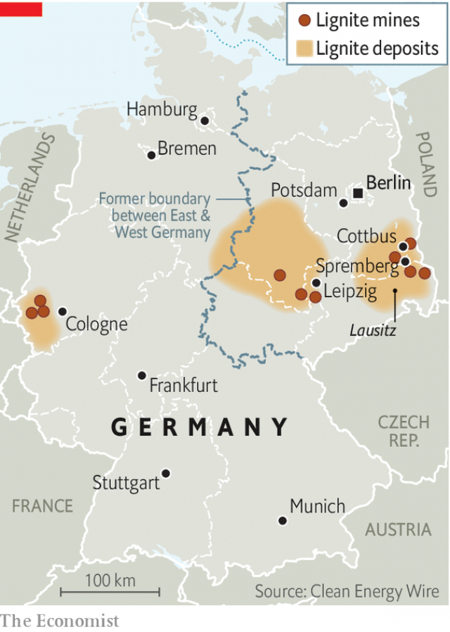
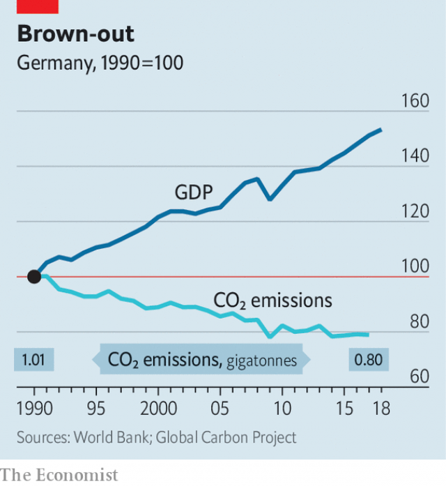

###### Dirty, and not quick

# Germany’s pricey “coal exit” 

 

> print-edition iconPrint edition | Europe | Sep 21st 2019 

THEY CAME in hi-vis jackets and anoraks, beating drums and blowing whistles as the rain pelted down, defiantly defending their dying industry. Perhaps a thousand miners and other workers turned out at the Schwarze Pumpe coal-fired power plant in eastern Germany on September 9th, presenting a boisterous welcome to visitors at a conference on the future of the local Lausitz region. In a clever stunt, they forced those attending to enter through one of two makeshift arches marked “2030” and “2038”, signifying two possible end-dates for the use of coal in Germany. Anyone taking the first was roundly booed. 

Next year Germany will miss its emission-reduction targets. Continued dependence on coal is one of the main reasons for this. The share in the electricity mix of brown coal (lignite), the cheapest and dirtiest sort, has remained stable for two decades. No country burns more of it than Germany. Last year the government assembled a commission spanning politicians, industry, scientists, activists and unions to get itself off the stuff. 

This approach was designed to ensure common ownership of whatever proposals emerged. The commission’s 275-page report, issued in January, commits Germany to end the use of coal no later than 2038, and pledges subsidies worth up to €40bn ($44bn) over 20 years for Germany’s remaining coal-mining areas. Regular reviews will determine when mines must close, and owners will be compensated. 

 

The compromise, not yet implemented in law, left everyone a little dissatisfied. Utilities murmur about supply insecurity; business lobbies fear rising energy prices. The biggest howls come from environmentalists, who want the closure advanced to help meet Germany’s target of cutting emissions by 55% on 1990 levels by 2030. 

A trip across the Lausitz, where a third of Germany’s lignite is mined, helps explain why coal-workers find this hard to swallow. This remote rural region, straddling the eastern states of Saxony and Brandenburg, once provided East Germany with 90% of its electricity (today it supplies around 7% of Germany’s power). The otherwise featureless landscape is pocked by the vast opencast mines from which lignite is stripped, and the lakes formed when disused ones are flooded. Fans of FC Energie, based in Cottbus, serenade their players with hymns to coal. But this sentimental attachment to coal, notes Johannes Staemmler at the Institute for Advanced Sustainability Studies in Potsdam, goes along with fear of change born from the ravages of deindustrialisation after German reunification in 1990, when most of the Lausitz’s mines were shut down and tens of thousands lost their jobs. 

 

Today there are no big employers in the Lausitz other than LEAG, the Czech-owned operator of the region’s mines and coal plants. LEAG’s three Lausitz plants, including Schwarze Pumpe, all sit among the top ten carbon emitters in the EU, but they also provide 8,000 well-paid jobs in a region not groaning with them, and thousands more indirectly. Such arguments helped local politicians secure €17bn of the promised €40bn. Plans to spend the cash have mushroomed, covering transport and mobile infrastructure, investment in R&D and the creation of government jobs. Christine Herntier, the mayor of Spremberg and a member of the coal commission, has her heart set on a state-of-the-art hydrogen plant at Schwarze Pumpe. Yet she too is losing faith, worried that federal funds will be spread too thinly, irritated that poor communities like hers must provide co-financing, and infuriated by turncoat greens. 

When foreign competition devastated Germany’s solar industry a few years ago, notes Felix Ekardt, head of the Research Unit Sustainability and Climate Policy in Leipzig, politicians simply shrugged and pointed to market forces. But private decisions are resented less than political ones. “People don’t forgive the state if it removes jobs,” says Jörg Steinbach, Brandenburg’s energy minister. Two of the three remaining lignite regions are in the former East Germany, where old grievances have found new political expression. In recent state elections the populist Alternative for Germany (AfD) swept the board in Lausitz after campaigning against the planned closures. 

 

Mr Steinbach remains optimistic. “There will be losers,” he says, “but not many.” Two-thirds of lignite workers are already over 45, which will limit forced redundancies, and the skills younger ones pick up are often transferable. Yet independent forecasts have shown how exposed the local economy remains to closures. In the Lausitz there are few other employment opportunities, as there are in the lignite area in the Rhineland. “Well-trained people will see their future elsewhere,” sighs Wolfgang Rupieper, head of Pro Lausitzer Braunkohle, a pro-coal association in Cottbus. Like others, he grumbles about the efforts expected of coal when emissions from other sectors, like transport, have barely shifted since 1990. 

Such concerns animated a broad package of climate-protection measures the government was due to unveil on September 20th. Chief among these was expected to be some form of carbon price, needed to ensure that the end of coal does in fact reduce overall emissions. The costly and complex commission approach fits awkwardly with more efficient emission-reduction strategies. Yet as other countries attempt to walk the line between protecting the climate and sheltering left-behind economies, they will be watching the German experiment closely. ■ 

