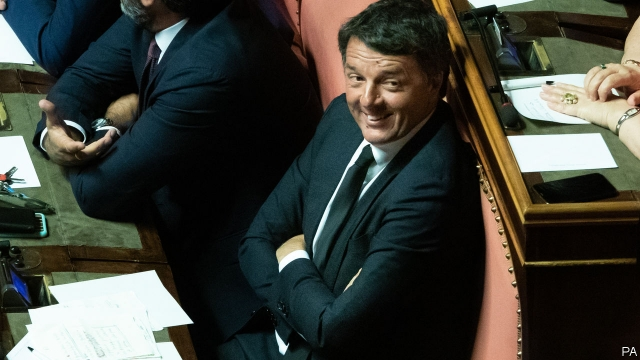

###### Demolition man

# Matteo Renzi quits his Democratic Party 

 

> print-edition iconPrint edition | Europe | Sep 19th 2019 

THE SWEARING-IN this month of a government yoking the populist Five Star Movement to the centre-left Democratic Party (PD) was a big relief to investors in Italy’s volatile government debt and to others with a stake in the country’s political stability. Among other things, the new alignment promised to keep the Northern League, a Eurosceptic and nativist party led by Matteo Salvini, out of office until at least 2023 when the next general election is due. 

But on September 17th Italian politics were once more cast into commotion. Matteo Renzi, prime minister for almost three years until December 2016, announced he was leaving the PD to form a separate parliamentary caucus. That appeared to be his first step towards the foundation of a new centrist party along the lines of France’s La République en Marche and Spain’s Ciudadanos. 

Mr Renzi called the incumbent prime minister, Giuseppe Conte, to assure him that the new group would continue to support the government. And it was soon apparent that a majority of Mr Renzi’s followers in parliament intended staying in the PD. Until now, he has been able to count on the loyalty of more than half the party’s 111 deputies and 51 senators. Yet only about 20-odd in the lower house and 13 in the upper were reportedly prepared to join him. Pollsters mused that, in an election, Mr Renzi’s proposed new party would scrape only 5% or so of the national vote. Markets stayed calm, with the spread between Italy and German bonds increasing only fractionally. 

The danger, though, is that Mr Renzi will soon have the means to strip the government of its majority. One assessment, which cheers the markets, is that this will enable him to impose moderate, business-friendly policies on the coalition. But another view, considerably more alarming, is that Mr Renzi, who stepped down as leader of the PD last year, remains hungry for power and will dispose of the government as soon as he believes it is in his interests to do so. 

Mr Renzi, still only 44, once revelled in the nickname rottamatore, “demolition man”. That was meant to reflect his energy, determination and reforming zeal. But the greatest destruction the former prime minister wreaked was on his own party, which split once before while he was in office. He may be about to complete the job. 

