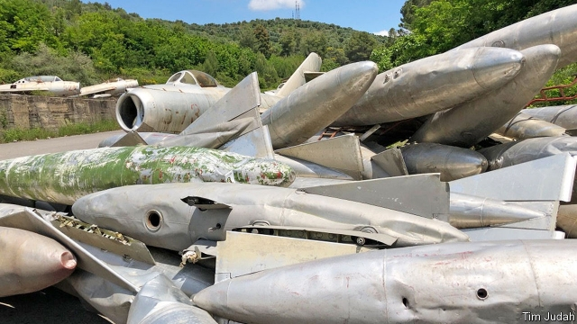

###### Changing sides

# Once part of the Warsaw Pact, Albania will soon host a NATO air base 

 

> print-edition iconPrint edition | Europe | Sep 21st 2019 

FLYING IN PERFECT formation, they wheel over the runway before touching down. For now these pigeons are the only ones making active use of Albania’s Kucova air base. Not for long, though. Early next year heavy machinery is expected to be moving in to upgrade this otherwise silent air base into a NATO one. Seventy-one rusting and broken Soviet and Chinese planes will be evicted. “The glory days are coming back,” says Viktor Vangjeli, aged 78, a retired MiG pilot. 

Communist Albania had a formidable air force, but by 2005 safety concerns and a lack of cash meant that the last of its MiGs were grounded. In Kucova they sit forlorn on flat tyres. Lettering on fuel tanks recalls the 1970s, when engineers from China assembled the MiGs they had shipped here and when men like Mr Vangjeli trained there. Now the Albanian air force flies just helicopters. Kucova plays host only to occasional agricultural planes and a few military visitors. It remains open in case of emergencies. 

A NATO team is deciding how it will invest around $50m in a first phase of upgrading the base. Albania has been a member of NATO since 2009, having left the Warsaw Pact in 1968 after years of disagreement with Russia. The plan is not for the alliance to have jets based there permanently, but for it to be an operational base for refuelling and for ammunition to be stored in its communist-era tunnels, originally built to house 100 warplanes. 

In the 1970s the base employed 3,000 people, says its commander, Major Arqile Olldashi. Now the number is 110. That, plus the demise of communist-era industries, means that Kucova’s population has plummeted from 20,000 to about 12,000. Still faintly visible is the first runway, laid by an Italian oil company in 1939. Locals hope that the restoration of the base will mean work for them. In its heyday an average of 25 flights roared in and out every day. 

In 1999 NATO flew drones from the base during the Kosovo war. Even though it is a majority Muslim country, Albanians are ferociously pro-American, in particular because of American support for the Kosovars against the Serbs at that time. NATO officials downplay reports that they are worried about what the Russians might be up to in the western Balkans. But the hard cash they are plainly investing in Kucova implies otherwise. 

Albania’s military beef is being restored in other ways. A radar station partly funded by the Pentagon is being built in the mountains; from next year, it will plug black spots in NATO’s Balkan surveillance capability. This, says Olta Xhacka, Albania’s minister of defence, will make her country NATO’s “eye in the region”. ■ 

