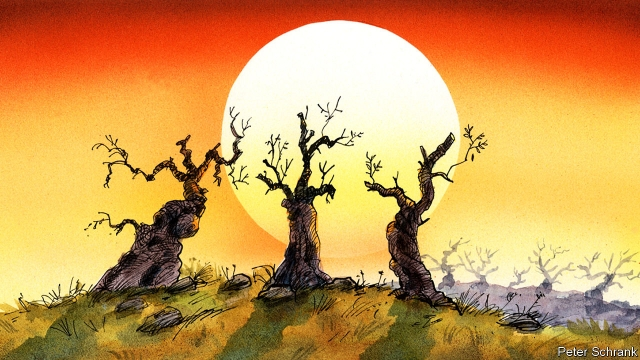

###### Charlemagne

# The threat to the southern European olive 

 

> print-edition iconPrint edition | Europe | Sep 21st 2019 

“THIS ONE has seen Napoleon,” says Massimo Arsieni. “It has seen the world wars. It has seen everything. And soon it will be dead.” He throws his arms around the fat, gnarled trunk of the olive tree. He means to emphasise its age, but could be clasping a dying relative. Mr Arsieni’s family has owned these groves outside the village of Cellino San Marco since 1800. Though harvest season is drawing near in Puglia, in the heel of the Italian boot, the tree’s branches are mostly bare and its remaining leaves are grey-brown. Its few olives are discoloured and weather-puckered. “A disaster,” Mr Arsieni sighs. The olive groves that have encircled Cellino San Marco since ancient times are now turning into what locals call tree cemeteries. 

The cause is a bacterium called Xylella fastidiosa. Carried by sap-sucking insects called spittlebugs, it arrived in the port of Gallipoli, near the southern tip of Puglia, in 2013. Olive farmers nearby started to notice that their trees were turning rust-brown. The bacteria start in the leaf-tips and work their way into the trunks, blocking the xylem (the water-carrying arteries) and preventing the trees from absorbing water. Eventually the trees die. “Xylella works incredibly fast,” says Eugenio Arsieni, Massimo’s brother. “If it gets to 10% of the tree, it will soon take over 80%.” The drive to Cellino San Marco from the nearby port of Brindisi passes fewer healthy groves than infected ones, their tree crowns bare or patchy. Last autumn’s olive harvest in Puglia, which supplies almost half of Italy’s olive oil, was down 65% on the previous year. Over 1m olive trees in Italy are thought to have died already, and this spring the country came perilously close to running out of native olive oil altogether. 

A reminder of the good old days hangs on the wall of the Arsieni family’s olive-oil shop in the market square of Cellino San Marco. The aerial photo of the groves in 2017 shows a healthy green sea of trees. That year production was close to 100% of the normal amount, explains Eugenio. Last year it was down by 40%. This year the loss will be more like 70%, he estimates. On a hike around the family’s land he points to one avenue of skeletal trees: “Last year these were all green.” Olive oil is the blood of Cellino San Marco. An olive tree features on the village’s crest, and locals traditionally test whether they have received the evil eye by putting three drops of oil into a bowl of water and observing the shape they make. Today that world is vanishing. Some farmers are simply abandoning their land and emigrating; to Australia to restart their farming careers, or to northern Europe to work in coffee shops. Pugliese olive presses are being sold off to producers in north Africa. 

The speed with which Xylella has taken hold in Puglia has astonished scientists as much as farmers. Its spread prompted the EU to require Italy to create a buffer zone—with susceptible trees destroyed and spittlebug-friendly grasses cut—but implementation has been slow. The bacterium has continued to move north. In recent months traces have been found in other parts of Italy, such as Tuscany, and on September 6th France’s Ministry of Agriculture confirmed that Xylella had been detected in two olive trees on the country’s Mediterranean coast. Vytenis Andriukaitis, the European commissioner for health and food safety, calls this “the biggest phytosanitary crisis confronting the EU for many years.” 

Climate change is not the root cause of the Xylella outbreak; it was probably introduced by an ornamental plant from Costa Rica. But it appears to explain its drastic spread. In recent years Puglia has experienced a series of extraordinary weather events, including uncommonly harsh summer droughts, spring frosts in 2017 and hailstorms earlier this year. Winters have been cold enough to weaken the trees, but not cold enough to kill the spittlebug populations. Riccardo Valentine of the Euro-Mediterranean Centre on Climate Change has argued that these extreme events have made the olive trees vulnerable to the bacterium. Climate change also helps to explain Xylella’s northward spread: Martin Godefroid of the French National Institute for Agricultural Research and others have shown that “climate change may strongly impact the distribution” of Xylella, with milder winters making this tropical bacterium viable far north of its natural habitat. 

The story in Puglia is not untypical. Climate change is destroying, or contributing to the destruction of, ancient olive groves across southern Europe. Unusually hot summers and heavy rains in Greece have produced surges in the olive-fly populations; the harvest there is expected to be down 35% this year. In Portugal droughts have also reduced yields. In Spain, yields are up but water shortages threaten whole regions in the medium term. 

So while the EU treats Puglia as an exception, a place to be quarantined, the region typifies wider trends. Centuries-old agricultural firms are going out of business. Nature is being thrown out of balance. And locals are having to decide whether to fight against change or to work with it. Elsewhere in Europe that means a choice between building dykes and giving up land to the sea, or between continuing to grow hops and switching to vines. In Puglia it means the choice between anti-Xylella interventions and adaptation to it. Examples of the former are plentiful—signs all over Brindisi airport warn that taking plants out of the affected zone is “STRICTLY FORBIDDEN”—but ineffective. “You can’t stop Xylella, you can only live with it,” says Massimo Arsieni. He mourns his family’s ancient olive trees. But without a cent of help from the EU he has planted 25 hectares (60 acres) of new olive trees of the leccino and favolosa varieties, whose broader arteries are less prone to Xylella’s water-restricting effect. For him, adaptation is the answer. “Look,” he says, holding out a handful of plump, shiny olives from the new generation of saplings. “This is the future.” ■ 

