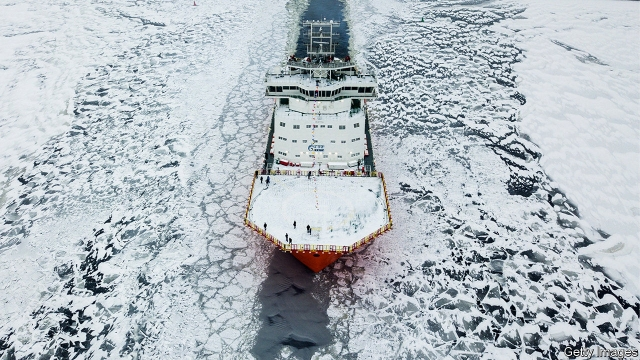
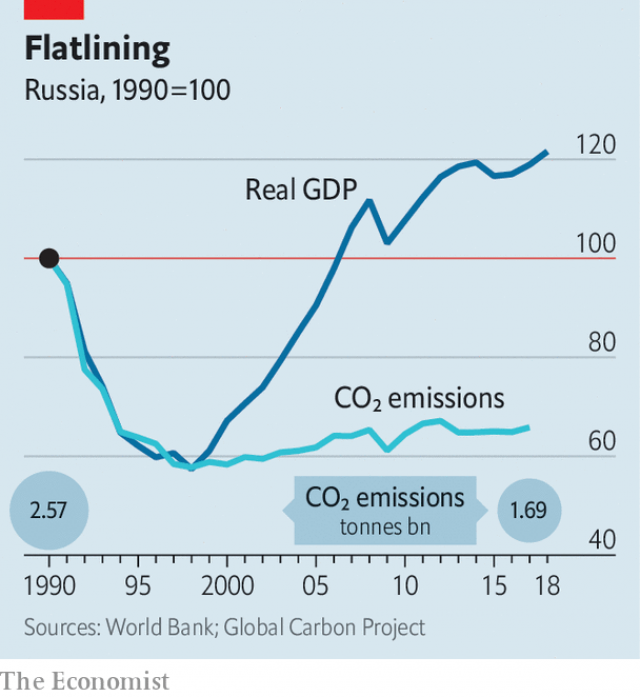

###### A warmer Russia

# Why Russia is ambivalent about global warming 

 

> print-edition iconPrint edition | Europe | Sep 19th 2019 

FIRST CAME fires that turned the Siberian skies into a wall of solid smoke stretching for thousands of kilometres. Then came a drought that sucked the Lena river nearly dry, leaving boats marooned in the mud. It has been an arduous summer in Yakutia, an icy republic in Russia’s far east. Add to that the fact that the regional capital, Yakutsk, stands upon thawing permafrost that warps roads and buildings, and climate inaction becomes hard to defend. “I’ve lived here my whole life, I remember what the winter used to be like, and what it’s like now,” says Sardana Avksenteva, Yakutsk’s mayor. “I can confirm that global warming is a problem.” 

Some 1,000km (600 miles) to the north, on the republic’s Arctic coast, the dying town of Tiksi would beg to differ. From its frozen vantage-point, warming has been a boon. Arctic sea ice is now receding at an alarming rate. In 1980 it covered 7.9m square kilometres (3m square miles) at its summer minimum, whereas last year it dipped to only 4.6m. So the Northern Sea Route (NSR) through once-impassable waters has emerged as a potential global shipping artery. The Russian government has pledged to direct some 735bn roubles ($11bn) over the next six years towards its development. The route holds the promise of cutting delivery times between Asia and Europe by weeks, compared with going by the much longer Suez Canal route—with Russia poised to take a healthy cut for helping the cargo through. Tiksi has seen a new military base go up. It is in the running for a 2.5bn-rouble port project. 

This tension between catastrophe and opportunity has shaped the contours of the climate-change debate in the world’s fourth-largest carbon-emitter. Russia has signed but has not ratified the Paris agreement, making it the only large emitter outside the pact (though President Donald Trump has said he intends to withdraw America from its strictures). It is not only the world’s second-largest producer of oil and gas combined, it also possesses ice-locked coasts and a vast, underpopulated hinterland which, some argue, could use the boost brought by a few degrees of warming. At an Arctic forum in 2017, Vladimir Putin called climate change “a factor that bolsters optimism”, adding that it “provides more favourable conditions for economic activity in this region”. He once quipped that climate change would enable Russians to spend less money on fur coats. 

Yet the downsides are proving harder to ignore, as Mr Putin himself acknowledged at a G20 summit this summer. Russia is warming more than twice as rapidly as the world’s average rate, and is experiencing a full range of climate-change-connected calamities for itself. The Ministry of Economic Development has accelerated climate policymaking. A national adaptation plan is in the works, and bills introducing carbon taxes and other mechanisms to regulate greenhouse-gas emissions have also been drafted. Earlier this year, Russia’s main industrial lobby dropped its opposition to the Paris agreement. Russia’s companies “understood that they lose more by remaining on the sidelines than by joining,” says Mikhail Yulkin, head of the lobby’s climate-and-environment committee. The economy minister, Maxim Oreshkin, tells The Economist that ratification is in the works. Rumours say it may come this autumn, though probably not in time for the UN Climate Action Summit that opens in New York on September 23rd. 

 

Ratification, though, will have minimal practical impact. Russia’s emissions-reduction pledge for the Paris agreement uses as a benchmark its levels in 1990—a year before the collapse of Soviet heavy industry. This means that cutting emissions by 25-30%, which Russia promised to do by 2030, requires virtually no reduction from today’s less industrial levels (see chart). 

There is little pressure from the citizenry to do more. Although 55% of the Russian population believes that humans are causing climate change, the number has changed little over the past decade, and climate change is on the periphery of Russian discourse. The worsening state of the environment came in ninth place when Russians were asked to name their main concerns, whereas concerns about the economy and corruption dominated. Even Russia’s embattled opposition has ignored the issue: the manifesto of Alexei Navalny, its leader, does not contain a single mention of climate change. Although young people have come out in their thousands to protest against corruption, Arshak Makichyan, a 22-year-old violinist who launched the Russian branch of Fridays for Future, an international group of students demanding action against climate change, reckons that the movement has just 50-100 active members in Russia. 

Russia’s leaders, in turn, see decarbonisation as a prospect too distant to care about. The government’s in-house think-tank reckons that global carbon-dioxide emissions will not decline until after 2040, and that the world’s appetite for Russia’s hydrocarbons will last that long, too. 

If Russia goes greener, it may not be in a way that Western environmentalists will like. It has a flourishing domestic nuclear industry, and a well-stocked foreign order book. Mr Putin recently raised eyebrows with an attack on wind turbines over the harm they do to birds and, he said, worms. “They shake, causing worms to come out of the soil,” he said. “This is not a joke.” Instead, warmer temperatures tantalise with the prospect of easier access to natural-resource wealth, an expanded farm belt, a reduced winter heating bill, and tolls from the Northern Sea Route. 

Yet those benefits are hardly certain. The number of ships taking the NSR remains a fraction of those taking more established paths, such as the Suez Canal; tapping its potential will require big investment. Though land in the north may become arable, it will be farther from the agricultural know-how, infrastructure and logistical base of traditional farming regions. Those established farmlands, meanwhile, will have to adjust the crops they plant and cope with ever more frequent droughts. “The bad will be there no matter what, while the good requires major efforts,” says Vladimir Kattsov, director of Russia’s Voeikov Geophysical Observatory. 

Unstable weather patterns are already on the rise. In 2000 Russia’s weather service recorded 141 “severe weather phenomena”, which it defines as intense weather conditions—from heatwaves to heavy winds—that threaten human safety and can cause significant economic damage. Last year there were 580. 

Frequent severe weather will trigger alarming consequences across Russia’s vast territory, its environment ministry warns. Modern-day infectious diseases will spread and ancient ones may return, as thawing permafrost exposes old burial sites. Arctic infrastructure will crumble as the ground becomes softer. In Yakutsk, locals have already taken to calling one tilting nine-storey apartment block built on the thawing ice their own leaning tower of Pisa. The floods that have devastated the Russian far east in recent years will become more common. So, too, will forest fires like the ones this summer that struck Siberia. “Nature is sending us little signals,” Ms Avksenteva says. Russia, and the world, would be wise to notice. ■ 

