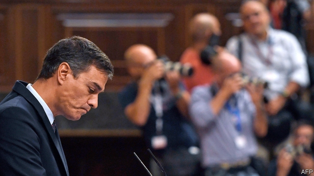

###### Back to the ballot box

# Will a November election break or prolong Spain’s political deadlock? 

 

> print-edition iconPrint edition | Europe | Sep 21st 2019 

“I’VE TRIED everything, but it was impossible.” So said Pedro Sánchez, Spain’s socialist prime minister (pictured), as time ran out this week on his efforts to put together a governing majority, thus almost certainly condemning Spaniards to vote again on November 10th in their fourth general election in as many years. Theoretically those efforts could drag on until September 20th. But his statement marked the start of a new election campaign. It was an attempt to shift the blame that other political leaders say attaches to him for a failure that has both personal and structural causes and from which few of them come out well. 

Mr Sánchez’s Socialists won the most votes in April’s election, but with 123 seats (out of 350) fell well short of a majority. His options were limited from the outset by the refusal of Albert Rivera, the leader of Ciudadanos, a centre-right party with 57 seats, to contemplate any kind of deal. In clumsy negotiations in July, Mr Sánchez’s team instead offered a coalition government and some plum cabinet posts to Podemos, a left-wing party with 42 seats. In an error of judgment that he soon regretted, Pablo Iglesias, Podemos’s leader, turned this down. When negotiations resumed this month, the Socialists had withdrawn their coalition invitation, claiming that they had lost trust in their potential partner. A last-minute offer by Mr Rivera to abstain in the vote to install a new government if Mr Sánchez promised a harsher line against Catalan and Basque nationalists smacked of a first blow in the blame game rather than a serious move. 

Mr Sánchez’s team reckons it will make gains in November. Opinion polls suggest that it may be right, that the conservative opposition People’s Party (PP) will do well too, and that voters will turn against the three newer parties, Ciudadanos, Podemos and the right-wing Vox. Their emergence reflects public anger, first at the banking crisis and economic slump in 2008-13, and then at the illegal bid for independence by separatists in the Catalan regional government in 2017. As the political system has fragmented since 2015, the country has been condemned to a series of weak minority governments. 

Spaniards generally like voting, perhaps because they were denied it for 40 years under General Franco’s dictatorship. But their patience is being tried. The first risk for Mr Sánchez is that turnout drops sharply from April’s 76%; lower turnout tends to hit the left disproportionately. The second risk is that the November vote merely prolongs the stalemate. 

A strong, stable and reformist government is urgently needed. A robust economic recovery has slowed markedly this year. That is one reason the Socialists had second thoughts about Podemos: their putative coalition would have involved some attractive but unaffordable promises and Mr Sánchez would have been the bad cop who had to say no, says José Ignacio Torreblanca, a political scientist in Madrid. Next month the Supreme Court will deliver its verdict in a long-running trial of 12 Catalan separatist leaders for their part in the unconstitutional independence bid. If it metes out long jail sentences, civil disobedience in Catalonia may follow. 

Many commentators long for Spain’s political leaders to adopt the coalition habits of other European democracies. They have not done so partly because the party system is still in flux. “The main players have all been hyper-tactical,” says a former official. “They are bad managers of tactics and are not measuring their words well.” 

Mr Sánchez got to the Moncloa palace through a mixture of obstinacy and daring, and by tacking left. But he has not handled the past few months well. The November election will be a battle for the centre. Its aftermath will require compromise if Spain’s democracy is not to suffer more damage. ■ 

