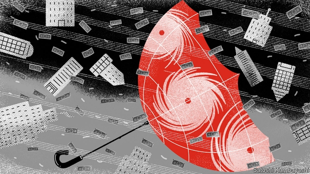
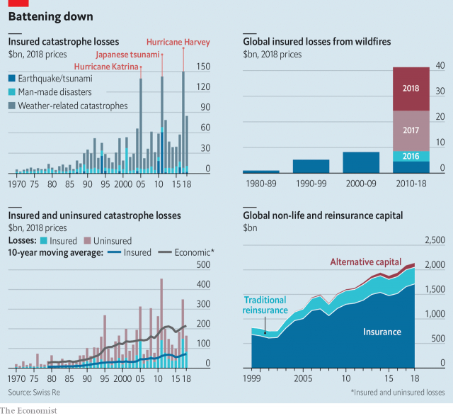

###### Blown cover

# Changing weather could put insurance firms out of business 

 

> print-edition iconPrint edition | Finance and economics | Sep 19th 2019 

THE PILOTS of the Port of London Authority are the cabbies of the Thames estuary. Based in Gravesend, 33km from the capital, they navigate some 10,000 ships into London terminals every year. Dispatched offshore on fast patrol boats, they use rope ladders to board ships as tall as buildings. Much like London’s black-cab drivers, who know its 25,000 streets by heart, they must recall every sandbank and wind farm at the mouth of the river. 

They are essential links in supply lines relied on by south-east England for everything from food to fuel. But when winds are too strong, pilots cannot board ships. If delays accumulate, terminals get clogged. The fiercer storms that could soon come to British shores could paralyse trade for days. Such a chain reaction is an example of the costs carbon emissions may bring. 

Insurance companies are uniquely exposed to these sorts of changes. Tens of millions of businesses buy policies every year to protect themselves from risks. Last year the premiums paid for property and casualty insurance worldwide reached $2.4trn, according to Swiss Re, one of the big reinsurance firms on to which consumer-facing insurers pass the risk of mega-losses. Extreme events becoming the norm could force insurers to fork out ever greater payouts to policyholders, and lower the value of the assets they hold. The best case is that insurers reinvent themselves, helping the world cope—managing risk is, after all, how they make their money. The worst is that some fail and that swathes of the global economy become uninsurable. 

Already, insurers are seeing disasters of unprecedented scale. Earlier this month Hurricane Dorian, one of the two largest storms ever known to have made landfall in the Atlantic, battered the Bahamas and then the Carolinas. In July Hurricane Barry brought the heaviest rainfall ever measured to Arkansas. The Indian Ocean basin has seen three huge cyclones so far this year. Last November California saw wildfires over the largest area ever recorded. 

Very costly disasters are becoming more frequent. Between 1980 and 2015 America saw an average of five events each year causing over $1bn in damage (in current prices). Between 2016 and 2018 the yearly average was 15. In the 20th century, according to AIR Worldwide, a climate-modelling firm, a hurricane on the scale of Harvey, America’s costliest ever, would have been regarded as a one-in-2,000-year event. By 2017, when Harvey blew in, that frequency was estimated at once in 300 years. By 2100, says Peter Sousounis of AIR, it will be once a century, and tidal surges that used to be classed as once-a-millennium events will be expected every 30 years. 

Catastrophes are also getting harder to predict. Though newer models are starting to take account of climate change, most still rely on data from the previous few decades, which are already obsolete. And insurers struggle to handle “compounding effects”—the mutually reinforcing impact on each other of events associated with global warming. Working out when droughts cause wildfires, for example, is tricky because lower rainfall not only makes vegetation drier and hence more flammable, but also slows its growth. Effects tend not to be linear. Above 100km per hour, a 10% increase in wind speed usually causes 50-60% more damage, says Pete Dailey of RMS, a modelling firm. 

Adding to the losses is the growing number of properties being built on flood plains and coasts. Annual insured losses from catastrophic events have grown 20 times, adjusted for inflation, since the 1970s, to an average of $65bn this decade. That excludes knock-on effects such as business disruption. Last year the global figure totalled $85bn, even though it was a year with no mega-disaster. 

Climate losses can also come from the other side of insurers’ balance-sheets: the investments they hold to cover payouts and park any spare funds. Insurers (including life and health as well as property and casualty) are the world’s second-largest institutional investors, with $25trn under management. They often place chunky bets on multinational firms, infrastructure and property—which are becoming riskier propositions as the climate changes. Moreover, structural changes in the economy, such as the move away from fossil fuels, could leave insurers’ portfolios exposed. 

In the face of these threats, insurers are seeking to future-proof their businesses. Part of this is about financial resilience. Most general policies are renewed annually, meaning firms can raise premiums promptly (within regulatory limits). Since a spate of mega-disasters caught them off-guard in the 1990s they have fortified their capital reserves. According to McKinsey, the policyholder surplus (crudely, the excess of assets over liabilities) available to pay claims in America’s property and casualty sector doubled in real terms over the past 20 years. In 1992 Hurricane Andrew sent 11 insurers to the wall. All survived the record hurricane season of 2017-18. 

 

Regulators are doing more to prod insurers to hold sufficient capital—typically the aim is to ensure they can withstand losses caused by the worst imaginable year in 200. But putting a figure on this is hard, because nobody has thousands of years of data. And the worst possible year is getting worse every year. The risks will keep rising long into the future, says Paul Fisher, a former supervisor at the Bank of England. A cataclysmic year could also hit markets, hurting insurers’ investments just when they need them most. Some could be forced to sell assets to cover giant payouts, pushing asset prices down further. 

Most probably, payouts will continue to rise without capsizing insurers. But that still creates a problem. To absorb bigger losses, they must charge higher premiums. According to Marsh, a broker, global commercial-insurance prices rose by 6% in the second quarter of this year, compared with the previous quarter. That was the largest increase since records began. In America property rates jumped 10%; in the Pacific region they soared by nearly 18%. The rise is to meet the demands of reinsurers. Average reinsurance rates are set to rise by 5% next year, according to S&P Global, a rating agency—and in California, after the huge recent wildfires, by 30-70%. 

A few calm quarters could see some of those increases unwound. But there is no doubt about the trend. And it cannot continue for ever without some customers rethinking whether to buy insurance at all. Insurers may seek to keep rates lower by adding exclusion clauses or capping payouts. Or regulators may set maximum premiums—which could mean some insurers quitting altogether. Swathes of the economy are likely to become uninsurable, leaving a growing number of people, firms and states exposed to catastrophic losses. 

The global gap between total losses and insured losses is already wide and growing. The research arm of Swiss Re estimates that it more than doubled in real terms between 2000 and 2018, to $1.2trn. Half of last year’s losses from natural disasters were uninsured. Nine out of ten American homeowners have no flood insurance despite half of the population living near water, says Erwann Michel-Kerjan of McKinsey. 

Insurers are trying various ways to stop this “protection gap” growing. They are digitising their operations and automating claims to cut costs. They are deploying new technologies, for example tackling fraud by gathering data through sensors and sending drones to disaster areas, notes Seth Rachlin of Capgemini, a consultancy. Innovations such as parametric policies help with cost-cutting and fraud prevention. Rather than compensating reported losses ex post, these pay a lump sum when an observable parameter, such as rainfall, passes an agreed threshold. 

Where risks become uninsurable, states and firms may work hand-in-hand. In Britain, where a sixth of homes are at risk of flooding, government and insurers have set up Flood Re, a reinsurer that enables insurers to offer affordable premiums on 350,000 homes in flood plains. 

Many insurers already offer discounted premiums when preventive measures are taken, such as building flood walls. They should consider lending to clients willing to undertake more substantial protective work, says David Bresch of the Swiss Federal Institute of Technology, for example reinforcing embankments. The short-term nature of most insurance contracts complicates matters: an insurer that invests in a project one year can lose its customer to someone offering lower premiums the next. But long-term policies could work for public infrastructure projects. 

Developing countries are underinsured partly because the risks they face are poorly understood. More research would help, as would making models publicly accessible in order to allow officials and financiers to evaluate mitigation measures. Above all, insurers need to publicise the risks posed by climate change, and the need for cover. Often people do not take out insurance because they think the worst will not happen, says Alison Martin of Zurich Insurance. Talking of one-in-2,000-year events is not very helpful, “because many people would think we’re safe for another 1,999”. ■ 

Dig Deeper: 

Why Russia is ambivalent about climate changeClimate change is making it harder to reduce poverty in Malawi 

