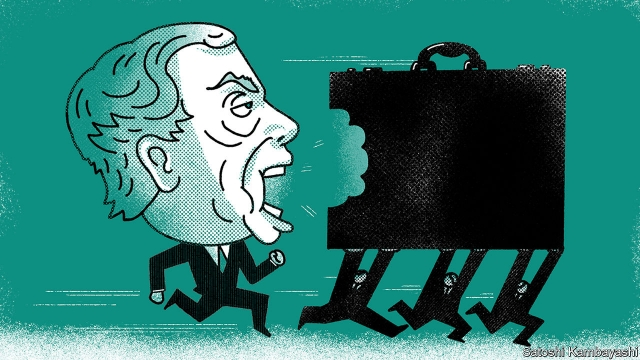

###### Buttonwood

# How T. Boone Pickens changed corporate finance in America 

 

> print-edition iconPrint edition | Finance and economics | Sep 21st 2019 

IN THE EARLY 1950s Thomas Boone Pickens worked as a geologist at Phillips, an oil firm based in Bartlesville, Oklahoma. He hated it. His working day was regimented. His colleagues lacked ambition. He found the waste and inefficiency sickening. “At Phillips, I met the monster: Big Oil,” he wrote. Mr Pickens left to form his own firm, Mesa Petroleum. Impatient with its progress, he devised an audacious plan. He would slay the monster by using Mesa to buy out larger, badly managed firms. 

Against the odds Mesa’s first big bid, for Hugoton, a far larger natural-gas firm, succeeded in 1969. But Mr Pickens, who died on September 11th, is best remembered for the daring takeover bids he made in the 1980s, not least for his old employer, Phillips. These failed, but not before driving the targets’ shares up and making Mr Pickens a small fortune. 

The one that had the most lasting impact on corporate America was his tilt at the Gulf Oil Company. Gulf was one of America’s top six oil firms in 1984; Mesa was a minnow by comparison. So it was a gutsy move. But what set it apart was that it was the first big attempt at a hostile buyout to be backed by junk bonds. Drexel Burnham Lambert, an upstart investment bank, supplied the financial muscle; Mr Pickens provided the oil-industry know-how. Corporate finance would never be quite the same. 

Leveraged buyouts (LBOs) were not entirely new. In the 1960s they were used as a way for small, family-owned firms to sell out to managers without the cost of a public listing. But by the early 1980s the financial landscape was changing. Specialist buyout firms were coming to prominence, including Kohlberg Kravis Roberts (KKR). Mergers were looked upon more kindly by trustbusters. And debt financing was on tap. Michael Milken, Drexel’s junk-bond king, had cultivated a network of investors who were hungry for new issues. He boasted that he could raise $4bn-5bn for T. Boone’s run at Gulf. 

Ideas about corporate finance were changing, too. Decades previously, Franco Modigliani and Merton Miller proposed that a firm’s capital structure—its mix of equity and debt finance—should not affect its value. It is firms’ cashflows that matter, not the nature of the claims on them. But the theory does not work well in the real world, with its bankruptcy costs and tax-deductible interest payments. The ideal capital structure came to be seen as a trade-off between the penalty for holding too much debt (bankruptcy) and the penalty for holding too little (forgone tax benefits). A paper in 1976 by Michael Jensen and William Meckling said that even this theory was incomplete. Debt, they argued, was a device used by shareholders to keep a firm’s management honest. Bosses feel greater pressure to cut costs and raise revenues if they are faced with a hefty interest burden each quarter. 

The debt-is-good doctrine appealed to a new breed of corporate raider. Mr Pickens dusted off the Hugoton blueprint. He would seek out a big, undervalued energy firm, take a large stake in it and then seek to take it over—or at least push the management to improve returns. Gulf Oil met his criteria. His bid failed, but a competing bid by Chevron, another oil giant, succeeded. Mesa made hundreds of millions of dollars on its stake. And Mr Pickens’s run at Gulf became the model for many successful LBOs. 

The legacy of the Mesa-Gulf bid is all around today. High-yield (junk) bonds are no longer the shameful offspring of the fixed-income family; they are an established asset class. The median credit rating for an American corporate has fallen to BBB, a notch above junk. That is largely because of corporate-finance strategy: lots of established firms have chosen to load up on debt to boost shareholder returns. If a firm declines to “optimise” its balance-sheet by taking on more debt, a band of capital-rich buyout firms stand ready to do the job. 

Trends in finance tend to go too far before reversing. But there is already a sense of the forces that might eventually make debt finance less attractive. Tax reforms, in America and elsewhere, have sought to limit the tax breaks on debt. Another catalyst is the changing nature of firms. With the advent of the Internet of Things, the leading digital companies need to demonstrate that they are sure to stay in business for decades in order to persuade customers to sign up with them. Firms that hold a lot of debt will be seen as riskier counterparties. Who knows? Perhaps a future T. Boone Pickens will make the case for a bigger buffer of equity as the essential element of an optimal capital structure. 

