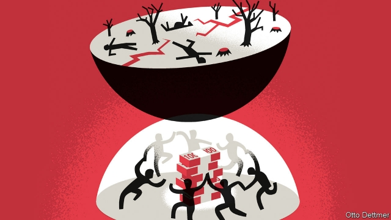

###### Free exchange

# Humanity will find ways to adapt to climate change 

 

> print-edition iconPrint edition | Finance and economics | Sep 21st 2019 

AFTER DESTRUCTIVE storms like Hurricane Dorian, those affected have decisions to make. Should they invest in cellar pumps and better drainage? Should they rebuild with more robust design and materials? Should they move? These judgments are informed by a harsh reality: the weather will get worse. Seas will be higher, rain more diluvial and storms fiercer. People with means will naturally adjust—as they should. Adaptation is essential to reduce the human and economic costs of climate change. But spending on adaptation may further complicate already-confounding politics. 

Efforts to slow global warming must overcome devilish political obstacles. The benefits to reduced warming accrue over decades and centuries, whereas the cost of cutting emissions must be paid upfront by taxpayers who cannot expect to see much return in their lifetimes. And mitigation (as efforts to curb emissions are called) is subject to a vicious collective-action problem. Climate harms are determined much more by what everyone else does than by what you do. Each actor has an incentive to free-ride on the sacrifices of others. Cutting emissions requires every large country saddling voters with expense and inconvenience that will mostly help people elsewhere, or not yet born. 

Adaptation, by contrast, can pay off even when a person acts alone, out of pure self-interest. Homeowners who invest in air-conditioning or flood defences do so in the expectation of capturing most of the returns in the form of reduced harm to themselves, or perhaps higher property values. There are no political-economy problems to untangle (though without investment in green energy, air-conditioning adds to the general problem while mitigating it for individuals). Government actions are only slightly more complicated. It requires political consensus to spend public money on reinforcing infrastructure or building seawalls. But the benefits will mostly be felt in the place where the funds are raised. And at most a few governments and agencies will be required to co-operate, rather than tens or hundreds. 

All this means that adaptation is likely to play a large role in humanity’s response to climate change. Indeed, research suggests that the price of agricultural land already incorporates the expected impact of climate change. Consumers already react to extreme weather events. Purchases of air-conditioning systems rise after heatwaves, for example. Some adaptation plans are explicitly labelled as such—New York City’s proposal to construct a “Big U” of raised flood-control berms around the southern end of Manhattan, for example. Others are not, such as individual decisions to take a job in a place less prone to extreme weather. 

As demand rises for ways to ease the pain of climate change, supply will respond. A growing market for goods prompts producers to innovate—and work by Matthew Kahn of Johns Hopkins University and Daxuan Zhao of Renmin University suggests that the same logic applies to adaptation. Firms researching zero-emission energy and carbon sequestration hope to create a market (or are betting that governments will eventually do the job for them by getting serious about emissions). By contrast the market for better means of coping with climate change is already growing daily. 

That is in many ways a good thing. Predictions of the costs of climate change are often far higher when analysts rule out the possibility of adaptive behaviour. A study published last year considering the global costs of coastal flooding, for example, estimated that floods will reduce real global GDP in 2200 by 4.5%—unless the effects of adaptive investments and migration are considered, in which case the loss works out as just 0.11%. A new report by the Global Commission on Adaptation, a group convened by 20 advanced and emerging economies, identifies $1.8trn in potential adaptation investments which, if realised between 2020 and 2030, would yield estimated net benefits of $7.1trn. 

But the march to adaptation is not an unalloyed good. Just as better safety features in cars may make for less careful drivers, investments in adaptation that blunt the effects of climate change could reduce the appetite for spending on mitigation. Serious decarbonisation will impose significant cost and inconvenience on nearly everyone. People will be persuaded that it is in their interests only if there are tangible harms in the not-too-distant future that might reasonably be averted. Investments in adaptation that reduce the likelihood or severity of those looming harms undercut the case for accepting the hardship of decarbonisation. The longer governments fail to act to curb warming, the more people and firms will spend to safeguard themselves, and the less troubled they may be by governments’ failures to decarbonise. 

But even if some people can adapt to a warmer world, it is still a big problem. Unmitigated global warming could result in catastrophic scenarios that outstrip any capacity to adapt. Moreover, the ability to adapt varies dramatically from place to place. Rich people in North America and mainland Europe, both of which have relatively temperate climates, have money to spend on adaptation and can move from the worst-hit spots with relative ease. Poor people have little spare cash, mostly live in hotter places and face far more obstacles when they try to migrate. Indeed, some research suggests they may even migrate less when temperatures rise, because hotter, drier conditions harm agricultural yields, thus depriving them of the capital they would need to move. 

Part of the attraction of mitigation as a primary response is that the steps rich countries take to help themselves also help poorer ones, which are both less responsible for global warming and more vulnerable to its effects. Residents of advanced economies must recognise that spending to shield themselves increases, rather than decreases, their obligations to others. ■ 

