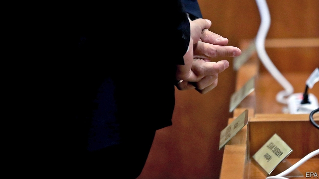

###### 12-step programme

# Two British bankers are on trial in Germany’s biggest tax case 

 

> print-edition iconPrint edition | Finance and economics | Sep 21st 2019 

OCCASIONALLY MARTIN SHIELDS slips into the jargon of financial markets: OTC (over-the-counter), for trades between banks and private customers; kd-1-11, a code for payments, which confuses his translator. But on September 18th, the first of two days’ testimony at a court in Bonn, the British investment banker does his best, with slides and a laser pointer, to explain to the judge the complexities of dividend arbitrage in general and “cum-ex” deals in particular. Even the most basic cum-ex deal, he says, involves 12 steps and a web of bankers, brokers, investors, asset managers, lawyers and consultants. 

Mr Shields and Nicholas Diable, another British banker, are the main defendants in Germany’s biggest post-war tax-fraud trial. They are accused of “aggravated tax evasion” for helping engineer 33 deals that cost taxpayers almost €450m ($494m) between 2006 and 2011. The charge sheet runs to 651 pages. Cum-ex trades are share transactions done at high speed on or just before the day dividend payments are recorded. Before payment, shares come with (cum) dividends, which are reflected in their prices; after, they come without (ex). A flurry of deals may allow two or more investors to reclaim tax on dividends, even though it has been paid just once. 

Mr Shields describes the pressure on traders in London’s investment banks 15 years ago to make juicy profits, in part by exploiting tax loopholes. He refers frequently to Paul Mora, his boss when he started, aged 23, at Merrill Lynch, an American investment bank. The pair then worked together at HypoVereinsbank, a German bank, and Ballance Capital, a fund they set up. Also mentioned is Hanno Berger, a tax lawyer known in Germany as “Mr Cum-Ex”, who wrote legal opinions in support of reimbursements for tax never paid. Mr Mora is thought to be in his native New Zealand and has not been charged with any offence. Mr Berger awaits trial in a German court at his home in Switzerland. All deny any wrongdoing. 

Also in the courtroom were representatives of M.M. Warburg, Warburg Invest, Hansainvest Hanseatische, BNY Mellon and Société Generale. All five banks played parts in cum-ex deals masterminded by Mr Shields, with Mr Diable in a supporting role. If the court rules that the tax reimbursements were fraudulent, they may be on the hook for tens of millions of euros. 

Estimates for the total cost of cum-ex trades in Germany vary wildly. At the low end the finance ministry, which has identified 499 suspected cases, puts the damage at €5.5bn, of which the taxman has recovered €2.4bn. The ministry says it closed the loophole in 2012. Critics say it should have done so much sooner. 

Christoph Spengel of Mannheim University reckons the bill is far higher: €31.8bn between 2001 and 2016. And a team of investigative journalists gathered by Correctiv, an investigative-journalism group, from newspapers in several countries, including Die Zeit in Germany, Le Monde in France and Politiken in Denmark, concluded in a report published last October that the trade is still flourishing. Correctiv estimates the losses to cum-ex trades across Europe to be as high as €55bn. 

Whatever the correct figure, cum-ex deals were much more common than Germany’s finance ministry thought when it was first warned of them a decade ago. About 100 financial firms have been linked to them, including Germany’s DZ Bank and HypoVereinsbank, and JPMorgan Chase, Morgan Stanley and Bank of America Merrill Lynch. On September 10th investigators raided the headquarters of Commerzbank, another German lender, seeking evidence of involvement. A few weeks earlier they searched the offices of Clearstream, Germany’s central share depository. 

The trial of Mr Shields and Mr Diable is due to end on January 9th. The maximum penalty they face if convicted is ten years in prison. They have co-operated with investigators: Mr Shields says he attended more than 30 interviews. Bankers across Europe will await the verdict with bated breath. The case could be the first of many. ■ 

