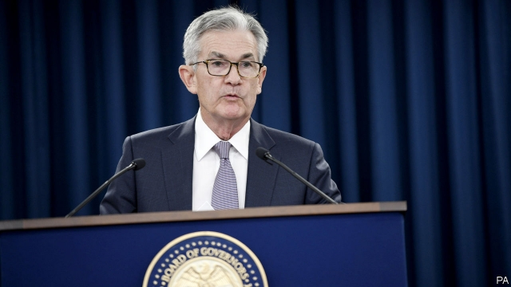
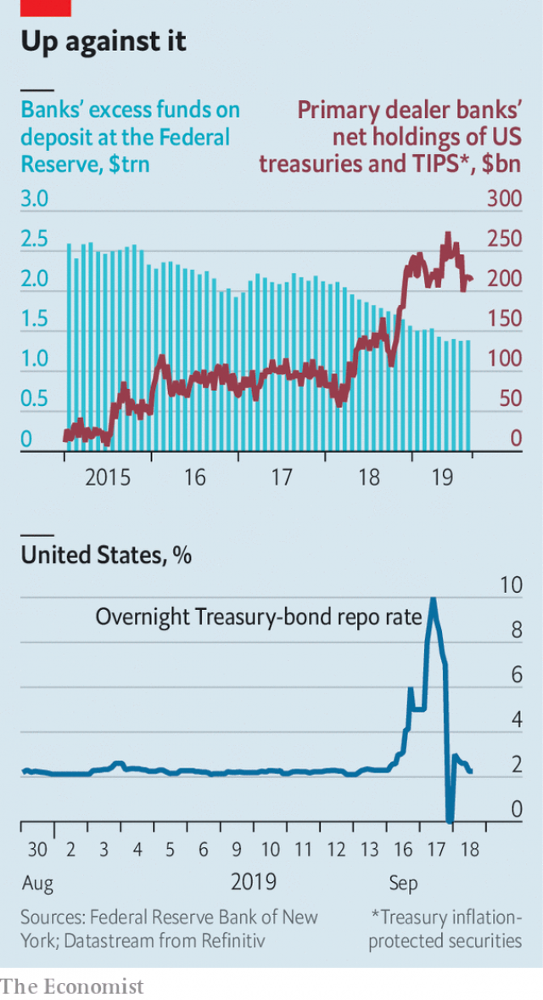

###### Hitting the ceiling

# Why the Fed was forced to intervene in short-term money markets 

 

> print-edition iconPrint edition | Finance and economics | Sep 19th 2019 

THE FEDERAL RESERVE had plenty to fret about as it prepared to discuss policy interest rates on September 17th and 18th. Trade tensions and wilting global growth have seen businesses cut back investment in the second quarter of the year. In manufacturing, production and capacity utilisation have been falling since the end of 2018. Though the Fed has described jobs growth as “solid”, some analysts worry that the labour market is wobbling. As expected, these concerns prompted the central bank to lower rates for the second time this year, by 0.25 percentage points, to a target of 1.75-2%. But the meeting was overshadowed by turmoil in money markets. 

On September 17th, for the first time in a decade, the Fed injected cash into the short-term money market. The intervention was needed after the federal funds rate, at which banks can borrow from each other, climbed above the Fed’s target. It rose as the “repo” rate—the price at which high-quality securities such as American government bonds can be temporarily swapped for cash—hit an intra-day peak of over 10%. On September 17th the Fed offered $75bn-worth of overnight funding, of which banks took up $53bn. The following two days it again offered $75bn-worth. Banks gobbled it up. 

That sent shivers down spines. A spiking repo rate was an early warning sign before the financial crisis. In 2007, as market participants began to doubt the quality of collateral backed by mortgage lending, repo rates jumped as lenders hoarded cash. 

The latest jump was unlikely to have been caused by such doubts. Most collateral is now high-quality American Treasury bonds or bills. Even so, there are reasons to worry. America’s banks and companies seem to be short of cash. And during the turmoil the repo rate stopped tracking the federal funds rate. This link is the main way monetary policy influences the economy. A gap opening between the two deprives the Fed of its most important policy tool. 

Fortunately, the Fed’s interventions seemed to work. The repo rate returned to its usual level, close to the federal funds rate, which in turn is within the range targeted by the Fed. Even so, the turmoil raised questions about how it plans to handle future cash shortages. The mere prospect of them marks an important shift for America’s financial system. Before the financial crisis the Fed controlled the federal funds rate using a “corridor”, with a ceiling and a floor. Banks with too little cash could borrow at the ceiling rate. But there was no compensation for extra cash held at the Fed (the floor interest rate was zero). To keep interest rates precisely on target the Fed used “open market operations”, swapping Treasuries and cash to control liquidity in the banking system. 

 

Six years of quantitative easing changed all that. To push down long-term interest rates, the Fed bought vast quantities of long-dated Treasury bonds. Its balance-sheet ballooned to $4.5trn. The holders—mainly banks—ended up with mountains of cash. To keep market interest rates at or above the policy rate, the Fed was authorised by Congress to raise the floor from zero, compensating banks for their cash that it held. The ceiling became redundant, as did open market operations. Only the floor mattered. 

But banks’ cash piles have dwindled of late. Since late 2017 the Fed has been reducing its balance-sheet by not reinvesting all the proceeds when its assets mature. The balance-sheet shrank from $4.5trn in 2017 to $3.8trn in June this year. Moreover, a wider budget deficit means the Treasury has had to issue more bills and bonds. So far this year it has issued an average of $63.9bn-worth per month, net of repayments. During the same period in 2017 the monthly figure was just $19.6bn. As banks buy Treasuries, their cash piles fall. The surplus reserves banks hold in their deposit accounts at the Fed fell from $2.2trn in 2017 to $1.4trn now. 

No one knows how much surplus cash banks need to feel comfortable. That depends partly on regulations, which have increased the amount of cash banks must hold as a buffer, but also on business sentiment. Banks’ near-death experience in 2008-09 has left them with a strong desire to hold plenty of extra cash. Economists have attempted to estimate the level at which banks would start to squirm, most coming up with estimates of $1.2trn-1.5trn. 

Usually banks have at least this much on hand. But they may not have had on September 16th, for quite benign reasons. That was the deadline for quarterly corporate-tax payments, meaning companies asked banks for more cash than usual. The Treasury had issued $77bn-worth of bills the previous week. The buyers, mostly banks, also had to pay on September 16th. The Fed expected these events, said Jerome Powell, its chairman, but not such an extreme reaction. As banks’ cash piles shrank, they grew reluctant to lend to companies and other counterparties. The repo rate spiked. Some banks stepped in, lending to companies at elevated rates. But then those banks tried to borrow from other banks in the federal funds market, pushing up the rate. This prompted the Fed to intervene. 

Cash would have become scarce sooner or later, says Bill English of Yale University. In a growing economy—especially one with a rising government deficit—the demand for bank cash increases over time. 

The Fed now faces a choice. It could return to conducting frequent open market operations to pin down interest rates, as before the crisis. Or it could keep the current system and avert future cash shortages by expanding its balance-sheet enough to keep the banking system permanently saturated with liquidity, even as demand for cash grows. On September 18th Mr Powell suggested that the Fed would opt for the latter, saying it wanted reserves to be ample enough to avoid operations of the sort carried out in recent days. He also announced technical tweaks that will mean banks are compensated a little less handsomely for cash deposited at the Fed, which might encourage them to lend a little more in the repo market instead. 

It is unclear how quickly balance-sheet expansion might be resumed. This week’s events suggest it may be soon. As Mr Powell said after the Fed’s meeting, “I think we’ll learn quite a lot in the next six weeks.” ■ 

