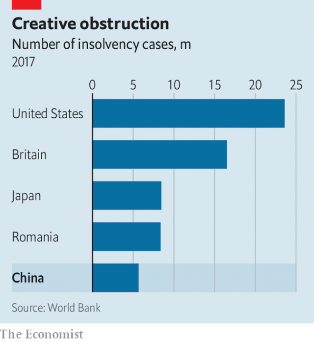

###### Got your number

# Wrapped in polite wording, the World Bank delivers a warning to China 

 

> print-edition iconPrint edition | Finance and economics | Sep 21st 2019 

CHINA LOVES political slogans expressed as numbered lists. There are, to name a few, the Two Centenaries, the Three Represents and the Four Comprehensives (not to be confused with the Four Modernisations or, heaven forfend, the Four Olds). In a new report the World Bank has made its own contribution to Chinese numerology, introducing the “three Ds”. These, it says, refer to what China must do to become more productive and innovative: remove economic distortions, diffuse technology and foster discovery. That might sound hokey, but it highlights a basic challenge for any external actor in China today: how to convey new ideas and criticism to a government that is increasingly set in its ways. 

The World Bank has more experience than most in this, having loaned cash (more than $60bn) and expertise to China over nearly four decades. Its report, “Innovative China”, published on September 17th, reflects a slightly different approach. It is the third time since 2012 that it has jointly written a policy blueprint with the Development Research Centre, a think-tank under the State Council. It is, in theory, a way to put recommendations into the prime minister’s hands, and perhaps into the next five-year plan. 

This report came with more controversy than the previous two. In March the Washington Post reported that it had been ready for a year, but that Chinese authorities had blocked its release because they objected to some of its contents, notably a section on reforming state-owned enterprises. People involved have disputed that account, saying that there were indeed debates but that these are normal for any report with high-level involvement. 

A closer look does reveal a striking change in tone. The first report, published in 2012, spoke of “the need to accelerate reforms in the state-owned sector”. The latest reads in parts as a restatement of Chinese policy: “state-owned enterprises are at the core of the co-existence between the state and the market.” The 2012 report recommended a big change to SASAC, the agency overseeing state firms, calling for it to be limited to regulation rather than asset management. The latest mentions SASAC only once, in the acknowledgments. 

 

But despite its cautious wording, “Innovative China” still has much to offer. It presents plenty of evidence of flaws in the Chinese economic model: a much-puffed rise in business creation has probably been overstated; the allocation of capital has become less efficient in recent years; and the number of bankruptcies is tiny—lower than in Romania (see chart), leaving China with zombie firms. In formulating its “three Ds” the Bank is trying, gently, to warn the government that it is focusing too much on shiny new inventions at the expense of basic policy settings that ought to yield more productive growth. 

As for the fraught question of the state’s role in the economy, the Bank is making a subtle point when it echoes official language. Over the past five years China has laid out plans to limit subsidies to state firms and help private-sector rivals fight them on a level terrain. “If China were actually implementing official policy, such as on fair competition, we would be making a lot of progress,” says Martin Raiser, the World Bank’s director for China. Perhaps a fourth D would help: China must deliver on its promises. ■ 

