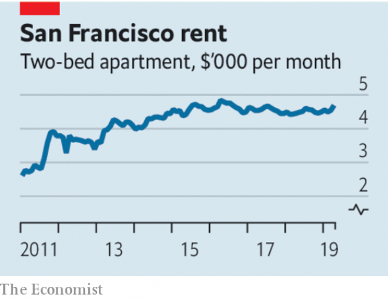

###### Control your instincts

# Rent control will make housing shortages worse 

 

> print-edition iconPrint edition | Leaders | Sep 21st 2019 

THE OVER-REGULATION of homebuilding in and around thriving cities is one of the great economic-policy failures of recent times. In London the median full-time employee renting the median two-bedroom flat works nearly half the year just to pay the landlord. In San Francisco rent is so high that a four-person household with an income of $129,000 might still qualify for federal handouts. Housing shortages like these have helped suck wealth away from young renters, fuelling tension between the generations. Supply restrictions have a high economic cost—by one estimate, curbs in just three successful cities lower overall GDP in the United States by almost 4%. As more and more voters find themselves on the losing end of property markets, they have also generated a political backlash. In America and Europe politicians are thus under pressure to reduce housing costs. 

A rethink of housing policy is certainly overdue. Many of the new ideas are welcome, for example more building and recognition of the harm wrought by NIMBYism (the attitude of homeowners campaigning against nearby developments). Britain has improved the regulation of rental contracts, a vital component of a functional housing market. Unfortunately, at the same time an old and rotten idea is being resurrected—rent controls. If these proliferate, they will, just like rules that stymie building, skewer property-market outsiders and protect favoured residents. 

Across the West rent controls are back in fashion. On September 11th California’s lawmakers passed a bill that would cap annual rent increases across the state at 5% plus inflation. The state is following in the footsteps of Oregon, which earlier this year limited most rent rises to 7% plus inflation. Some Democrats want rents managed nationally. On September 14th Bernie Sanders, a senator and presidential contender, said that the limit everywhere should be 3% or 1½ times inflation, whichever is higher (see article). Meanwhile London’s mayor, Sadiq Khan, has called for rent controls in the capital. Berlin’s legislators have voted to freeze rents for five years from 2020; some German politicians have called for national rent caps. Paris reintroduced rent controls in July, having scrapped them in 2017. 

 

Rent controls are a textbook example of a well-intentioned policy that does not work. They deter the supply of good-quality rental housing. With rents capped, building new homes becomes less profitable. Even maintaining existing properties is discouraged because landlords see no return for their investment. Renters stay put in crumbling properties because controls often reset when tenants change. Who occupies housing ends up bearing little relation to who can make best use of it (ie, workers well-suited to local job opportunities). The mismatch reduces economy-wide productivity. The longer a tenant stays put, the bigger the disparity between the market rent and his payments, sharpening the incentive not to move. 

The resulting damage is clear from the fate of two American cities. In the mid-1990s Cambridge, Massachusetts, scrapped its rent controls, while San Francisco made its regime even stricter. In Cambridge apartments freed from rent control saw a spurt of property improvements. San Francisco experienced its own residential investment boom, but one that was aimed at getting round the rules, for example by converting rental properties so that they could be sold. The subsequent 15% reduction in supply by affected landlords pushed up rents across the city by more than 5%. 

It is unrealistic to expect politicians to ignore voters’ demands. But the danger is that one abuse of power is replaced by another as renters, just like NIMBYs, campaign for regulations to lock newcomers out of the market. Although today’s residents might benefit from capped rent increases, outsiders, faced with less supply and fewer opportunities, will suffer. Just ask the 636,000 people who were queuing at the end of 2018 for a diminishing stock of rental housing in rent-controlled Stockholm. There, the average waiting-time to find a long-term tenancy is ten years and black-market rentals have begun to thrive. Rent control harms almost everyone eventually because the housing stock deteriorates. 

Falling home-ownership rates in countries like Britain and America mean that it is more important than ever for the rental market to function well. Yet rent controls will only make it worse. As a solution to housing shortages, they are snake oil. Voters and politicians everywhere should reject them. ■ 

