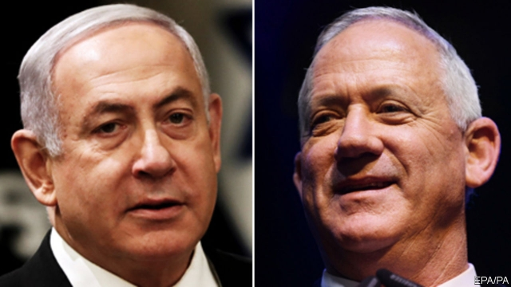

###### King Bibi fails

# The reign of Bibi Netanyahu is ending 

 

> print-edition iconPrint edition | Leaders | Sep 21st 2019 

HIS DEVOTEES call him King Bibi, but the crown is slipping. Twice this year Binyamin Netanyahu, Israel’s prime minister, has gone to the country to ask voters for a clear majority. Twice they have denied him one. With almost all the votes counted from the ballot on September 17th, Mr Netanyahu’s Likud party was two seats behind Blue and White, a centrist alliance led by Benny Gantz, a former military chief. Mr Netanyahu’s coalition of right-wing and religious parties fell six short of a majority, a larger shortfall than at the previous election in April. 

Mr Netanyahu (pictured, left) still hopes to cling to power as Mr Gantz (right), too, has no clear path to a governing coalition. Yet the era of King Bibi is surely coming to a close. Having lost his majority, Mr Netanyahu has lost almost all hope of obtaining immunity from prosecution on three counts of alleged corruption. And he has lost the aura of invincibility given by four terms and 13 years in power. 

Liberals in Israel and around the world may dare to believe that, at last, Mr Netanyahu’s brand of ethno-nationalist politics can be defeated. Israel now has a chance to return to a more sane democratic politics. But only a chance. 

Much will depend on how the coalition horse-trading plays out. By nosing ahead, Mr Gantz has the better claim to try to form a cabinet. But Mr Netanyahu remains caretaker prime minister until another government is formed. Even if he somehow stays in office, he will be much diminished. He will have to share power with his enemies—whether Mr Gantz or, worse, Avigdor Lieberman, an ex-aide who split with him and thwarted him. The best Mr Netanyahu can hope for is a government of national unity in which he and Mr Gantz take turns as leader. Even so, he will be vulnerable to prosecution and abandonment by allies. 

In March this newspaper described Mr Netanyahu’s tenure as a parable of modern populism. He embraced muscular nationalism and elite-bashing long before these became a global force (though he adopted more sensible economic policies). During the campaign he reverted to type: although after 13 years in power he can hardly claim to be the underdog, he cast himself as the champion of the people against the elite. He claimed that policemen and prosecutors dogging him were leftists, even though he appointed many of them. The journalists who questioned him were denounced for purveying false news, though Israel Hayom, the biggest freesheet, is so loyal that Israelis call it bibiton (iton is Hebrew for newspaper). 

Mr Netanyahu sowed distrust of Arab citizens. He accused Arab parties of fraud; a chatbot message on his Facebook page, since withdrawn, accused them of trying “to destroy us all”. As ever, he highlighted the threat of Iran and his friendship with President Donald Trump, who recognised Jerusalem as Israel’s capital. Above all, Mr Netanyahu sought to mobilise his right-wing base, promising to annex part of the occupied West Bank if re-elected. 

None of these tactics worked, and some backfired. The threat to place cameras in polling stations, supposedly to deter Arab voter fraud, instead provoked a large Arab turnout. What were once acts of bravura from the man known as “the magician” now look like tired old stunts. 

His potential replacement, Mr Gantz, presents himself as a warrior who wants peace, but has been worryingly vague about his policies. Do not expect him to rush into a deal with the Palestinians. A two-state peace deal, with a Palestinian state alongside Israel, may seem desirable to most of the world but appeals to only about half of Israelis. And many of them think it is unachievable right now: moderate Palestinians are too weak, and the radicals strong enough to spoil any accord. Most Israelis reckon the conflict can only be managed, not solved. At least under Mr Gantz some sort of dialogue with Palestinians might resume, and the threat of unilateral annexation will recede; perhaps there can be partial deals. If Mr Gantz makes a difference, it is more likely to be to the tenor of Israeli politics, whose drift towards intolerant ethno-nationalism he might arrest. 

That said, what brought Mr Netanyahu down was not a victory of the peace camp, but a betrayal among nationalists. Mr Lieberman, formerly Mr Netanyahu’s chief of staff, has become Israel’s kingmaker. His breakaway party, Yisrael Beiteinu (Israel, Our Home), made bigger gains than any other by promising not to join any government unless it introduced secular reforms, which would in turn break Likud’s alliance with ultra-religious parties. That is welcome, but Yisrael Beiteinu is hardly liberal. It is more rabidly nationalist than Likud, having often led efforts to delegitimise Arab parties, and Mr Lieberman has been fending off accusations of corruption for as long as Mr Netanyahu has. 

It is tempting to conclude that the parable has a hopeful moral: populism has found its limits; the institutions of liberal democracy can stand up to it. But the weakening of one kind of populism may simply have strengthened another. The work of embattled liberals in Israel, and elsewhere, is far from done. ■ 

