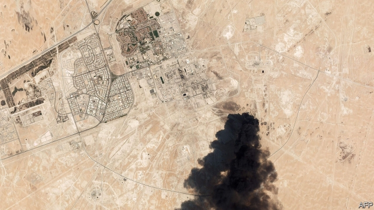
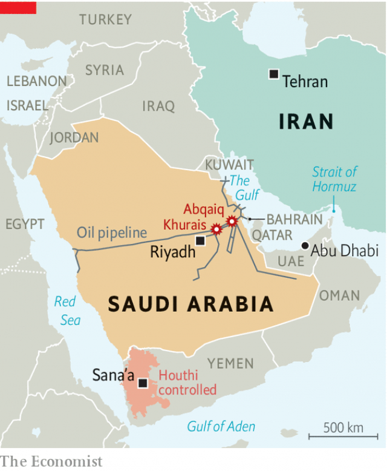
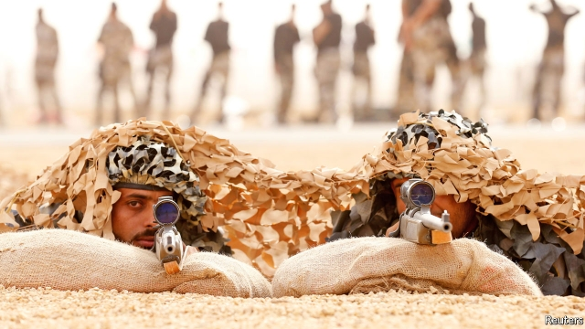

###### Iran’s dangerous game

# A strike on Saudi Arabia moves a shadowy conflict closer to open war 

 

> print-edition iconPrint edition | Middle East and Africa | Sep 19th 2019 

THE MISSILES streaked down and turned the night sky orange. In the early hours of September 14th a barrage of fast-moving weapons hit Abqaiq, a town in the eastern Saudi desert that is home to the world’s largest oil-processing facility. They punched holes in the spheroids that process crude oil and smashed five of Abqaiq’s 18 stabilisation towers, lighting up the night. A separate volley set ablaze the Khurais oilfield, 185km to the south west. 

When the sun rose a few hours later, thick plumes of smoke were visible from space. The images reminded some of the 1991 war with Iraq, when Saddam Hussein’s retreating army set fire to oilfields in Kuwait. Oil prices briefly surged 20% on news that more than 5.7m barrels a day of oil production had been halted. This was the biggest disruption to the world’s energy supply in decades (see article). 

The attack appears to be the most dangerous escalation yet by the Islamic republic in its simmering conflict with America and its allies. After months of sabre-rattling and increasingly brazen acts of aggression—from mine attacks on ships to the seizure of a British-flagged oil tanker—Iran (or its proxies) has moved on to strike directly at the jugular vein of the world’s economy. The barrage, by a mix of cruise missiles and drones, also marks a worrying transition to open war from the shadowy proxy conflict that Iran has waged with Saudi Arabia and its allies. 

Iran has made mischief in the region, and beyond, for years. The Quds Force, a special-operations arm of the hardline Islamic Revolutionary Guard Corps (IRGC), provided explosives used in attacks on American troops in Iraq a decade ago. Iran was also implicated in terrorist activities in Europe and the Americas long before that. 

But the regime’s most dangerous card—a nuclear programme that may have left it months away from the ability to manufacture an atomic bomb—was removed from the deck in 2015. An agreement struck between Iran and six world powers saw it accept strict limits on uranium enrichment in exchange for relief from some economic sanctions. The deal may have also helped to dissuade Iran from aggressive acts that could have threatened the foreign investment and other benefits promised by the deal. But that calculus changed when President Donald Trump unilaterally withdrew America from the agreement in May 2018 and in effect banned the export of its oil a year later. Iran’s exports have shrunk from a peak of 2.8m barrels a day last year to less than 1m now. Mr Trump has since added to the pain with new sanctions on entire industries, such as petrochemicals and the gold trade, and on individuals including Mohammad Javad Zarif, the foreign minister. 

This pressure has prompted Iran to hit back. It first sabotaged oil tankers in the Persian Gulf. Then it stepped up a notch to seizing them, most recently grabbing a vessel on September 16th that it said was smuggling fuel to the United Arab Emirates (UAE). Iran has also begun to flout some aspects of the nuclear deal itself, by enriching uranium to proscribed quantities and levels of purity. 

There was a logic to this escalation. Iran hoped that by threatening to step away from the nuclear pact it would press the other signatories, in particular France, Germany and Britain, into offering it support such as credit lines to mitigate the impact of American sanctions. And by menacing shipping in the Gulf it wanted to demonstrate that the regime could impose costs on America and its allies. But what may have started as a way of signalling Iran’s unhappiness has since escalated into more dangerous actions such as the latest attack on Saudi Arabia’s oil facilities. 

In part this is because of Mr Trump’s tepid response to earlier provocations. For all his hawkish rhetoric and sanctions, a campaign he calls “maximum pressure”, the president is averse to military conflict. He ordered retaliatory air strikes after Iran shot down an American drone flying over the Gulf in June, only to recall the bombers at the last minute. 

Much is still unknown about the latest attack. But it is reasonable to conclude, as Saudi Arabia (and its ally America) soon did, that Iran had a hand in it. The Islamic republic denies involvement, but circumstantial evidence links it to the weapons used. The first claim of responsibility came from the Houthis, who control northern parts of Yemen and its capital, Sana’a. UN investigators have previously said that Iran had supplied the Houthis with advanced weapons, including drones, missiles and equipment to make rocket fuel. 

 

Many Houthi drones look almost identical to Iranian ones. Scores have been flown into Saudi Arabia, aimed at airports, military bases and other targets. In December 2017 the Houthis even launched missiles towards a nuclear reactor under construction in Abu Dhabi. In January the UN noted that the Houthis had acquired a new drone with a range of up to 1,500km. In May the group claimed to have struck two oil-pumping stations and a pipeline deep in Saudi territory using such drones. 

The weapons used in the latest attack seem to have been developed in Iran. Fabian Hinz, an analyst with the James Martin Centre for Nonproliferation Studies, wrote that wreckage found near Abqaiq looked like a cruise missile known as the Quds-1, probably designed by Iran. At a press conference on September 18th Saudi Arabia showed the wreckage of drones and missiles that it claimed proved Iran’s involvement. America says that these were launched from a base in southern Iran. Satellite photos indicate a sophisticated and precise operation, with clean strikes on Abqaiq’s facilities. It is hard to imagine the Houthis conducting such an attack without Iran’s help. 

If oil output, and by extension the world economy, was the first casualty, then the second was surely Saudi credibility as a dependable guardian of that supply. Last year Saudi Arabia spent between $68bn and $83bn on defence (estimates vary), behind only America and China. Saudi Arabia was one of the first foreign buyers of America’s Patriot missile-defence system in 1991 and now operates six batteries of them. 

Yet its ground forces have been humbled by four years of fighting rebels waging guerrilla warfare in Yemen. And its air defences seem to be just as inept at fending off conventional threats. To be fair, drones and cruise missiles are especially hard to stop, particularly if they overwhelm defences by arriving in large numbers. They are small and they fly low, hiding from radar behind the curvature of the earth. And they are manoeuvrable, so they can skirt known missile-defence sites. Some reports suggest the Aramco barrage snuck in via Kuwait. Saudi air defences are relatively thin in the eastern province, with most of its batteries focused to the south on the threat from Yemen. 

Even so, Saudi forces seem to have had only limited success in using their Patriots against ballistic missiles, which are easier to spot. The company that makes the Patriot claims that its batteries have batted away more than 100 Houthi missiles over Saudi Arabia and the UAE. But Jeffrey Lewis, an expert at the Middlebury Institute of International Studies at Monterey, says there is no evidence that they have intercepted any missiles. If the Patriot and similar systems are leakier than assumed, Saudi oil facilities may be worryingly vulnerable to Iran should the conflict escalate. 

America’s standing as the ultimate guarantor of security in the region has also been damaged. Mr Trump first said that America was “locked and loaded” to respond to the attack. Then he prevaricated, as he had done in earlier incidents, kicking the ball back to Saudi Arabia, saying he would wait “to hear from the kingdom” before acting. The following day he stressed his desire to make a deal with Iran. On September 18th Mr Trump announced that he would impose further sanctions. But their impact will be limited, because the administration is running out of effective targets. 

An aide to the vice-president, Mike Pence, said that “locked and loaded” was in fact a reference to American energy independence, a prize bit of spin even for Mr Trump’s White House. The erratic swerves then continued with Mike Pompeo, the secretary of state, calling the attack an “act of war” in a visit to the kingdom. 

Saudi Arabia has tried to downplay the incident at home. King Salman said that his country has the “ability to respond”—hardly a war cry. Much of the public commentary on the attack has come from oil officials, not military men. Two days after the attack the front page of Al-Riyadh, a pro-government daily, led with a story about the crown prince attending a camel race. Coverage of the Aramco incident came further down. It emphasised international support for the kingdom and avoided photos of burning oilfields. 

This seems in keeping with Saudi tradition. For decades the kingdom was conservative in its foreign policy and shunned the use of hard power. Under the previous monarch, King Abdullah, it would have been unthinkable for Saudi Arabia to conduct a military strike without America’s full support. 

Times have changed. The crown prince, Muhammad bin Salman, has ploughed ahead with a ruinous war in Yemen despite deep misgivings in Washington and other Western capitals. He has also worked to cultivate a new Saudi identity, one rooted in muscular nationalism instead of Islam. Officials in the Gulf have warned for months that the kingdom would eventually have to retaliate against Iran for the seemingly endless string of drone and missile attacks on its facilities. 

Yet Saudi Arabia remains hesitant to pick a fight with a foe that can fight back. The experience of its air force in Yemen is not encouraging. Air strikes by the Saudi-led coalition have killed thousands of civilians, despite Britain and America providing precision munitions from their own arsenals and targeting assistance in a bid to reduce “collateral damage”. Iran, which operates the Russian S-300 air defence system, would be an even harder target for Saudi warplanes. (Vladimir Putin, in a sublime bit of political trolling, suggested on September 16th that Saudi Arabia might want to buy the same system, while Mr Rouhani chuckled on a stage next to him.) The kingdom does have its own arsenal of Western-built cruise missiles, but their short range means they could reach only parts of Iran. 

 

If further evidence of Iran’s role comes to light, Mr Trump may face more pressure to act. “The strike on Abqaiq is arguably the most serious attack on energy infrastructure in the Gulf since Saddam Hussein’s forces invaded Kuwait in 1990,” says Michael Singh of the Washington Institute for Near East Peace Policy, a think-tank. 

Mr Trump has a range of options. His proposed strike in June was aimed at the radar and missile batteries involved with shooting down the American drone. This time he could target facilities from which the attack on Saudi Arabia was launched—although drones and cruise missiles tend to be mobile and easy to launch from austere sites. Another option would be to target facilities associated with the IRGC. Attacking their bases and personnel outside Iran—whether in Iraq, Syria or Yemen—might be considered less escalatory than striking Iranian soil. A larger show of force is also possible. In 1988 America responded to Iranian attacks on shipping in the Persian Gulf with Operation Praying Mantis, a major air and naval assault on Iranian ships and platforms. 

Iran would not sit by. Its conventional means are limited; its $13bn defence budget is a fifth of Saudi Arabia’s, and one-fiftieth that of America’s. But it could target further missile volleys at ships, bases and other critical infrastructure throughout the Gulf. The Quds Force could also mobilise regional allies, from the Houthis inYemen to Hizbullah in Lebanon, to attack Western and Arab interests, which is one reason that the Pentagon is discouraging Mr Trump from ordering a military strike. More subtly, Iran’s accomplished cyber-forces could disrupt energy, financial and political networks within the region and beyond. In 2012 Iranian hackers were blamed for crippling 30,000 of Saudi Aramco’s computers in one of the costliest cyber-attacks ever. 

A wild and uncontrolled backlash is unlikely. In choosing their parry, Iran’s leaders would need to balance between facing down America by raising the stakes, and avoiding an all-out war that would threaten the regime’s survival. Their hope is that Mr Trump would lose the stomach for a fight long before matters reached such a stage. 

This was always the inexorable endpoint of Mr Trump’s policy of “maximum pressure”. He and his aides thought they could pummel Iran into a new deal that constrained not only its nuclear programme but also its foreign policy. Instead they convinced Iran’s hardliners that the only way of dealing with America was through muscular confrontation. Neither side will find it easy to back away. ■ 

