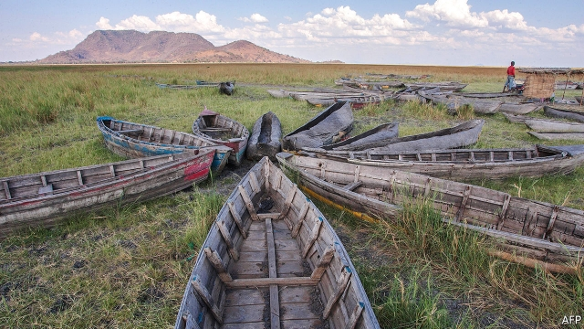
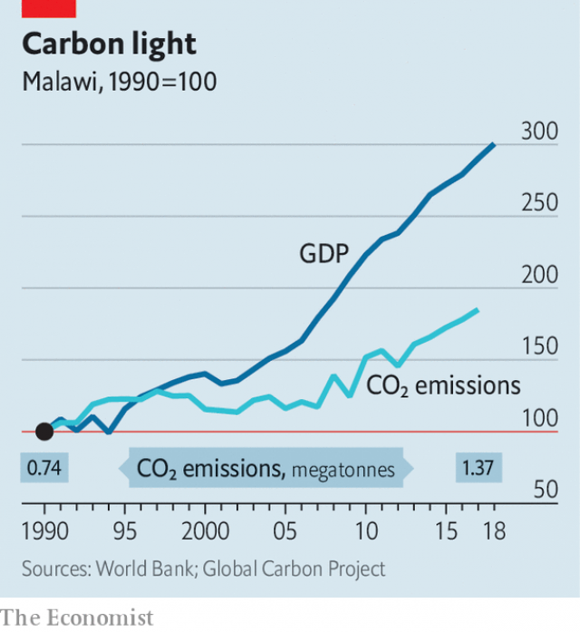
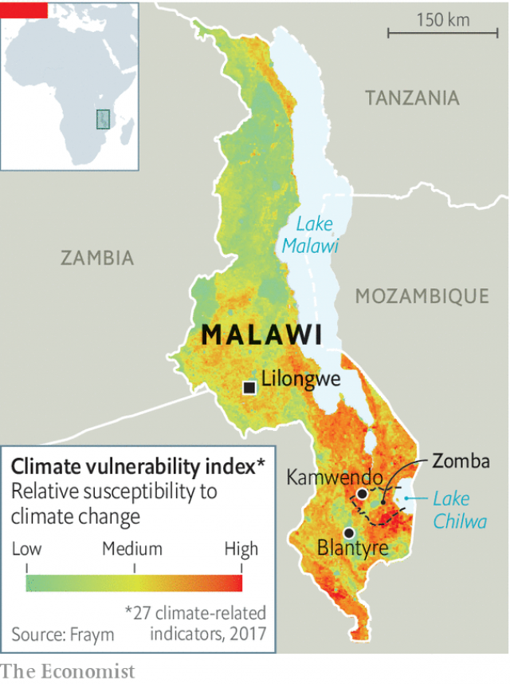

###### When it rains

# Climate change is making it harder to reduce poverty in Malawi 

 

> print-edition iconPrint edition | Middle East and Africa | Sep 21st 2019 

LIKE MOST Malawians, Wema Kaloti lives off the land. She grows maize on her family plot in Kamwendo, a village in the south of the country. But farming is getting harder as rainfall grows erratic. “Sometimes a lot, sometimes a little,” she says, glancing at the sky. Yields have dwindled. A hectare that once produced 20 sacks of maize now brings in seven. “There is not enough to sustain ourselves.” 

Malawi is one of the poorest countries in the world. GDP per capita is lower in just five others. Fully 71% of Malawians earn less than the international poverty level of $1.90 per day. Most of the labour force works in agriculture. Improving Malawians’ lot, therefore, depends on making farming more productive or developing better ways of making a living. Both tasks are made more difficult by climate change. 

Malawi is especially vulnerable to rising temperatures and erratic rainfall. Most farmers in the country are smallholders. Four in every five grow maize. Almost all of them rely on a single rainy season. If it is disrupted, their livelihoods are at risk. 

And disruption is on the way. Research summarised by Future Climate for Africa (FCA), a research group, points to two trends. The first is rising temperatures. By 2040 there may be more than 100 days a year when the mercury rises above 30°C, a threshold at which maize suffers, compared with about ten days now. The second trend is that although there may be fewer rainy days in future, when it does rain, it is more likely to pour. This is a recipe for floods, droughts and shorter rainy seasons. 

 

In 2015 both drought and floods occurred, and a year later further drought. Maize production fell by 30% in 2015, then by another 12% in 2016, when 6.7m people (in a country of 18.1m) needed food aid. In 2018 Lake Chilwa, in south-east Malawi, dried up completely. Residents of Chisi Island, in the middle of the lake, which was once the country’s second-largest body of water, no longer needed to use canoes to reach the mainland. 

In Zomba district, the region that includes the lake and Kamwendo village, climate change has had profound effects on the economy. Maize yields have slumped as the onset of the rainy season has moved from early October to mid-November. Rice fields near Lake Chilwa have flooded. Livestock farming has become harder with less water and feed. Around Lake Chilwa, the drying of the lake forced 7,000 fishermen to seek work elsewhere, mostly on Lake Malawi, which covers a fifth of the country. 

 

It is not just climate change that is hurting farming. A growing population has meant dwindling farm sizes; today the average plot is 0.8 hectares, less than the area of a football pitch. Soils are being degraded because they are farmed too intensively and often by using damaging practices. Nearly 40% of agricultural land has soil that is too acidic for decent yields. Malawian maize farmers get only 11-28% of the potential yield from the crop, according to the World Bank. Widespread deforestation, often by desperate farmers who need to sell wood for extra income, has made it harder to manage water flows. 

Some efforts are afoot to adapt to climate change while improving land management. In Kamwendo, Ms Kaloti is part of a “farmer field school” supported by the Food and Agriculture Organisation, a UN agency. Farmers like her are experimenting with faster-growing varieties of maize and growing banana trees in gullies to lessen the effects of floods. 

At Lake Chilwa, Sosten Chiotha of the University of Malawi has been leading a similar project. Farmers have doubled yields by improving the soil through mulching and using seeds that can grow in a shorter rainy season. Tree-planting has helped to protect rice fields from drowning. Solar-powered fish-dryers have speeded the process of preparing the catch for market. Mr Chiotha has set up a “weather chasers” WhatsApp group to raise awareness of incoming storms. 

There is, however, a danger that adaptation schemes will never be enough to help Malawian farmers escape poverty. “Ultimately there are too many small-scale farmers,” says Pamela Kuwali of the Civil Society Agriculture Network, an NGO. She argues that the government—and aid donors who account for the bulk of public spending in many areas—need to do more to increase the 4% of farmland that is irrigated for commercial use. Instead, policy is a mess. A ban on exporting maize hinders trade in the crop. A fertiliser subsidy scheme takes up most of the spending on agriculture. 

Irrigation would leave Malawi’s farmers less at the mercy of the rains. But it has its own problems. Lake Malawi feeds the hydro-power stations that provide more than 90% of the country’s electricity. In 2015 these stations lost two-thirds of their capacity because of droughts, leading to widespread blackouts. This hampered irrigation schemes as well as affecting businesses in the cities of Lilongwe and Blantyre. Malawi’s power sector is “massively exposed to fluctuations in the lake level,” says Declan Conway of the London School of Economics. 

Mr Conway is one of the academics in the Future Climate for Africa project. It is trying to produce more accurate modelling of Malawi’s climate, with the hope that it will help policymakers plan. But Mr Conway acknowledges it can be hard to get politicians to see climate change as an immediate threat. 

One hope is that voters may push them to stop ignoring it. Afrobarometer, a pan-African outfit, says that the share of Malawians who are aware of climate change (78%) is the joint second-highest of the 34 African countries it has polled. A separate survey by Afrobarometer in 2018 found that 81% of Malawians said conditions for agricultural production were getting worse. Such views seem to correlate with poor opinions of the government. 

Yet Malawians are not just angry at their government. “There is so much hypocrisy around climate change,” says Isaac Ali, an official in Zomba. “Donor countries give us money to plant some trees, but they keep polluting.” It is too much to expect Malawi to carry the burden for changes it did not cause, he argues. “They’re using poor countries to cleanse their own sins.” ■ 

