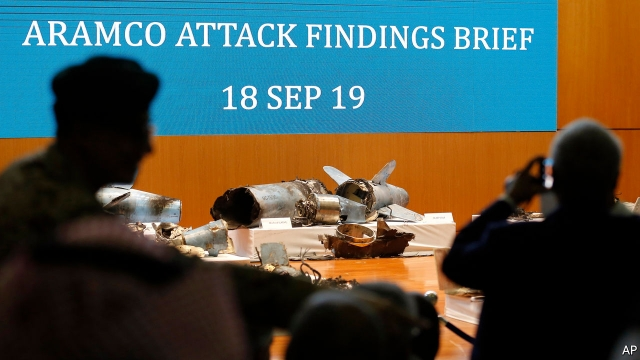
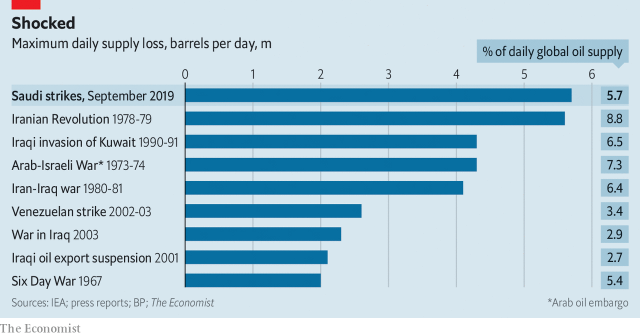

###### A sticky mess

# Despite American shale, oil markets still rely on Saudi Arabia 

 

> print-edition iconPrint edition | Middle East and Africa | Sep 19th 2019 

THE WORLD’S oil markets depend on Saudi Aramco, Saudi Arabia’s state-owned giant. In turn Aramco depends on Abqaiq. Crude from Saudi Arabia’s legendary oil fields—Ghawar, Khurais, Shaybah—comes to Abqaiq to be processed, coursing through its sprawling network of pipes, spheroids and stabilisation towers before being sent to customers around the world. Last year about half of Saudi Arabia’s production flowed through the facility. Little wonder that the kingdom’s enemies have long sought to cripple it. 

On September 14th they succeeded. Drone strikes at Abqaiq and the Khurais oil field knocked out 5.7m barrels per day of production, a staggering 60% of the kingdom’s output and 6% of global supply. By September 17th, however, Abqaiq had resumed processing 2m barrels of oil. Amin Nasser, Aramco’s chief executive, said that capacity would be fully restored by the end of the month and that the attack would not affect plans to list a portion of Aramco’s shares in what is expected to be one of the biggest initial public offerings (IPO) ever. 

The price of Brent oil, which had briefly jumped as much as 20% after the attack, slumped back to $64, just $1 above its level a week earlier. Aramco has so far maintained exports by drawing down supplies, but its stocks were already at a 12-year low. Much depends on whether it can meet its own timeline for resuming production. Yet its assurances were greeted sceptically by some industry veterans. “Does anybody actually believe that after looking at the satellite imaging photos?” questioned one oil man. And even if Aramco does resume full operations quickly, big questions haunt the company and the oil market. 

 

In the past year oil prices have jumped and slid, alternately pushed up by concerns that American sanctions on Iran and Venezuela would curb supply and depressed by fears of slowing economic growth. In December the Organisation of Petroleum Exporting Countries (OPEC), Russia and other oil producers agreed to reduce output by 1.2m barrels a day. Saudi Arabia has cut more than it promised to, keeping oil prices from sinking as far as they might have otherwise. Even so, the price of Brent crude on September 13th, the day before the attacks, was about 20% lower than it had been in late April. 

Faced with such challenges, Saudi Arabia has shaken up its oil hierarchy. A new oil minister, Prince Abdulaziz bin Salman, and a new chairman of Aramco, Yasir Othman Al-Rumayyan, assumed their posts in the past month. But stabilising oil prices and speeding Aramco’s IPO now look harder than ever. 

Start with Aramco’s delayed IPO, which has tantalised investors since it was first announced in 2016. In April possible investors drooled over the figures in its first ever bond prospectus: Aramco’s $111bn net income was almost twice that of Apple’s, the world’s most profitable public company, and larger than the earnings of ExxonMobil, Royal Dutch Shell, Chevron, Total and BP combined. Some also fretted that its production is much more dependent on a single country than its major competitors. Mr Nasser has sought to downplay such concerns, insisting that its production was reliable. But Aramco’s vulnerabilities have been laid bare and this may be reflected in the valuation it attracts. 

Oil traders are now looking for signs that Aramco’s customers are seeking oil elsewhere, says Michael Tran of RBC Capital Markets, a bank. The biggest uncertainty is whether the conflict in the Gulf will escalate and remove millions of barrels of Saudi production from the market. Were that to happen it is not immediately clear what would replace it. 

Shale has made America the world’s biggest oil producer, but Donald Trump cannot ramp production up and down because he does not control shale companies. If oil prices rise many shale firms would probably return cash to shareholders rather than boost output, says Chris Midgley of S&P Global Platts, an energy analytics firm. 

All this points to uncomfortable realities for the world’s two energy superpowers. Despite talk of America as a new swing producer, it is Saudi Arabia that remains the oil market’s central banker, with its ability to dial production up and down quickly, helping to keep prices steadier. But markets can no longer ignore the threats to its supply. Meanwhile claims of American energy independence have never looked so hollow. Even with America set to become a net exporter of oil, it still imported 10m barrels a day last year, not least because shale produces light, sweet crude and many of its refineries need heavy, sour stuff. If oil prices rise elsewhere, they rise in America, too. Mr Trump claims that American “energy dominance” makes the country less likely to be entangled in conflicts abroad. It doesn’t look that way. ■ 

