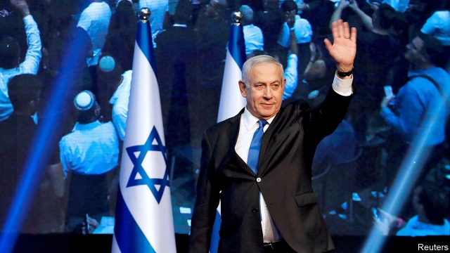
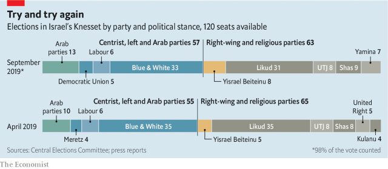

###### Second time unlucky

# Israel’s prime minister will desperately struggle to stay in office 

 

> print-edition iconPrint edition | Middle East and Africa | Sep 19th 2019 

BINYAMIN NETANYAHU spent the last two hours of voting in Israel’s general election on September 17th speaking through a camera to an online audience, begging people to come out and vote for Likud, his ruling party, before it was too late. “All the battles I fought as a soldier in an elite unit, all the battles I fought against a president of the United States [Barack Obama], all my other battles in Congress and at the United Nations—I did it for you. And now I’m asking you for something small. Go the polling station. It’s only a five-minute walk.” 

As he wheedled and begged his voice grew hoarser. He took phone-calls from fans. Occasionally he stood up to gesture at a map of the Middle East on the wall, pointing to the menace of Iran. At one point, he mockingly showed puppets of his rivals. It was a bravura and sometimes bizarre performance of an embattled prime minister, frantic for every last vote. For the first time in over a decade he was staring at defeat. As the results came in, they confirmed that he had failed. Likud and the clutch of right-wing and religious parties backing him would lack a majority in the new Knesset. 

On May 30th, seven weeks after the previous election, Mr Netanyahu took the unprecedented step of dissolving the Knesset to call for a second election, since he was just one seat short of a majority in the 120-strong parliament. Now he is short by six. 

 

He had thrown everything at his foes. He had accused them of treasonous behaviour. He smeared Israel’s Arab citizens with allegations of voter-fraud (Facebook briefly suspended a chatbot on his page after a message accused Arabs of wanting “to destroy us all”). He promised his right-wing base that he would annex chunks of the occupied West Bank. And he tried to enlist other world leaders, including Donald Trump and Vladimir Putin, to endorse him. But this time it wasn’t enough. The man dubbed “the magician” for defying the odds to pull off improbable election victories had run out of tricks. 

About 54% of Israel’s voters picked parties opposed to Mr Netanyahu. Some are right-wingers who back many of Mr Netanyahu’s policies yet refused to vote for Likud or its allies. This was a personal rebuff. 

Ironically, a key constituency that helped bring him down was the Arab one, which he had tried to deter from voting with a law, which failed to pass, that would have let party officials film voters in polling-stations. The turnout of Arab voters rose by around ten percentage points. Their Joint List won three extra seats. 

Mr Netanyahu has not yet had to concede. He will remain in office as a caretaker prime minister until a new government is sworn in. That can take months. Benny Gantz, a former general who leads the centrist Blue and White party, which is now narrowly the largest in the Knesset, lacks a majority too. Mr Netanyahu’s assorted opponents do not share enough common ground to form their own coalition government. Many Israelis refuse to consider the Arab parties as legitimate coalition partners, though a growing number of Arab voters want to play a bigger role. 

So Israeli politics looks deadlocked all over again. But there is a precedent for solving the conundrum. In 1984 neither Likud nor its main rival, the Labour party, could form a ruling coalition. Instead they agreed to a national-unity government with a “rotation” between Labour’s leader, Shimon Peres, and Likud’s Yitzhak Shamir, with each agreeing to serve two years of the prime minister’s term. 

This just might work again. Likud and Blue and White are nearly even in their tally of seats. Together they command a majority, which could be strengthened by a couple of other parties joining such a coalition. Mr Gantz is experienced in military matters, having commanded Israel’s army, but is a political novice. He could benefit from working with Mr Netanyahu. 

But big obstacles remain. On October 2nd Mr Netanyahu faces a pre-trial hearing before the attorney-general, which may herald criminal charges for bribery and fraud. Mr Gantz has promised not to serve under an indicted prime minister. Mr Netanyahu, however, hopes that by clinging to office he will be shielded from prosecution. Had he won even a narrow majority, he could have tried to pass a law granting immunity. That prospect is now fading. 

A third obstacle to forming a national-unity government is the former defence minister, Avigdor Lieberman, a hardliner whose party, Yisrael Beitenu, broke last year with Mr Netanyahu’s coalition. He is now refusing to back either candidate for prime minister without a promise to pass a bunch of laws that would enrage the religious parties, who are Mr Netanyahu’s closest allies. Among these is a law that would conscript religious seminary students into the army. Another would force ultra-Orthodox schools to teach a national curriculum or lose state funding. And another would cancel a prohibition on shops from opening on the Sabbath, the sacred day of rest. Once notorious for vilifying Israeli-Arab citizens, Mr Lieberman can now be credited with bringing Mr Netanyahu down. As well as acting as kingmaker, he wants to establish himself as the champion of secular Israelis, who complain of the rabbis’ excessive influence in politics. 

But Mr Netanyahu is not going anywhere yet. Despite losing his majority twice this year and still facing indictments, he will try to stymie any attempt to form a coalition without him. He has yet to realise he is no longer the magician. ■ 

