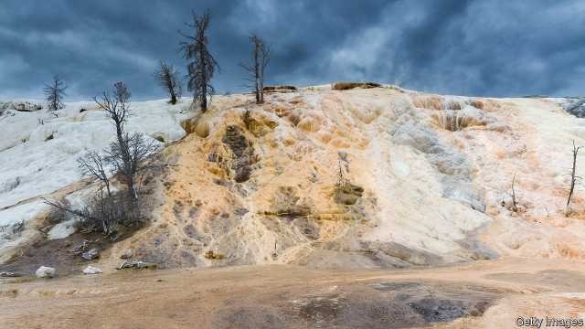

###### Palaeoclimatology

# Ancient climates are written in stone 

 

> print-edition iconPrint edition | Science and technology | Sep 21st 2019 

THROUGHOUT HISTORY, people have viewed springs as mystical. From the warm pools of Roman Bath, whence sheets of lead inscribed with prayers have been recovered, to the gassy waters beneath the Oracle of Delphi that are thought to have stimulated the visions experienced by Apollo’s sacred priestesses, these sites have been sought out for purposes of divination. With a modern twist, this is still happening, for Jason Ricketts of the University of Texas at El Paso thinks the remnants of ancient springs can be used to help monitor climates of the past by dating when warm and cold periods occurred. 

Dr Rickett’s starting point is his assumption that, as ice ages end and the world warms up, underground water flows will increase simultaneously all around the planet. Moreover, as water travels through the ground it dissolves and picks up minerals, particularly calcium carbonate. When it subsequently bubbles to the surface, it deposits these minerals as a type of limestone called travertine, which has bands in it that reveal by their thickness approximately how long the water which created them was flowing. The age of a band can be determined by analysis of the radioactive isotopes within it, particularly those of uranium and its decay products. Dr Rickett therefore predicted that the thicknesses of bands of travertine of the same age from all around the world would be correlated, and that those thicknesses would decrease and increase with the coming and going of ice ages. 

To test this idea he and his colleagues searched the scientific literature for all the previous studies of travertine they could find. By doing so, as they report in the Journal of Quaternary Science, they discovered the ages of 1,649 deposits of the rock, scattered across every continent except Antarctica. To his delight, when Dr Rickett plotted these ages against the thickness of the bands reported, he found that those thicknesses did indeed rise and fall in step. 

To his further delight, the dates he deduced for warm and cold periods matched those from the existing way of dating them, which measures the ratio of isotopes of oxygen in fossil teeth—for this ratio is temperature dependent. That different dating methods have arrived at the same conclusion in this way is a useful confirmation that palaeoclimatologists’ dates for events in the past few hundred thousand years are correct. 

