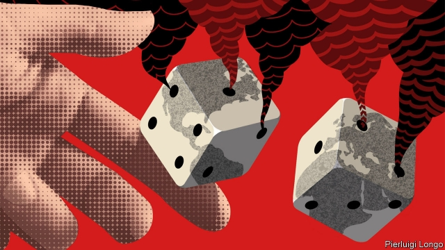
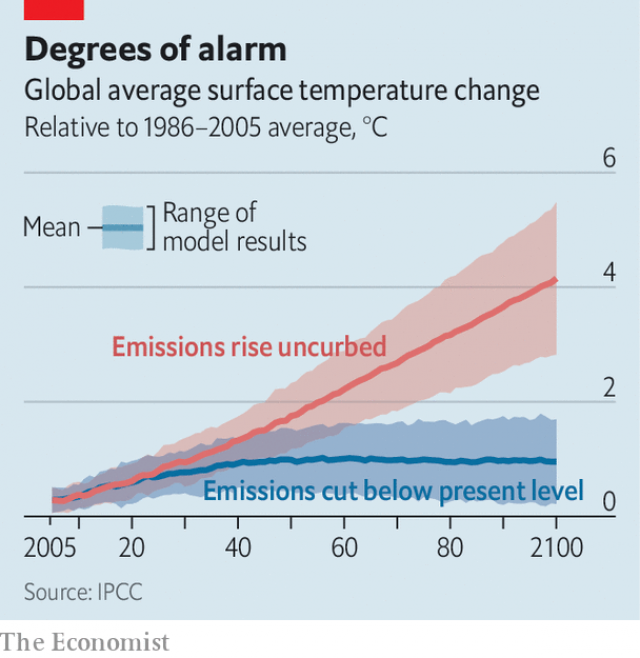

###### Climate science

# Predicting the climatic future is riddled with uncertainty 

 

> print-edition iconPrint edition | Science and technology | Sep 21st 2019 

THE WORLD’S climate scientists are charged with a difficult task: to create a crystal ball with which to skry a future that promises to be hotter than today. But exactly how much hotter depends on innumerable factors, both natural and human. Creating the crystal ball is thus a two-stage process. First, you have to build a simulacrum of how Earth’s climate works. Then, you try to perturb this simulacrum with plausible future human actions, to see what picture appears. 

Modern magic being what it is, the crystal balls are actually supercomputers running programs with 1m or more lines of code. These programs are models that divide the planet’s atmosphere, ocean and land surface into grids of cells—many millions of them. Land cells are flat. Atmosphere and ocean cells are three-dimensional and are stacked in columns to account for the effects of altitude and depth. A model calculates what is going on, physically and chemically, inside each cell, and how this will affect that cell’s neighbours, both sideways and, if appropriate, above and below. Then it does it again. And again. And again. 

That is a complicated process. A model’s code has to represent everything from the laws of thermodynamics to the intricacies of how air molecules interact with one another. Running it means performing quadrillions of mathematical operations a second—hence the need for supercomputers. And using it to make predictions means doing this thousands of times, with slightly different inputs on each run, to get a sense of which outcomes are likely, which unlikely but possible, and which implausible in the extreme. 

Even so, such models are crude. Millions of grid cells might sound a lot, but it means that an individual cell’s area, seen from above, is about 10,000 square kilometres, while an air or ocean cell may have a volume of as much as 100,000km3. Treating these enormous areas and volumes as points misses much detail. Clouds, for instance, present a particular challenge to modellers. Depending on how they form and where, they can either warm or cool the climate. But a cloud is far smaller than even the smallest grid-cells, so its individual effect cannot be captured. The same is true of regional effects caused by things like topographic features or islands. 

Building models is also made hard by lack of knowledge about the ways that carbon—the central atom in molecules of carbon dioxide and methane, the main heat-capturing greenhouse gases other than water vapour—moves through the environment. Understanding Earth’s carbon cycles is crucial to understanding climate change. But much of that element’s movement is facilitated by living organisms, and these are even more difficult to understand than physical processes. 

Plants absorb carbon from the air during photosynthesis and then return it during respiration. Animals that eat those plants also respire. Bacteria and fungi similarly break down dead plants and animals to pillage materials and energy from them, releasing carbon dioxide and methane into the atmosphere as they do so. Some organic matter, nevertheless, gets buried rather than broken down, and is thus removed from climatic consideration. But, over time, this buried material is transformed by heat and pressure into oil, gas and coal—substances pertinent to the climate in the context of one particular biological agent, Homo sapiens. This species uses them to power its civilisation, taking mere decades to fill the air with carbon that took hundreds of millions of years to accumulate underground. 

Organic matter may also be trapped in ice: on land in areas of permafrost, and at the bottom of the sea in molecular structures called clathrates. On top of all this, the oceans themselves contain vast amounts of dissolved carbon dioxide, and many sea creatures draw on that reserve to build themselves shells and carapaces out of calcium carbonate. Not all of this material is recycled. Some ends up on the seabed and eventually turns into limestone. 

Changes in temperature are also a consideration. The relationship between warmth and carbon-dioxide concentration in the atmosphere is a two-way street. Warm water holds less of the gas than cold water. During past ice ages, oceans therefore drew carbon dioxide out of the atmosphere as they cooled, amplifying the process of cooling. Today’s warmer oceans still act in aggregate as sinks for CO2. The warmer they get, however, the less that will continue to be true. 

A further problem in model building is that uncertainties about feedback loops like the one between ocean temperature and CO2 absorption also underpin uncertainties about a parameter called climate sensitivity, which is crucial to models’ predictions. This is a measure of how responsive the climate is to changes in CO2 concentrations in the atmosphere. Basic physics suggests the air should warm by approximately 1°C for a doubling of CO2 levels relative to pre-industrial times. (So far, CO2 levels have risen by about 50%.) Add feedback loops and estimates of temperature increase range from 1.5°C to 4.5°C. There have, moreover, been suggestions that climate sensitivity may itself be subject to a feedback loop, causing the climate to become yet more sensitive to CO2 as it warms, thus promoting warming still further. 

To test predictions such as these against reality and adjust models accordingly requires better data for, until recently, most parts of the globe lacked decent observations. Satellite records of the area covered by ice in the Arctic, for instance, stretch back only to 1979, and it was not until 2002 that researchers were able, courtesy of some new satellites, to estimate how the thickness of that ice varies over time and from place to place. Applied to land-covering ice sheets as well as the floating ice of the Arctic Ocean, this revealed that Greenland was losing more than 200 cubic kilometres of ice (though only 0.007% of its total volume) a year—three times previous estimates. 

Other parts of the globe suffer from a similar lack of observations. The oceans, for example, are reckoned to absorb more than 90% of the heat trapped by man-made greenhouse-gas emissions. But serious collection of data on the marine processes that underpin this, using networks of autonomous buoys, began only in the early 2000s. Swathes of the Southern Ocean, which plays an important role in storing both heat and CO2, are still not monitored, and there are parts of the Arctic Ocean where no man has ever dipped a toe, nor machine a sensor. 

Data from even inhabited parts of the world can be sparse, with unfortunate consequences. West Africa’s monsoon, the failure of which in the 1970s and 1980s led to drought and famine, is poorly simulated by models, leading to fuzzy predictions for how it will change as the world continues to warm. Parts of east Africa where models had predicted an increase in rainfall have instead experienced a decrease. And heatwaves are rarely recorded on that continent, even though they would be expected to occur there. 

A further source of uncertainty is what scientists refer to as non-linear effects. These are big, rapid shifts that occur in response to small changes, and may be irreversible, at least in the short term. Many involve ice changing into liquid water. The collapse of ice sheets on parts of Greenland and Antarctica could happen with mere decades of warming, but would take millennia of cooling to reverse. The melting of permafrost might be worse: not only irreversible, but releasing vast amounts of carbon dioxide and methane to boost temperatures further. 

Ocean currents also look susceptible to non-linear effects. These currents are propelled by a phenomenon called thermohaline circulation that depends, as its name suggests, on the salinity and temperature of seawater, and thus its density. Cold or saline water sinks, while warm or fresher water rises, and large bodies of sinking or rising water provide the engine that drives currents around the world. There are signs that the North Atlantic conveyor belt, which drives the circulation of water through the depths of the world’s oceans, is slowing down—probably as a result of melting ice from Greenland freshening the water. Since the ocean’s currents are all connected, this local slowdown could also have effects far from north-west Europe (an area it has long been known to warm), such as on the Intertropical Convergence Zone, a weather belt that brings rainfall to the tropics. 

 

In spite of all this uncertainty, climate models have done a pretty good job of predicting what has happened so far. But they also have to cope with the biggest uncertainties of all: how rapidly, and in what ways, human beings respond to the threat they face (see chart). 

The most important human uncertainty is how quickly and completely people will stop using fossil fuels, and thus stop transferring carbon from Earth’s crust to the air. This transition will be driven by a mixture of economics, politics and technological change. Already, some countries (such as Britain) have more or less abandoned using coal, the most carbon-intensive fuel, to generate electricity. It helps that natural gas, which is less carbon-intensive, is also often cheaper. But zero-carbon power generation by wind and sun is competitive with coal, too, in a growing number of places. Add electrically powered vehicles to the mix and an optimist might say, “problem solved”. 

Well, not exactly. Though profitable technological change can happen fast (in America, the shift from horse-drawn carts to engine-driven vehicles took place within a decade, between 1903 and 1913), it would be going some to convert all the world’s electricity production (which would mean scrapping vast amounts of installed capacity) by the deadline of 2050 that has been proposed, by the Intergovernmental Panel on Climate Change, for the elimination of man-made greenhouse-gas emissions. Other means will be needed as well. 

Most routes to the goal of avoiding 1.5°C of warming, the target agreed at a UN climate-change meeting in Paris in 2015, involve some amount of “negative emissions”, whereby carbon dioxide is removed from the atmosphere. This can be as low-tech as reforesting land, or as high-tech as using chemical engineering to purge the air of undesirable substances. There are also ideas around to capture at source the CO2 released by processes such as cement-making, of which the gas is an inevitable chemical by-product, and then bury it somehow underground—a plan known as carbon capture and storage. 

Both negative emissions and carbon capture and storage could work in principle. But, unlike alternative ways of generating electricity, which, once mastered, will be profitable, they offers little prospect of turning a profit without subsidy. Given the threat, asking for such subsidies is perfectly reasonable. Taxpayers are called on to pay for wars against human enemies, so might be expected to stump up for one against a less tangible foe. But predicting how rapidly and in what quantity cash for such a war will arrive is a mug’s game. 

Other human-induced uncertainties could be even greater. Some, for instance, talk of solar geoengineering—intercepting a portion of the incoming energy from the sun and returning it to space before it has had a chance to warm the atmosphere. There are several ways this might be done, from deploying fine mists of particles in the stratosphere to building mirrors in space. Such methods might conceivably stop warming within a few years, or even cool things down. That might look attractive to some, if emissions are not drastically reduced soon. 

 

As to the political will needed to jolly the process along, and arrange payment for those parts of the programme that will not pay for themselves, this can push both ways. America’s approach to climate policy and regulation has see-sawed from George W. Bush’s obstructionism to Barack Obama’s efforts to work with China and introduce domestic policy and regulations, and now Donald Trump’s roll-back from those positions. Some countries, however, seem to have arrived at more of an internal consensus. Earlier this year, for example, Britain adopted what it says is a legally binding target to reach “net-zero” emissions by 2050 (though what “legally binding” actually amounts to is not exactly clear). Britain’s current contribution to greenhouse-gas emissions is about 1%, so this will, by itself, make little difference. But it may encourage the others. 

France, a country with an economy about the same size as Britain’s, is also aiming for net-zero by the middle of the century, and it, too, says this target is legally binding. Denmark has joined in as well. Germany and Chile are considering doing so. And California and Sweden have pledged to outdo the others by reaching net zero by 2045. How important all this is, is hard to guess, and almost impossible to model. Some game theorists are, nevertheless, trying to do so. Their games suggest that in international climate negotiations a small group of nations could create a “tipping set” that has the power, perhaps through financial sanctions, to induce other governments to join them on a path to net zero. 

Ultimately, tackling climate change will require all of these pieces—the political, the economic, the technological and the social—to come together. But if they do, a solution may yet be possible. Earlier this year, Britain’s Committee on Climate Change published the results of its own crystal-ball gazing, a report on what a net-zero United Kingdom might look like. Homes in this paradise would be heated by decarbonised electricity. Ships would be powered by ammonia. People would eat more vegetables and less meat. Parts of the country would once again be covered by forests. And there would be a new programme to capture and store CO2. 

As an objective, this all sounds quite attractive—reminiscent, perhaps, of William Blake’s vision of a New Jerusalem taking over from a land of dark, satanic mills. But whether such promised lands will, in the end, be built remains the biggest uncertainty of all.■ 

